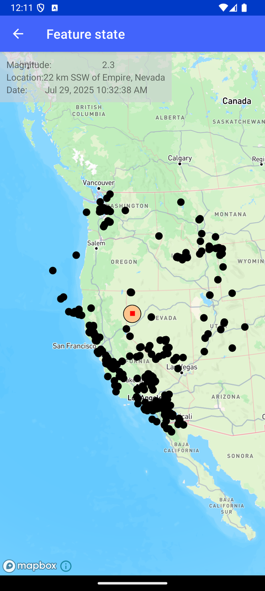

# Feature State（Feature state）

> 官方示例：[feature-state](https://docs.mapbox.com/android/maps/examples/android-view/feature-state/)

## 示例效果



## 功能说明

使用 Feature State 创建交互式 hover 效果。

<details>
<summary>英文原文</summary>

This example demonstrates the usage of feature state in the Mapbox Maps SDK for Android. The FeatureStateActivity class showcases how to work with feature state, allowing for the highlighting of map features upon hover. Within the activity, features are highlighted by changing their state based on user interaction to provide visual feedback. The activity utilizes coroutine functions like getFeatureState, setFeatureState, and queryRenderedFeatures to manage and manipulate feature states. Additionally, the example includes the implementation of a customized map style that adjusts the appearance of map features based on their state and properties, such as magnitude, location, and time of occurrence. The activity integrates various Mapbox SDK components, including MapboxMap, RenderedQueryGeometry, ScreenCoordinate, and geoJsonSource, to interact with map features and update their states dynamically. By setting up event listeners and leveraging coroutine flows, the example ensures real-time responsiveness when interacting with map features. This feature-rich example also includes the integration of a scale bar plugin and the implementation of a custom crosshair view to enhance the user experience during feature interaction.

</details>

## 示例 Activity

- `FeatureStateActivity.kt`

## 示例代码

```kotlin
package com.mapbox.maps.testapp.examples.coroutines.featurestate

import android.graphics.Color
import android.graphics.Rect
import android.os.Bundle
import android.view.Gravity
import android.view.View
import android.widget.FrameLayout
import androidx.appcompat.app.AppCompatActivity
import androidx.core.view.doOnLayout
import androidx.lifecycle.Lifecycle
import androidx.lifecycle.lifecycleScope
import androidx.lifecycle.repeatOnLifecycle
import com.mapbox.annotation.MapboxExperimental
import com.mapbox.bindgen.Value
import com.mapbox.geojson.Point
import com.mapbox.maps.MapboxMap
import com.mapbox.maps.QueriedFeature
import com.mapbox.maps.RenderedQueryGeometry
import com.mapbox.maps.RenderedQueryOptions
import com.mapbox.maps.ScreenBox
import com.mapbox.maps.ScreenCoordinate
import com.mapbox.maps.Style
import com.mapbox.maps.coroutine.cameraChangedCoalescedEvents
import com.mapbox.maps.coroutine.getFeatureState
import com.mapbox.maps.coroutine.queryRenderedFeatures
import com.mapbox.maps.coroutine.setFeatureState
import com.mapbox.maps.dsl.cameraOptions
import com.mapbox.maps.extension.style.expressions.dsl.generated.literal
import com.mapbox.maps.extension.style.expressions.dsl.generated.switchCase
import com.mapbox.maps.extension.style.layers.generated.circleLayer
import com.mapbox.maps.extension.style.sources.generated.geoJsonSource
import com.mapbox.maps.extension.style.style
import com.mapbox.maps.logD
import com.mapbox.maps.plugin.scalebar.scalebar
import com.mapbox.maps.testapp.databinding.ActivityFeatureStateBinding
import kotlinx.coroutines.flow.distinctUntilChangedBy
import kotlinx.coroutines.flow.fold
import kotlinx.coroutines.flow.map
import kotlinx.coroutines.launch
import kotlinx.coroutines.suspendCancellableCoroutine
import java.text.DateFormat.getDateTimeInstance
import java.text.SimpleDateFormat
import java.util.Calendar
import java.util.Date
import java.util.Locale
import java.util.TimeZone
import kotlin.coroutines.resume

/**
 * Example showcasing usage of feature state.
 */
class FeatureStateActivity : AppCompatActivity() {

  private lateinit var mapboxMap: MapboxMap
  private lateinit var crosshair: View
  private lateinit var binding: ActivityFeatureStateBinding

  override fun onCreate(savedInstanceState: Bundle?) {
    super.onCreate(savedInstanceState)
    binding = ActivityFeatureStateBinding.inflate(layoutInflater)
    setContentView(binding.root)

    mapboxMap = binding.mapView.mapboxMap
    binding.mapView.scalebar.enabled = false
    mapboxMap.loadStyle(createStyle()) {
      mapboxMap.setCamera(
        cameraOptions {
          center(CAMERA_CENTER)
          zoom(CAMERA_ZOOM)
        }
      )
    }
    showCrosshair()

    lifecycleScope.launch {
      repeatOnLifecycle(Lifecycle.State.STARTED) {
        highlightFeatureOnHover()
      }
    }
  }

  /**
   * Wait for the first layout pass to get the [ScreenBox] of the crosshair.
   */
  private suspend fun getCrosshairScreenBox() = suspendCancellableCoroutine { cont ->
    binding.mapView.doOnLayout {
      val rect = Rect()
      crosshair.getDrawingRect(rect)
      binding.mapView.offsetDescendantRectToMyCoords(crosshair, rect)
      val screenBox = ScreenBox(
        ScreenCoordinate(rect.left.toDouble(), rect.top.toDouble()),
        ScreenCoordinate(rect.right.toDouble(), rect.bottom.toDouble())
      )
      cont.resume(screenBox)
    }
  }

  @OptIn(MapboxExperimental::class)
  private suspend fun highlightFeatureOnHover() {
    val crosshairScreenBox = getCrosshairScreenBox()

    // Observe camera changes and query the rendered features under the crosshair.
    mapboxMap.cameraChangedCoalescedEvents
      .map { _ ->
        mapboxMap
          .queryRenderedFeatures(
            RenderedQueryGeometry(crosshairScreenBox),
            RenderedQueryOptions(listOf(LAYER_ID), literal(true))
          ).value?.firstOrNull()?.queriedFeature
      }
      .distinctUntilChangedBy { queriedFeature ->
        queriedFeature?.feature?.id()
      }
      .fold(null) { lastFeatureId: String?, queriedFeature: QueriedFeature? ->
        // Clear the state of the last feature
        lastFeatureId?.let { lastId ->
          setHoverFeatureState(lastId, false)
        }

        val selectedFeature = queriedFeature?.feature
        val selectedFeatureId = selectedFeature?.id()
        if (selectedFeatureId != null) {
          setHoverFeatureState(selectedFeatureId, true)
          logHoverFeatureState(selectedFeatureId)

          // Update Magnitude, location and date text view.
          val time = selectedFeature.getNumberProperty("time")
          binding.date.text = getDateTime(time.toLong())
          binding.location.text = if (selectedFeature.hasNonNullValueForProperty("place")) {
            selectedFeature.getStringProperty("place")
          } else {
            "N/A"
          }
          binding.magnitude.text = if (selectedFeature.hasNonNullValueForProperty("mag")) {
            selectedFeature.getNumberProperty("mag").toString()
          } else {
            "N/A"
          }
        }

        // Pass this id to the next iteration of the fold
        queriedFeature?.feature?.id()
      }
  }

  private suspend fun setHoverFeatureState(featureId: String, hover: Boolean) {
    mapboxMap.setFeatureState(
      sourceId = SOURCE_ID,
      featureId = featureId,
      state = Value(
        hashMapOf(
          "hover" to Value(hover)
        )
      )
    )
  }

  private suspend fun logHoverFeatureState(featureId: String) {
    val featureState = mapboxMap.getFeatureState(
      sourceId = SOURCE_ID,
      featureId = featureId,
    )

    logD(TAG, "getFeatureState: ${featureState.value}")
  }

  private fun showCrosshair() {
    crosshair = View(this)
    crosshair.layoutParams = FrameLayout.LayoutParams(20, 20, Gravity.CENTER)
    crosshair.setBackgroundColor(Color.RED)
    binding.mapView.addView(crosshair)
  }

  private fun getDateTime(time: Long): String = try {
    val sdf = getDateTimeInstance()
    val netDate = Date(time)
    sdf.format(netDate)
  } catch (e: Exception) {
    e.toString()
  }

  private fun createStyle() = style(style = Style.STANDARD) {
    +geoJsonSource(id = SOURCE_ID) {
      data(GEOJSON_URL)
      cluster(false)
      generateId(true)
    }
    +circleLayer(layerId = LAYER_ID, sourceId = SOURCE_ID) {
      circleRadius(
        switchCase {
          boolean {
            featureState {
              literal("hover")
            }
            literal(false)
          }
          interpolate {
            linear()
            get("mag")
            stop {
              literal(1.0)
              literal(8.0)
            }
            stop {
              literal(1.5)
              literal(10.0)
            }
            stop {
              literal(2.0)
              literal(12.0)
            }
            stop {
              literal(2.5)
              literal(14.0)
            }
            stop {
              literal(3.0)
              literal(16.0)
            }
            stop {
              literal(3.5)
              literal(18.0)
            }
            stop {
              literal(4.5)
              literal(20.0)
            }
            stop {
              literal(6.5)
              literal(22.0)
            }
            stop {
              literal(8.5)
              literal(24.0)
            }
            stop {
              literal(10.5)
              literal(26.0)
            }
          }
          literal(5.0)
        }
      )
      circleStrokeColor(Color.BLACK)
      circleStrokeWidth(1.0)
      circleColor(
        switchCase {
          boolean {
            featureState {
              literal("hover")
            }
            literal(false)
          }
          interpolate {
            linear()
            get("mag")
            stop {
              literal(1.0)
              literal("#fff7ec")
            }
            stop {
              literal(1.5)
              literal("#fee8c8")
            }
            stop {
              literal(2.0)
              literal("#fdd49e")
            }
            stop {
              literal(2.5)
              literal("#fdbb84")
            }
            stop {
              literal(3.0)
              literal("#fc8d59")
            }
            stop {
              literal(3.5)
              literal("#ef6548")
            }
            stop {
              literal(4.5)
              literal("#d7301f")
            }
            stop {
              literal(6.5)
              literal("#b30000")
            }
            stop {
              literal(8.5)
              literal("#7f0000")
            }
            stop {
              literal(10.5)
              literal("#000")
            }
          }
          literal("#000")
        }
      )
    }
  }

  companion object {
    /**
     * Use data from the USGS Earthquake Catalog API, which returns information about recent earthquakes,
     * including the magnitude, location, and the time at which the earthquake happened.
     */
    private val GEOJSON_URL =
      "https://earthquake.usgs.gov/fdsnws/event/1/query?format=geojson&eventtype=earthquake&minmagnitude=1&starttime=${
        // Get the date seven days ago as an ISO 8601 timestamp, as required by the USGS Earthquake Catalog API.
        SimpleDateFormat("yyyy-MM-dd'T'HH:mm:ss'Z'", Locale.US).apply {
          timeZone = TimeZone.getTimeZone("UTC")
        }.format(
          Calendar.getInstance().apply {
            add(Calendar.DATE, -7)
          }.time
        )
      }"
    private const val LAYER_ID = "earthquakes-viz"
    private const val SOURCE_ID = "earthquakes"
    private val CAMERA_CENTER = Point.fromLngLat(-122.44121, 37.76132)
    private const val CAMERA_ZOOM = 3.5
    private const val TAG = "FeatureStateActivity"
  }
}
```

## 在 Aura 项目中使用

- UI 框架：**Android View**（与 Aura 当前 `MapFragment` + `MapView` 一致）
- 包名请替换为 `com.catclaw.aura`
- 需在 `local.properties` 配置 `MAPBOX_ACCESS_TOKEN`
- 部分示例依赖 `assets/` 或额外布局文件，请参考 GitHub 示例工程

## 参考链接

- [官方文档（英文）](https://docs.mapbox.com/android/maps/examples/android-view/feature-state/)
- [GitHub 源码](https://github.com/mapbox/mapbox-maps-android/blob/v11.24.3/app/src/main/java/com/mapbox/maps/testapp/examples/coroutines/featurestate/FeatureStateActivity.kt)
- [Android View 示例索引](./README.md)
- [Mapbox 中文指南](../../README.md)
