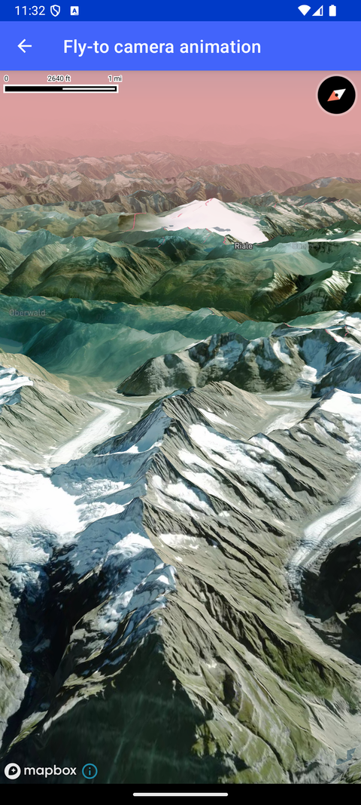

# FlyTo 相机动画（Fly-to camera animation）

> 官方示例：[fly-to-camera-animation](https://docs.mapbox.com/android/maps/examples/android-view/fly-to-camera-animation/)

## 示例效果



## 功能说明

使用 flyTo 动画平滑移动相机。

<details>
<summary>英文原文</summary>

This example demonstrates the usage of MapboxMap.flyTo on a map with globe projection, atmosphere, and terrain to smoothly zoom to a specified location with the Maps SDK for Android. The GlobeFlyToActivity class and implements OnMapClickListener. Within the onCreate method, the app sets up the MapView, loads the style with a globe projection, configures atmosphere settings including color and horizon blend, adds a raster DEM source, and enables terrain rendering. Upon completion of the map setup, a Toast message guides users to tap on the map to trigger the fly-to animation. When the user taps on the map, the onMapClick function is triggered to determine the target camera location based on the current state, and the flyTo method is called on the mapboxMap with animation options specifying a duration of 12 seconds. The camera options for the start and end locations are stored as constants within a private companion object. This example provides a seamless zooming experience to showcase the globe view of the map with atmospheric effects.

</details>

## 示例 Activity

- `GlobeFlyToActivity.kt`

## 示例代码

```kotlin
package com.mapbox.maps.testapp.examples.globe

import android.graphics.Color.rgb
import android.os.Bundle
import android.widget.Toast
import androidx.appcompat.app.AppCompatActivity
import com.mapbox.geojson.Point
import com.mapbox.maps.MapView
import com.mapbox.maps.MapboxMap
import com.mapbox.maps.Style
import com.mapbox.maps.dsl.cameraOptions
import com.mapbox.maps.extension.style.atmosphere.generated.atmosphere
import com.mapbox.maps.extension.style.layers.properties.generated.ProjectionName
import com.mapbox.maps.extension.style.projection.generated.projection
import com.mapbox.maps.extension.style.sources.generated.rasterDemSource
import com.mapbox.maps.extension.style.style
import com.mapbox.maps.extension.style.terrain.generated.terrain
import com.mapbox.maps.plugin.animation.MapAnimationOptions.Companion.mapAnimationOptions
import com.mapbox.maps.plugin.animation.flyTo
import com.mapbox.maps.plugin.gestures.OnMapClickListener
import com.mapbox.maps.plugin.gestures.addOnMapClickListener
import com.mapbox.maps.testapp.R

/**
 * Use [MapboxMap.flyTo] on a map with globe projection, atmosphere and terrain to slowly zoom to a location.
 */
class GlobeFlyToActivity : AppCompatActivity(), OnMapClickListener {

  private lateinit var mapboxMap: MapboxMap
  private var isAtStart = true

  override fun onCreate(savedInstanceState: Bundle?) {
    super.onCreate(savedInstanceState)
    val mapView = MapView(this)
    setContentView(mapView)
    mapboxMap = mapView.mapboxMap
    mapboxMap.loadStyle(
      style(Style.STANDARD_SATELLITE) {
        +projection(ProjectionName.GLOBE)
        +atmosphere {
          color(rgb(220, 159, 159)) // Pink fog / lower atmosphere
          highColor(rgb(220, 159, 159)) // Blue sky / upper atmosphere
          horizonBlend(0.4) // Exaggerate atmosphere (default is .1)
        }
        +rasterDemSource("raster-dem") {
          url("mapbox://mapbox.terrain-rgb")
        }
        +terrain("raster-dem")
      }
    ) {
      // Toast instructing user to tap on the map
      Toast.makeText(
        this@GlobeFlyToActivity,
        getString(R.string.tap_on_map_instruction),
        Toast.LENGTH_LONG
      ).show()
      mapboxMap.addOnMapClickListener(this@GlobeFlyToActivity)
    }
  }

  override fun onMapClick(point: Point): Boolean {
    val target = if (isAtStart) CAMERA_END else CAMERA_START
    isAtStart = !isAtStart
    mapboxMap.flyTo(
      target,
      mapAnimationOptions {
        duration(12_000)
      }
    )
    return true
  }

  private companion object {
    private val CAMERA_START = cameraOptions {
      center(Point.fromLngLat(80.0, 36.0))
      zoom(1.0)
      pitch(0.0)
      bearing(0.0)
    }
    private val CAMERA_END = cameraOptions {
      center(Point.fromLngLat(8.11862, 46.58842))
      zoom(12.5)
      pitch(75.0)
      bearing(130.0)
    }
  }
}
```

## 在 Aura 项目中使用

- UI 框架：**Android View**（与 Aura 当前 `MapFragment` + `MapView` 一致）
- 包名请替换为 `com.catclaw.aura`
- 需在 `local.properties` 配置 `MAPBOX_ACCESS_TOKEN`
- 部分示例依赖 `assets/` 或额外布局文件，请参考 GitHub 示例工程

## 参考链接

- [官方文档（英文）](https://docs.mapbox.com/android/maps/examples/android-view/fly-to-camera-animation/)
- [GitHub 源码](https://github.com/mapbox/mapbox-maps-android/blob/v11.24.3/app/src/main/java/com/mapbox/maps/testapp/examples/globe/GlobeFlyToActivity.kt)
- [Android View 示例索引](./README.md)
- [Mapbox 中文指南](../../README.md)
