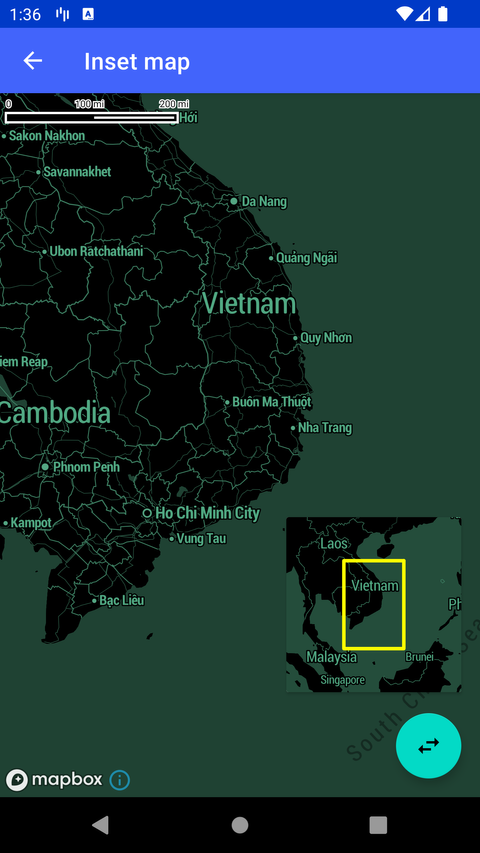

# Inset 小地图（Inset map）

> 官方示例：[inset-map](https://docs.mapbox.com/android/maps/examples/android-view/inset-map/)

## 示例效果



## 功能说明

显示联动的小地图 inset，适合游戏等双地图场景。

<details>
<summary>英文原文</summary>

This example demonstrates displaying two maps, a main map and a smaller map with lower zoom in the bottom-right corner, using the Maps SDK for Android. The small map includes optional bounds to show the area covered by the main map. The InsetMapActivity class implements CameraChangedCallback. The InsetMapActivity sets up both the main and inset MapboxMap instances, loads styles, and handles camera changes. It includes functionality to toggle the visibility of the camera bounds line layer and sets the style for the inset map with line properties like line cap, line join, width, color, and visibility. The code also calculates and updates the bounds of the line layer based on the camera's position. Additionally, it disables certain UI elements like logo, scale bar, attribution, and compass, and configures gesture settings for the inset map.

</details>

## 示例 Activity

- `InsetMapActivity.kt`

## 示例代码

```kotlin
package com.mapbox.maps.testapp.examples

import android.graphics.Color
import android.os.Bundle
import androidx.appcompat.app.AppCompatActivity
import androidx.lifecycle.Lifecycle
import androidx.lifecycle.lifecycleScope
import androidx.lifecycle.repeatOnLifecycle
import com.mapbox.annotation.MapboxExperimental
import com.mapbox.geojson.Feature
import com.mapbox.geojson.LineString
import com.mapbox.geojson.Point
import com.mapbox.maps.*
import com.mapbox.maps.coroutine.cameraChangedCoalescedEvents
import com.mapbox.maps.dsl.cameraOptions
import com.mapbox.maps.extension.style.layers.addLayer
import com.mapbox.maps.extension.style.layers.generated.lineLayer
import com.mapbox.maps.extension.style.layers.getLayer
import com.mapbox.maps.extension.style.layers.properties.generated.LineCap
import com.mapbox.maps.extension.style.layers.properties.generated.LineJoin
import com.mapbox.maps.extension.style.layers.properties.generated.Visibility
import com.mapbox.maps.extension.style.sources.addSource
import com.mapbox.maps.extension.style.sources.generated.GeoJsonSource
import com.mapbox.maps.extension.style.sources.generated.geoJsonSource
import com.mapbox.maps.extension.style.sources.getSource
import com.mapbox.maps.plugin.attribution.attribution
import com.mapbox.maps.plugin.compass.compass
import com.mapbox.maps.plugin.gestures.gestures
import com.mapbox.maps.plugin.logo.logo
import com.mapbox.maps.plugin.scalebar.scalebar
import com.mapbox.maps.testapp.R
import com.mapbox.maps.testapp.databinding.ActivityInsetMapBinding
import com.mapbox.maps.testapp.examples.fragment.MapFragment
import kotlinx.coroutines.launch

/**
 * Example demonstrating displaying two maps: main map and small map with lower zoom
 * in bottom-right corner with optional bounds showing what area is covered by main map.
 */
class InsetMapActivity : AppCompatActivity() {

  private lateinit var mainMapboxMap: MapboxMap
  private var insetMapboxMap: MapboxMap? = null

  @OptIn(MapboxExperimental::class)
  override fun onCreate(savedInstanceState: Bundle?) {
    super.onCreate(savedInstanceState)
    val binding = ActivityInsetMapBinding.inflate(layoutInflater)
    setContentView(binding.root)
    mainMapboxMap = binding.mapView.mapboxMap
    mainMapboxMap.setCamera(MAIN_MAP_CAMERA_POSITION)
    mainMapboxMap.loadStyle(
      style = STYLE_URL
    )

    lifecycleScope.launch {
      // repeatOnLifecycle launches the block in a new coroutine every time the
      // lifecycle is in the STARTED state (or above) and cancels it when it's STOPPED.
      repeatOnLifecycle(Lifecycle.State.STARTED) {
        mainMapboxMap.cameraChangedCoalescedEvents.collect { cameraEvent ->
          updateInsetMapCamera(cameraEvent.cameraState)
        }
      }
    }

    var insetMapFragment: MapFragment? =
      supportFragmentManager.findFragmentByTag(INSET_FRAGMENT_TAG) as? MapFragment
    if (insetMapFragment == null) {
      // Create fragment transaction for the inset fragment
      val transaction = supportFragmentManager.beginTransaction()
      insetMapFragment = MapFragment()
      // Add fragmentMap fragment to parent container
      transaction.add(R.id.mini_map_fragment_container, insetMapFragment, INSET_FRAGMENT_TAG)
      transaction.commit()
    }
    setInsetMapStyle(insetMapFragment)

    binding.showBoundsToggleFab.setOnClickListener {
      // Toggle the visibility of the camera bounds LineLayer
      insetMapboxMap?.getStyle { style ->
        style.getLayer(BOUNDS_LINE_LAYER_LAYER_ID)?.apply {
          visibility(if (visibility == Visibility.VISIBLE) Visibility.NONE else Visibility.VISIBLE)
        }
      }
    }
  }

  private fun setInsetMapStyle(insetMapFragment: MapFragment) {
    insetMapFragment.getMapAsync {
      insetMapboxMap = it
      insetMapboxMap?.apply {
        setCamera(INSET_CAMERA_POSITION)
        loadStyle(
          style = STYLE_URL
        ) { style ->
          style.addSource(geoJsonSource(BOUNDS_LINE_LAYER_SOURCE_ID) {})
          // The layer properties for our line. This is where we make the line dotted, set the color, etc.
          val layer = lineLayer(BOUNDS_LINE_LAYER_LAYER_ID, BOUNDS_LINE_LAYER_SOURCE_ID) {
            lineCap(LineCap.ROUND)
            lineJoin(LineJoin.ROUND)
            lineWidth(3.0)
            lineColor(Color.YELLOW)
            visibility(Visibility.VISIBLE)
          }
          style.addLayer(layer)
          updateInsetMapLineLayerBounds(style, mainMapboxMap.cameraState)
        }
      }
      insetMapFragment.getMapView().apply {
        logo.enabled = false
        scalebar.enabled = false
        attribution.enabled = false
        compass.enabled = false

        gestures.updateSettings {
          scrollEnabled = false
          pinchToZoomEnabled = false
        }
      }
    }
  }

  private fun updateInsetMapCamera(mainCameraPosition: CameraState) {
    val insetCameraPosition = CameraOptions.Builder()
      .zoom(mainCameraPosition.zoom.minus(ZOOM_DISTANCE_BETWEEN_MAIN_AND_INSET_MAPS))
      .pitch(mainCameraPosition.pitch)
      .bearing(mainCameraPosition.bearing)
      .center(mainCameraPosition.center)
      .build()
    insetMapboxMap?.setCamera(insetCameraPosition)
    insetMapboxMap?.getStyle { style -> updateInsetMapLineLayerBounds(style, mainCameraPosition) }
  }

  private fun updateInsetMapLineLayerBounds(
    fullyLoadedStyle: Style,
    mainMapCameraState: CameraState
  ) {
    (fullyLoadedStyle.getSource(BOUNDS_LINE_LAYER_SOURCE_ID) as? GeoJsonSource)?.apply {
      feature(Feature.fromGeometry(LineString.fromLngLats(getRectanglePoints(mainMapCameraState))))
    }
  }

  private fun getRectanglePoints(mainMapCameraState: CameraState): List<Point> {
    val bounds = mainMapboxMap.coordinateBoundsForCamera(
      mainMapCameraState.toCameraOptions()
    )
    return listOf(
      Point.fromLngLat(bounds.northeast.longitude(), bounds.northeast.latitude()),
      Point.fromLngLat(bounds.northeast.longitude(), bounds.southwest.latitude()),
      Point.fromLngLat(bounds.southwest.longitude(), bounds.southwest.latitude()),
      Point.fromLngLat(bounds.southwest.longitude(), bounds.northeast.latitude()),
      Point.fromLngLat(bounds.northeast.longitude(), bounds.northeast.latitude())
    )
  }

  companion object {
    private const val STYLE_URL = "mapbox://styles/mapbox/cj5l80zrp29942rmtg0zctjto"
    private const val INSET_FRAGMENT_TAG = "com.mapbox.insetMapFragment"
    private const val BOUNDS_LINE_LAYER_SOURCE_ID = "BOUNDS_LINE_LAYER_SOURCE_ID"
    private const val BOUNDS_LINE_LAYER_LAYER_ID = "BOUNDS_LINE_LAYER_LAYER_ID"
    private const val ZOOM_DISTANCE_BETWEEN_MAIN_AND_INSET_MAPS = 3
    private val MAIN_MAP_CAMERA_POSITION = cameraOptions {
      center(Point.fromLngLat(106.025839, 11.302318))
      zoom(5.11)
    }

    private val INSET_CAMERA_POSITION = CameraOptions.Builder()
      .zoom(MAIN_MAP_CAMERA_POSITION.zoom?.minus(ZOOM_DISTANCE_BETWEEN_MAIN_AND_INSET_MAPS))
      .pitch(MAIN_MAP_CAMERA_POSITION.pitch)
      .bearing(MAIN_MAP_CAMERA_POSITION.bearing)
      .center(MAIN_MAP_CAMERA_POSITION.center)
      .build()
  }
}
```

## 在 Aura 项目中使用

- UI 框架：**Android View**（与 Aura 当前 `MapFragment` + `MapView` 一致）
- 包名请替换为 `com.catclaw.aura`
- 需在 `local.properties` 配置 `MAPBOX_ACCESS_TOKEN`
- 部分示例依赖 `assets/` 或额外布局文件，请参考 GitHub 示例工程

## 参考链接

- [官方文档（英文）](https://docs.mapbox.com/android/maps/examples/android-view/inset-map/)
- [GitHub 源码](https://github.com/mapbox/mapbox-maps-android/blob/v11.24.3/app/src/main/java/com/mapbox/maps/testapp/examples/InsetMapActivity.kt)
- [Android View 示例索引](./README.md)
- [Mapbox 中文指南](../../README.md)
