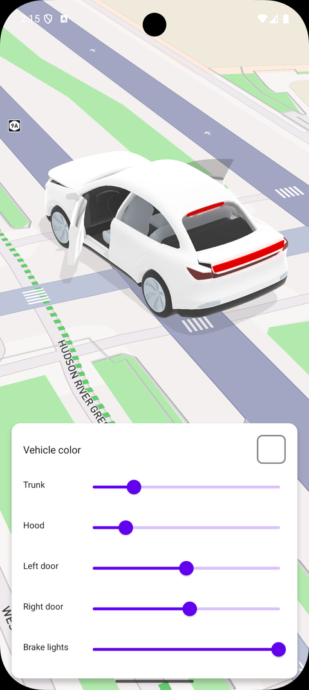

# 交互式 3D 模型源（Interactive 3D model source）

> 官方示例：[interactive-3d-model-source](https://docs.mapbox.com/android/maps/examples/android-view/interactive-3d-model-source/)

## 示例效果



## 功能说明

通过更新模型源属性控制 3D 模型的车门、引擎盖、后备箱和颜色。

<details>
<summary>英文原文</summary>

This example demonstrates how to interactively control a 3D car model by modifying ModelSource properties directly using the Mapbox Maps SDK for Android. The car is loaded into a ModelSource with modelNodeOverride and modelMaterialOverride names configured, then displayed via a ModelLayer. Sliders and color pickers update the model in real time:

</details>

## 示例 Activity

- `Interactive3DModelSourceActivity.kt`

## 示例代码

```kotlin
package com.mapbox.maps.testapp.examples

import android.graphics.Color
import android.graphics.drawable.GradientDrawable
import android.os.Bundle
import android.widget.SeekBar
import androidx.appcompat.app.AppCompatActivity
import com.mapbox.bindgen.Value
import com.mapbox.geojson.Point
import com.mapbox.maps.MapboxExperimental
import com.mapbox.maps.Style
import com.mapbox.maps.dsl.cameraOptions
import com.mapbox.maps.extension.style.layers.generated.modelLayer
import com.mapbox.maps.extension.style.layers.properties.generated.ModelType
import com.mapbox.maps.extension.style.light.dynamicLight
import com.mapbox.maps.extension.style.light.generated.ambientLight
import com.mapbox.maps.extension.style.light.generated.directionalLight
import com.mapbox.maps.extension.style.sources.generated.ModelSourceModel
import com.mapbox.maps.extension.style.sources.generated.modelMaterialOverride
import com.mapbox.maps.extension.style.sources.generated.modelNodeOverride
import com.mapbox.maps.extension.style.sources.generated.modelSource
import com.mapbox.maps.extension.style.sources.generated.modelSourceModel
import com.mapbox.maps.extension.style.style
import com.mapbox.maps.testapp.databinding.ActivityInteractive3dModelSourceBinding
import kotlin.math.roundToInt

/**
 * Showcase interactive 3D model with source-based updates.
 * Demonstrates node overrides for doors/hood/trunk and material overrides for colors/lights.
 */
@MapboxExperimental
class Interactive3DModelSourceActivity : AppCompatActivity() {

  private lateinit var binding: ActivityInteractive3dModelSourceBinding

  // Vehicle parameters
  private var doorsFrontLeft = 0.5
  private var doorsFrontRight = 0.0
  private var trunk = 0.0
  private var hood = 0.0
  private var brakeLights = 0.0
  private var vehicleColor = Color.WHITE
  private lateinit var model: ModelSourceModel

  override fun onCreate(savedInstanceState: Bundle?) {
    super.onCreate(savedInstanceState)
    binding = ActivityInteractive3dModelSourceBinding.inflate(layoutInflater)
    setContentView(binding.root)

    model = createCarModel()

    binding.mapView.mapboxMap.apply {
      setCamera(
        cameraOptions {
          center(CAR_POSITION)
          zoom(19.3)
          bearing(45.0)
          pitch(60.0)
        }
      )

      loadStyle(
        style(Style.STANDARD) {
          +dynamicLight(
            ambientLight("environment") {
              intensity(0.4)
            },
            directionalLight("sun_light") {
              castShadows(true)
            }
          )
          +modelSource(SOURCE_ID) {
            models(listOf(model))
          }
          +modelLayer(LAYER_ID, SOURCE_ID) {
            modelScale(listOf(10.0, 10.0, 10.0))
            modelType(ModelType.LOCATION_INDICATOR)
          }
        }
      ) {
        binding.mapView.mapboxMap.setStyleImportConfigProperty(
          "basemap",
          "show3dObjects",
          Value.valueOf(false)
        )
        setupControls()
      }
    }
  }

  private fun setupControls() {
    // Color picker view
    updateColorPickerBackground()
    binding.colorPickerButton.setOnClickListener {
      showColorPickerDialog()
    }

    // Trunk slider
    binding.seekBarTrunk.setOnSeekBarChangeListener(object : SeekBar.OnSeekBarChangeListener {
      override fun onProgressChanged(seekBar: SeekBar?, progress: Int, fromUser: Boolean) {
        trunk = progress / 100.0
        model.nodeOverrides(
          listOf(
            modelNodeOverride("trunk") {
              orientation(listOf(mix(trunk, 0.0, -60.0), 0.0, 0.0))
            }
          )
        )
      }
      override fun onStartTrackingTouch(seekBar: SeekBar?) {}
      override fun onStopTrackingTouch(seekBar: SeekBar?) {}
    })

    // Hood slider
    binding.seekBarHood.setOnSeekBarChangeListener(object : SeekBar.OnSeekBarChangeListener {
      override fun onProgressChanged(seekBar: SeekBar?, progress: Int, fromUser: Boolean) {
        hood = progress / 100.0
        model.nodeOverrides(
          listOf(
            modelNodeOverride("hood") {
              orientation(listOf(mix(hood, 0.0, 45.0), 0.0, 0.0))
            }
          )
        )
      }
      override fun onStartTrackingTouch(seekBar: SeekBar?) {}
      override fun onStopTrackingTouch(seekBar: SeekBar?) {}
    })

    // Front left door slider
    binding.seekBarDoorLeft.progress = (doorsFrontLeft * 100).roundToInt()
    binding.seekBarDoorLeft.setOnSeekBarChangeListener(object : SeekBar.OnSeekBarChangeListener {
      override fun onProgressChanged(seekBar: SeekBar?, progress: Int, fromUser: Boolean) {
        doorsFrontLeft = progress / 100.0
        model.nodeOverrides(
          listOf(
            modelNodeOverride("doors_front-left") {
              orientation(listOf(0.0, mix(doorsFrontLeft, 0.0, -80.0), 0.0))
            }
          )
        )
      }
      override fun onStartTrackingTouch(seekBar: SeekBar?) {}
      override fun onStopTrackingTouch(seekBar: SeekBar?) {}
    })

    // Front right door slider
    binding.seekBarDoorRight.setOnSeekBarChangeListener(object : SeekBar.OnSeekBarChangeListener {
      override fun onProgressChanged(seekBar: SeekBar?, progress: Int, fromUser: Boolean) {
        doorsFrontRight = progress / 100.0
        model.nodeOverrides(
          listOf(
            modelNodeOverride("doors_front-right") {
              orientation(listOf(0.0, mix(doorsFrontRight, 0.0, 80.0), 0.0))
            }
          )
        )
      }
      override fun onStartTrackingTouch(seekBar: SeekBar?) {}
      override fun onStopTrackingTouch(seekBar: SeekBar?) {}
    })

    // Brake lights slider
    binding.seekBarBrake.setOnSeekBarChangeListener(object : SeekBar.OnSeekBarChangeListener {
      override fun onProgressChanged(seekBar: SeekBar?, progress: Int, fromUser: Boolean) {
        brakeLights = progress / 100.0
        model.materialOverrides(
          listOf(
            modelMaterialOverride("lights_brakes") {
              modelColor(Color.rgb(224, 0, 0))
              modelColorMixIntensity(brakeLights)
              modelEmissiveStrength(brakeLights)
            },
            modelMaterialOverride("lights-brakes_reverse") {
              modelColor(Color.rgb(224, 0, 0))
              modelColorMixIntensity(brakeLights)
              modelEmissiveStrength(brakeLights)
            },
            modelMaterialOverride("lights_brakes_volume") {
              modelColor(Color.rgb(224, 0, 0))
              modelColorMixIntensity(1.0)
              modelEmissiveStrength(0.8)
              modelOpacity(brakeLights)
            },
            modelMaterialOverride("lights-brakes_reverse_volume") {
              modelColor(Color.rgb(224, 0, 0))
              modelColorMixIntensity(1.0)
              modelEmissiveStrength(0.8)
              modelOpacity(brakeLights)
            }
          )
        )
      }
      override fun onStartTrackingTouch(seekBar: SeekBar?) {}
      override fun onStopTrackingTouch(seekBar: SeekBar?) {}
    })
  }

  private fun showColorPickerDialog() {
    val colors = intArrayOf(
      Color.WHITE,
      Color.BLACK,
      Color.RED,
      Color.rgb(0, 100, 200), // Blue
      Color.rgb(0, 150, 0), // Green
      Color.YELLOW,
      Color.rgb(150, 75, 0), // Brown
      Color.GRAY
    )

    androidx.appcompat.app.AlertDialog.Builder(this)
      .setTitle("Vehicle Color")
      .setItems(arrayOf("White", "Black", "Red", "Blue", "Green", "Yellow", "Brown", "Gray")) { _, which ->
        vehicleColor = colors[which]
        updateColorPickerBackground()

        model.materialOverrides(
          listOf(
            modelMaterialOverride("body") {
              modelColor(vehicleColor)
              modelColorMixIntensity(1.0)
            }
          )
        )
      }
      .show()
  }

  private fun updateColorPickerBackground() {
    val drawable = GradientDrawable().apply {
      shape = GradientDrawable.RECTANGLE
      setColor(vehicleColor)
      cornerRadius = 8f * resources.displayMetrics.density
      setStroke((2 * resources.displayMetrics.density).toInt(), Color.GRAY)
    }
    binding.colorPickerButton.background = drawable
  }

  // Create initial model with all overrides
  private fun createCarModel(): ModelSourceModel {
    val doorOpeningDegMax = 80.0

    // Material overrides
    val materialOverrides = listOf(
      modelMaterialOverride("body") {
        modelColor(vehicleColor)
        modelColorMixIntensity(1.0)
      },
      modelMaterialOverride("lights_brakes") {
        modelColor(Color.rgb(224, 0, 0))
        modelColorMixIntensity(brakeLights)
        modelEmissiveStrength(brakeLights)
      },
      modelMaterialOverride("lights-brakes_reverse") {
        modelColor(Color.rgb(224, 0, 0))
        modelColorMixIntensity(brakeLights)
        modelEmissiveStrength(brakeLights)
      },
      modelMaterialOverride("lights_brakes_volume") {
        modelColor(Color.rgb(224, 0, 0))
        modelColorMixIntensity(1.0)
        modelEmissiveStrength(0.8)
        modelOpacity(brakeLights)
      },
      modelMaterialOverride("lights-brakes_reverse_volume") {
        modelColor(Color.rgb(224, 0, 0))
        modelColorMixIntensity(1.0)
        modelEmissiveStrength(0.8)
        modelOpacity(brakeLights)
      }
    )

    // Node overrides for door/hood/trunk animations
    val nodeOverrides = listOf(
      modelNodeOverride("doors_front-left") {
        orientation(listOf(0.0, mix(doorsFrontLeft, 0.0, -doorOpeningDegMax), 0.0))
      },
      modelNodeOverride("doors_front-right") {
        orientation(listOf(0.0, mix(doorsFrontRight, 0.0, doorOpeningDegMax), 0.0))
      },
      modelNodeOverride("hood") {
        orientation(listOf(mix(hood, 0.0, 45.0), 0.0, 0.0))
      },
      modelNodeOverride("trunk") {
        orientation(listOf(mix(trunk, 0.0, -60.0), 0.0, 0.0))
      }
    )

    return modelSourceModel(CAR_MODEL_KEY) {
      uri(CAR_MODEL_URI)
      position(listOf(CAR_POSITION.longitude(), CAR_POSITION.latitude()))
      orientation(listOf(0.0, 0.0, 0.0))
      nodeOverrides(nodeOverrides)
      materialOverrides(materialOverrides)
    }
  }

  // Helper function to mix values (linear interpolation)
  private fun mix(t: Double, a: Double, b: Double): Double {
    return b * t - a * (t - 1)
  }

  private companion object {
    const val SOURCE_ID = "3d-model-source"
    const val LAYER_ID = "3d-model-layer-for-source-based-updates"
    const val CAR_MODEL_KEY = "car"
    const val CAR_MODEL_URI = "https://docs.mapbox.com/mapbox-gl-js/assets/ego_car.glb"
    val CAR_POSITION: Point = Point.fromLngLat(-74.0138, 40.7154)
  }
}
```

## 在 Aura 项目中使用

- UI 框架：**Android View**（与 Aura 当前 `MapFragment` + `MapView` 一致）
- 包名请替换为 `com.catclaw.aura`
- 需在 `local.properties` 配置 `MAPBOX_ACCESS_TOKEN`
- 部分示例依赖 `assets/` 或额外布局文件，请参考 GitHub 示例工程

## 参考链接

- [官方文档（英文）](https://docs.mapbox.com/android/maps/examples/android-view/interactive-3d-model-source/)
- [GitHub 源码](https://github.com/mapbox/mapbox-maps-android/blob/v11.24.3/app/src/main/java/com/mapbox/maps/testapp/examples/Interactive3DModelSourceActivity.kt)
- [Android View 示例索引](./README.md)
- [Mapbox 中文指南](../../README.md)
