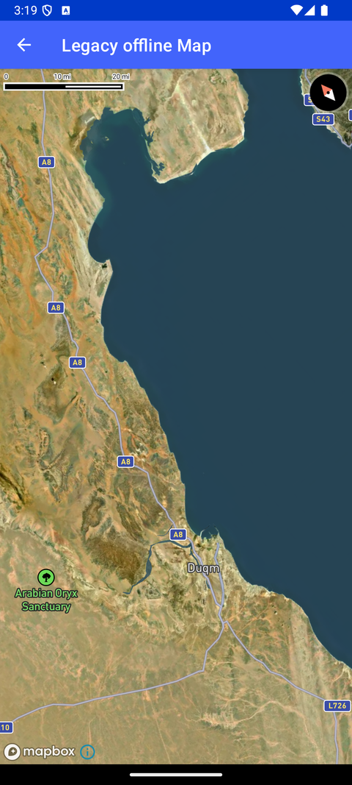

# 旧版离线地图（Legacy offline Map）

> 官方示例：[legacy-offline-map](https://docs.mapbox.com/android/maps/examples/android-view/legacy-offline-map/)

## 示例效果



## 功能说明

使用旧版 OfflineManager API 下载瓦片。

<details>
<summary>英文原文</summary>

This example demonstrates the process of downloading an offline region using the OfflineRegionManager and displaying a map at the offline region location using the Maps SDK for Android. The app creates an offline region based on specific parameters such as geometry, pixelRatio, minZoom, and maxZoom, and sets the style URL to Style.STANDARD_SATELLITE. The callback function OfflineRegionCreateCallback is used to handle the creation of the offline region, and an OfflineRegionObserver monitors the status of the download process, providing feedback on resource download progress and handling any errors that may occur. Once the offline region download is complete, a button is displayed to load the map at the defined offline region. Clicking the button creates a MapView with the specified style URI and adjusts the camera position based on the defined zoom level and center point. The map view is then set to be displayed on the screen by calling setContentView(mapView). Additionally, the app manages the lifecycle of the map view by calling onStart() when the activity starts, onStop() when the activity stops, and onDestroy() when the activity is destroyed, ensuring proper resource handling.

</details>

## 示例 Activity

- `LegacyOfflineActivity.kt`

## 示例代码

```kotlin
package com.mapbox.maps.testapp.examples

import android.os.Bundle
import android.view.View
import androidx.appcompat.app.AppCompatActivity
import com.mapbox.geojson.Point
import com.mapbox.maps.*
import com.mapbox.maps.testapp.databinding.ActivityLegacyOfflineBinding

/**
 * Example app that downloads an offline region and when succeeded
 * shows a button to load a map at the offline region definition.
 */
@Suppress("DEPRECATION")
class LegacyOfflineActivity : AppCompatActivity() {

  private lateinit var offlineManager: OfflineRegionManager
  private lateinit var offlineRegion: OfflineRegion
  private var mapView: MapView? = null
  private lateinit var binding: ActivityLegacyOfflineBinding

  private val regionObserver: OfflineRegionObserver = object : OfflineRegionObserver {
    override fun errorOccurred(error: OfflineRegionError) {
      if (error.isFatal) {
        logE(TAG, "Fatal error: ${error.type}, ${error.message}")
      } else {
        logW(TAG, "Error downloading some resources:  ${error.type}, ${error.message}")
      }
      offlineRegion.setOfflineRegionDownloadState(OfflineRegionDownloadState.INACTIVE)
    }

    override fun statusChanged(status: OfflineRegionStatus) {
      logD(
        TAG,
        "${status.completedResourceCount}/${status.requiredResourceCount} resources; ${status.completedResourceSize} bytes downloaded."
      )
      if (status.downloadState == OfflineRegionDownloadState.INACTIVE) {
        downloadComplete()
        return
      }
    }
  }

  private val callback: OfflineRegionCreateCallback = OfflineRegionCreateCallback { expected ->
    if (expected.isValue) {
      expected.value?.let {
        offlineRegion = it
        it.setOfflineRegionObserver(regionObserver)
        it.setOfflineRegionDownloadState(OfflineRegionDownloadState.ACTIVE)
      }
    } else {
      logE(TAG, expected.error!!)
    }
  }

  override fun onCreate(savedInstanceState: Bundle?) {
    super.onCreate(savedInstanceState)
    binding = ActivityLegacyOfflineBinding.inflate(layoutInflater)
    setContentView(binding.root)
    offlineManager = OfflineRegionManager()
    offlineManager.createOfflineRegion(
      OfflineRegionGeometryDefinition.Builder()
        .geometry(point)
        .pixelRatio(2f)
        .minZoom(zoom - 2)
        .maxZoom(zoom + 2)
        .styleURL(styleUrl)
        .glyphsRasterizationMode(GlyphsRasterizationMode.NO_GLYPHS_RASTERIZED_LOCALLY)
        .build(),
      callback
    )
  }

  private fun downloadComplete() {
    binding.downloadProgress.visibility = View.GONE
    binding.showMapButton.visibility = View.VISIBLE
    binding.showMapButton.setOnClickListener {
      it.visibility = View.GONE
      // create mapView
      mapView = MapView(
        this@LegacyOfflineActivity,
        MapInitOptions(context = this@LegacyOfflineActivity, styleUri = styleUrl)
      )
      mapView?.mapboxMap?.setCamera(CameraOptions.Builder().zoom(zoom).center(point).build())
      setContentView(mapView)

      mapView?.onStart()
    }
  }

  override fun onStart() {
    super.onStart()
    mapView?.onStart()
  }

  override fun onStop() {
    super.onStop()
    mapView?.onStop()
  }

  override fun onDestroy() {
    super.onDestroy()
    offlineRegion.invalidate { }
    mapView?.onDestroy()
  }

  companion object {
    private const val TAG = "Offline"
    private const val zoom = 16.0
    private val point: Point = Point.fromLngLat(57.818901, 20.071357)
    private const val styleUrl = Style.STANDARD_SATELLITE
  }
}
```

## 在 Aura 项目中使用

- UI 框架：**Android View**（与 Aura 当前 `MapFragment` + `MapView` 一致）
- 包名请替换为 `com.catclaw.aura`
- 需在 `local.properties` 配置 `MAPBOX_ACCESS_TOKEN`
- 部分示例依赖 `assets/` 或额外布局文件，请参考 GitHub 示例工程

## 参考链接

- [官方文档（英文）](https://docs.mapbox.com/android/maps/examples/android-view/legacy-offline-map/)
- [GitHub 源码](https://github.com/mapbox/mapbox-maps-android/blob/v11.24.3/app/src/main/java/com/mapbox/maps/testapp/examples/LegacyOfflineActivity.kt)
- [Android View 示例索引](./README.md)
- [Mapbox 中文指南](../../README.md)
