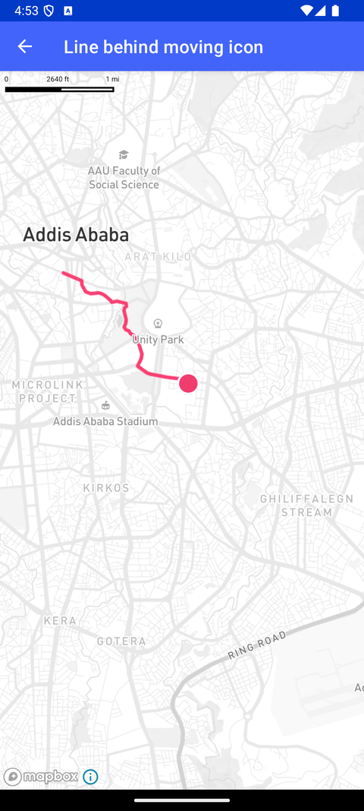

# 移动图标后的线（Line behind moving icon）

> 官方示例：[line-behind-moving-icon](https://docs.mapbox.com/android/maps/examples/android-view/line-behind-moving-icon/)

## 示例效果



## 功能说明

在移动图标后方绘制轨迹线。

<details>
<summary>英文原文</summary>

This example demonstrates using the Mapbox Directions API to make a directions request and then animating a SymbolLayer icon along the route's line coordinates with the Maps SDK for Android. The MovingIconWithTrailingLineActivity class includes methods to set up the map view, load a map style, fetch route data, animate the icon, and handle map data initialization. The initData method adds data to the map after loading the GeoJSON data obtained from the Directions API. The animate function sets up continuous movement of the icon along the route by creating a point animator. The getRoute method fetches route data using Mapbox Directions API. Various sources and symbol layers are initialized in initSources and initSymbolLayer methods, while the initDotLinePath method adds a   to visualize the marker icon's traversal path on the map. Finally, the class handles cancellation of API calls and animation cleanup in the onDestroy method.

</details>

## 示例 Activity

- `MovingIconWithTrailingLineActivity.kt`

## 示例代码

```kotlin
package com.mapbox.maps.testapp.examples.linesandpolygons

import android.animation.Animator
import android.animation.AnimatorListenerAdapter
import android.animation.TypeEvaluator
import android.animation.ValueAnimator
import android.graphics.BitmapFactory
import android.os.Bundle
import android.view.animation.LinearInterpolator
import android.widget.Toast
import androidx.appcompat.app.AppCompatActivity
import androidx.lifecycle.lifecycleScope
import com.mapbox.api.directions.v5.DirectionsCriteria
import com.mapbox.api.directions.v5.MapboxDirections
import com.mapbox.api.directions.v5.models.DirectionsResponse
import com.mapbox.api.directions.v5.models.RouteOptions
import com.mapbox.bindgen.Value
import com.mapbox.common.MapboxOptions
import com.mapbox.core.constants.Constants.PRECISION_6
import com.mapbox.geojson.Feature
import com.mapbox.geojson.FeatureCollection
import com.mapbox.geojson.LineString
import com.mapbox.geojson.Point
import com.mapbox.maps.EdgeInsets
import com.mapbox.maps.MapboxDelicateApi
import com.mapbox.maps.Style
import com.mapbox.maps.coroutine.awaitCameraForCoordinates
import com.mapbox.maps.coroutine.awaitStyle
import com.mapbox.maps.dsl.cameraOptions
import com.mapbox.maps.extension.style.layers.addLayer
import com.mapbox.maps.extension.style.layers.generated.lineLayer
import com.mapbox.maps.extension.style.layers.generated.symbolLayer
import com.mapbox.maps.extension.style.layers.properties.generated.LineCap
import com.mapbox.maps.extension.style.layers.properties.generated.LineJoin
import com.mapbox.maps.extension.style.sources.addSource
import com.mapbox.maps.extension.style.sources.generated.GeoJsonSource
import com.mapbox.maps.extension.style.sources.generated.geoJsonSource
import com.mapbox.maps.logE
import com.mapbox.maps.plugin.animation.MapAnimationOptions.Companion.mapAnimationOptions
import com.mapbox.maps.plugin.animation.easeTo
import com.mapbox.maps.testapp.R
import com.mapbox.maps.testapp.databinding.ActivityDdsMovingIconWithTrailingLineBinding
import com.mapbox.maps.toMapboxImage
import com.mapbox.turf.TurfMeasurement
import kotlinx.coroutines.launch
import retrofit2.Call
import retrofit2.Callback
import retrofit2.Response
import java.util.concurrent.CopyOnWriteArrayList

/**
 * Make a directions request with the Mapbox Directions API and then draw a line behind a moving
 * SymbolLayer icon which moves along the Directions response route.
 */
class MovingIconWithTrailingLineActivity : AppCompatActivity() {

  private lateinit var pointSource: GeoJsonSource
  private lateinit var lineSource: GeoJsonSource
  private lateinit var routeCoordinateList: MutableList<Point>
  private var markerLinePointList = CopyOnWriteArrayList<Point>()

  private var routeIndex: Int = 0
  private lateinit var currentAnimator: Animator
  private var directionsClient: MapboxDirections? = null

  private var count = 0
  private lateinit var binding: ActivityDdsMovingIconWithTrailingLineBinding

  override fun onCreate(savedInstanceState: Bundle?) {
    super.onCreate(savedInstanceState)
    binding = ActivityDdsMovingIconWithTrailingLineBinding.inflate(layoutInflater)
    setContentView(binding.root)
    binding.mapView.mapboxMap.loadStyle(
      Style.STANDARD
    ) { // Use the Mapbox Directions API to get a directions route
      getRoute()
      binding.mapView.mapboxMap.setStyleImportConfigProperty("basemap", "theme", Value.valueOf("monochrome"))
    }
  }

  /**
   * Add data to the map once the GeoJSON has been loaded
   *
   * @param featureCollection returned GeoJSON FeatureCollection from the Directions API route request
   */
  private fun initData(style: Style, featureCollection: FeatureCollection) {
    featureCollection.features()?.firstOrNull()?.geometry()?.let {
      (it as? LineString)?.let { lineString ->
        routeCoordinateList = lineString.coordinates()
        initSources(style, featureCollection)
        initSymbolLayer(style)
        initDotLinePath(style)
        animate()
      }
    }
  }

  /**
   * Set up the repeat logic for moving the icon along the route.
   */
  private fun animate() {
    if (routeCoordinateList.size - 1 > routeIndex) {
      val indexPoint = routeCoordinateList[routeIndex]
      val newPoint = Point.fromLngLat(indexPoint.longitude(), indexPoint.latitude())
      currentAnimator = createPointAnimator(indexPoint, newPoint)
      currentAnimator.start()
      routeIndex++
    }
  }

  private fun createPointAnimator(curretPosition: Point, targetPosition: Point): Animator {
    val pointEvaluator = TypeEvaluator<Point> { fraction, startValue, endValue ->
      Point.fromLngLat(
        startValue.longitude() + ((endValue.longitude() - startValue.longitude() * fraction)),
        startValue.latitude() + ((endValue.latitude() - startValue.latitude()) * fraction)
      )
    }
    return ValueAnimator.ofObject(pointEvaluator, curretPosition, targetPosition).apply {
      duration = TurfMeasurement.distance(curretPosition, targetPosition, "meters").toLong()
      interpolator = LinearInterpolator()

      addListener(object : AnimatorListenerAdapter() {
        override fun onAnimationEnd(animation: Animator) {
          super.onAnimationEnd(animation)
          animate()
        }
      })

      addUpdateListener { animation ->
        (animation.animatedValue as? Point)?.let {
          markerLinePointList.add(it)
          pointSource.geometry(it)
          if (++count > 1) {
            lineSource.geometry(LineString.fromLngLats(markerLinePointList))
          }
        }
      }
    }
  }

  private fun getRoute() {
    val routeOptions =
      RouteOptions.builder()
        .coordinatesList(listOf(originPoint, destinationPoint))
        .overview(DirectionsCriteria.OVERVIEW_FULL)
        .profile(DirectionsCriteria.PROFILE_WALKING)
        .build()
    directionsClient = MapboxDirections.builder()
      .routeOptions(routeOptions)
      .accessToken(MapboxOptions.accessToken)
      .build()

    directionsClient?.enqueueCall(object : Callback<DirectionsResponse> {
      override fun onResponse(
        call: Call<DirectionsResponse>,
        response: Response<DirectionsResponse>
      ) {
        response.body()?.let { body ->
          if (body.routes().size < 1) {
            logE(TAG, "No routes found")
            return
          }

          val currentRoute = body.routes()[0]
          lifecycleScope.launch {
            val map = binding.mapView.mapboxMap
            val cameraOptionsForCoordinates = map.awaitCameraForCoordinates(
              coordinates = listOf(originPoint, destinationPoint),
              camera = cameraOptions { },
              coordinatesPadding = EdgeInsets(50.0, 50.0, 50.0, 50.0),
              maxZoom = null,
              offset = null
            )
            map.easeTo(
              cameraOptionsForCoordinates,
              mapAnimationOptions {
                duration(5000L)
              }
            )
            currentRoute.geometry()?.let {
              initData(
                binding.mapView.mapboxMap.awaitStyle(),
                FeatureCollection.fromFeature(
                  Feature.fromGeometry(
                    LineString.fromPolyline(
                      it,
                      PRECISION_6
                    )
                  )
                )
              )
            }
          }
        } ?: run {
          logE(TAG, "No routes found, make sure you set the right user and access token.")
          return
        }
      }

      override fun onFailure(call: Call<DirectionsResponse>, t: Throwable) {
        logE(TAG, "Error: ${t.message}")
        Toast.makeText(
          this@MovingIconWithTrailingLineActivity,
          "Error: ${t.message}",
          Toast.LENGTH_SHORT
        ).show()
      }
    })
  }

  /**
   * Add various sources to the map.
   */
  private fun initSources(style: Style, featureCollection: FeatureCollection) {
    pointSource = geoJsonSource(DOT_SOURCE_ID) {
      featureCollection(featureCollection)
    }
    lineSource = geoJsonSource(LINE_SOURCE_ID) {
      featureCollection(featureCollection)
    }
    style.addSource(pointSource)
    style.addSource(lineSource)
  }

  /**
   * Add the marker icon SymbolLayer.
   */
  private fun initSymbolLayer(style: Style) {
    @OptIn(MapboxDelicateApi::class)
    val image = BitmapFactory.decodeResource(resources, R.drawable.pink_dot).toMapboxImage()
    style.addImage(MARKER_ID, image)
    style.addLayer(
      symbolLayer(SYMBOL_LAYER_ID, DOT_SOURCE_ID) {
        iconImage(MARKER_ID)
        iconSize(1.0)
        iconOffset(listOf(5.0, 5.0))
        iconIgnorePlacement(true)
        iconAllowOverlap(true)
      }
    )
  }

  /**
   * Add the LineLayer for the marker icon's travel route. Adding it under the "road-label-simple" layer, so that the
   * this LineLayer doesn't block the street name.
   */
  private fun initDotLinePath(style: Style) {
    style.addLayer(
      lineLayer(LINE_LAYER_ID, LINE_SOURCE_ID) {
        lineColor("#F13C6E")
        lineCap(LineCap.ROUND)
        lineJoin(LineJoin.ROUND)
        lineWidth(4.0)
        slot("middle")
      }
    )
  }

  override fun onDestroy() {
    super.onDestroy()
    directionsClient?.cancelCall()
    if (::currentAnimator.isInitialized) {
      currentAnimator.removeAllListeners()
      currentAnimator.cancel()
    }
  }

  companion object {
    private const val TAG = "MovingIconWithTrailingLineActivity"
    private const val DOT_SOURCE_ID = "dot-source-id"
    private const val LINE_SOURCE_ID = "line-source-id"
    private const val LINE_LAYER_ID = "line-layer-id"
    private const val MARKER_ID = "moving-red-marker"
    private const val SYMBOL_LAYER_ID = "symbol-layer-id"
    private val originPoint = Point.fromLngLat(38.7508, 9.0309)
    private val destinationPoint = Point.fromLngLat(38.795902, 8.984467)
  }
}
```

## 在 Aura 项目中使用

- UI 框架：**Android View**（与 Aura 当前 `MapFragment` + `MapView` 一致）
- 包名请替换为 `com.catclaw.aura`
- 需在 `local.properties` 配置 `MAPBOX_ACCESS_TOKEN`
- 部分示例依赖 `assets/` 或额外布局文件，请参考 GitHub 示例工程

## 参考链接

- [官方文档（英文）](https://docs.mapbox.com/android/maps/examples/android-view/line-behind-moving-icon/)
- [GitHub 源码](https://github.com/mapbox/mapbox-maps-android/blob/v11.24.3/app/src/main/java/com/mapbox/maps/testapp/examples/linesandpolygons/MovingIconWithTrailingLineActivity.kt)
- [Android View 示例索引](./README.md)
- [Mapbox 中文指南](../../README.md)
