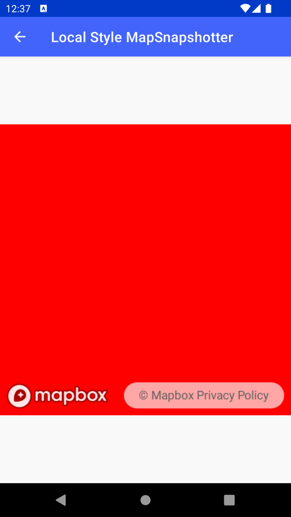

# 本地样式 MapSnapshotter（Local Style MapSnapshotter）

> 官方示例：[local-style-mapsnapshotter](https://docs.mapbox.com/android/maps/examples/android-view/local-style-mapsnapshotter/)

## 示例效果

## 功能说明

使用本地样式文件生成静态地图图片。

英文原文

This example demonstrates the process of creating a snapshot from a configuration that does not use a style Uniform Resource Identifier (URI) or JSON format with the Maps SDK for Android. The LocalStyleMapSnapshotterActivity class generates a snapshot of a map with a specific custom configuration. In this example, a Snapshotter instance is created with specified options such as size and pixel ratio using MapSnapshotOptions. The app sets the map's camera to a specific zoom level and center coordinates, and defines a custom style directly in the code using JSON format. After starting the snapshot process, the resulting bitmap is displayed on an ImageView which is then set as the content view of the activity.

## 示例 Activity

- `LocalStyleMapSnapshotterActivity.kt`

## 在 Aura 项目中使用

- UI 框架：**Android View**（与 Aura 当前 `MapFragment` + `MapView` 一致）
- 包名请替换为 `com.catclaw.aura`
- 需在 `local.properties` 配置 `MAPBOX_ACCESS_TOKEN`
- 部分示例依赖 `assets/` 或额外布局文件，请参考 GitHub 示例工程

## 参考链接

- [官方文档（英文）](https://docs.mapbox.com/android/maps/examples/android-view/local-style-mapsnapshotter/)
- [GitHub 源码](https://github.com/mapbox/mapbox-maps-android/blob/v11.24.3/app/src/main/java/com/mapbox/maps/testapp/examples/snapshotter/LocalStyleMapSnapshotterActivity.kt)
- [Android View 示例索引](./README.md)
- [Mapbox 中文指南](../../README.md)
