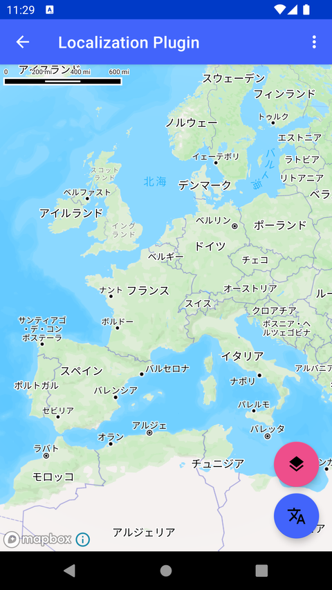

# 本地化插件（Localization Plugin）

> 官方示例：[localization-plugin](https://docs.mapbox.com/android/maps/examples/android-view/localization-plugin/)

## 示例效果



## 功能说明

将地图标签自动本地化为设备当前语言。

<details>
<summary>英文原文</summary>

This example demonstrates how to localize map labels client-side to a specific locale using the localizeLabels(locale: Locale) method provided by the MapboxStyleManager class in the Mapbox Maps SDK for Android. The example allows the user to change the map locale dynamically by selecting a specific locale from a list of language options, and then applying that locale which adds the language-specific labels to the map. The example also switches between Mapbox Streets styles which support this feature. This ability is supported across both v7 and v8 versions of the Mapbox style specification.  Note: this feature does not work with the Mapbox Standard style. This example uses classic Mapbox styles (for example: MAPBOX_STREETS,SATELLITE, OUTDOORS, etc). These styles are no longer maintained and may not include the latest features or updates. Developers are encouraged to use the Mapbox Standard or Mapbox Standard Satellite styles](https://docs.mapbox.com/map-styles/standard/guides#mapbox-standard-satellite) or to build a custom style using Mapbox Studio.

</details>

## 示例 Activity

- `LocalizationActivity.kt`

## 示例代码

```kotlin
package com.mapbox.maps.testapp.examples.localization

import android.os.Bundle
import android.view.Menu
import android.view.MenuItem
import android.widget.Toast
import androidx.appcompat.app.AppCompatActivity
import com.mapbox.maps.MapboxMap
import com.mapbox.maps.Style
import com.mapbox.maps.extension.localization.localizeLabels
import com.mapbox.maps.testapp.R
import com.mapbox.maps.testapp.databinding.ActivityMapLocalizationBinding
import java.util.*

/**
 * Example showcasing how to localize a map client side to a specific locale using Style#localizeLabels(locale: Locale).
 * This function will attempt to localize a map into a selected locale if the symbol layers are using
 * a Mapbox source and the locale is being provided as part of the vector source data.
 *
 * This feature supports both v7 and v8 of Mapbox style spec version and does not support [Style.STANDARD].
 */
class LocalizationActivity : AppCompatActivity() {
  private lateinit var mapboxMap: MapboxMap
  private var applySelectedLanguage: Boolean = false
  private var index: Int = 0
  private val styles =
    arrayOf(
      Style.MAPBOX_STREETS,
      MAPBOX_STREETS_V10
    )

  private val nextStyle: String
    get() {
      return styles[index++ % styles.size]
    }
  private lateinit var locale: Locale
  private lateinit var selectedLocale: Locale
  private var layerIdList = mutableSetOf<String>()

  override fun onCreate(savedInstanceState: Bundle?) {
    super.onCreate(savedInstanceState)
    val binding = ActivityMapLocalizationBinding.inflate(layoutInflater)
    setContentView(binding.root)
    @Suppress("DEPRECATION")
    locale = resources.configuration.locale
    selectedLocale = locale
    applySelectedLanguage = false
    Toast.makeText(this, R.string.change_language_instruction, Toast.LENGTH_LONG).show()
    mapboxMap = binding.mapView.mapboxMap
    mapboxMap.loadStyle(nextStyle) {
      it.localizeLabels(locale)
    }
    binding.fabStyles.setOnClickListener {
      val styleUri = nextStyle
      mapboxMap.loadStyle(styleUri) {
        it.localizeLabels(selectedLocale)
      }
      Toast.makeText(this, styleUri, Toast.LENGTH_SHORT).show()
    }
    binding.fabLocalize.setOnClickListener {
      applySelectedLanguage = if (!applySelectedLanguage) {
        mapboxMap.style?.localizeLabels(selectedLocale)
        Toast.makeText(this, R.string.map_not_localized, Toast.LENGTH_SHORT).show()
        true
      } else {
        mapboxMap.style?.localizeLabels(locale)
        Toast.makeText(this, R.string.map_localized, Toast.LENGTH_SHORT).show()
        false
      }
    }
  }

  override fun onCreateOptionsMenu(menu: Menu): Boolean {
    menuInflater.inflate(R.menu.menu_languages, menu)
    return true
  }

  override fun onOptionsItemSelected(item: MenuItem): Boolean {
    when (item.groupId) {
      R.id.layers -> {
        item.isChecked = !item.isChecked
        when (item.itemId) {
          R.id.country_label -> {
            if (item.isChecked) {
              layerIdList.add(COUNTRY_LABEL)
            } else {
              layerIdList.remove(COUNTRY_LABEL)
            }
          }
          R.id.state_label -> {
            if (item.isChecked) {
              layerIdList.add(STATE_LABEL)
            } else {
              layerIdList.remove(STATE_LABEL)
            }
          }
        }
      }
      R.id.group -> {
        applySelectedLanguage = true
        item.isChecked = true
        selectedLocale = when (item.itemId) {
          R.id.english -> Locale.ENGLISH
          R.id.spanish -> Locale("es", "ES")
          R.id.french -> Locale.FRENCH
          R.id.german -> Locale.GERMAN
          R.id.russian -> Locale("ru", "RU")
          R.id.chinese -> Locale.CHINESE
          R.id.simplified_chinese -> Locale.SIMPLIFIED_CHINESE
          R.id.portuguese -> Locale("pt", "PT")
          R.id.japanese -> Locale.JAPANESE
          R.id.korean -> Locale.KOREAN
          R.id.vietnamese -> Locale("vi", "VN")
          R.id.italian -> Locale.ITALIAN
          else -> locale
        }
      }
      else -> return super.onOptionsItemSelected(item)
    }
    mapboxMap.style?.localizeLabels(selectedLocale, layerIdList.toList())
    return true
  }

  companion object {
    private const val MAPBOX_STREETS_V10 = "mapbox://styles/mapbox/streets-v10"
    private const val STATE_LABEL = "state-label"
    private const val COUNTRY_LABEL = "country-label"
  }
}
```

## 在 Aura 项目中使用

- UI 框架：**Android View**（与 Aura 当前 `MapFragment` + `MapView` 一致）
- 包名请替换为 `com.catclaw.aura`
- 需在 `local.properties` 配置 `MAPBOX_ACCESS_TOKEN`
- 部分示例依赖 `assets/` 或额外布局文件，请参考 GitHub 示例工程

## 参考链接

- [官方文档（英文）](https://docs.mapbox.com/android/maps/examples/android-view/localization-plugin/)
- [GitHub 源码](https://github.com/mapbox/mapbox-maps-android/blob/v11.24.3/app/src/main/java/com/mapbox/maps/testapp/examples/localization/LocalizationActivity.kt)
- [Android View 示例索引](./README.md)
- [Mapbox 中文指南](../../README.md)
