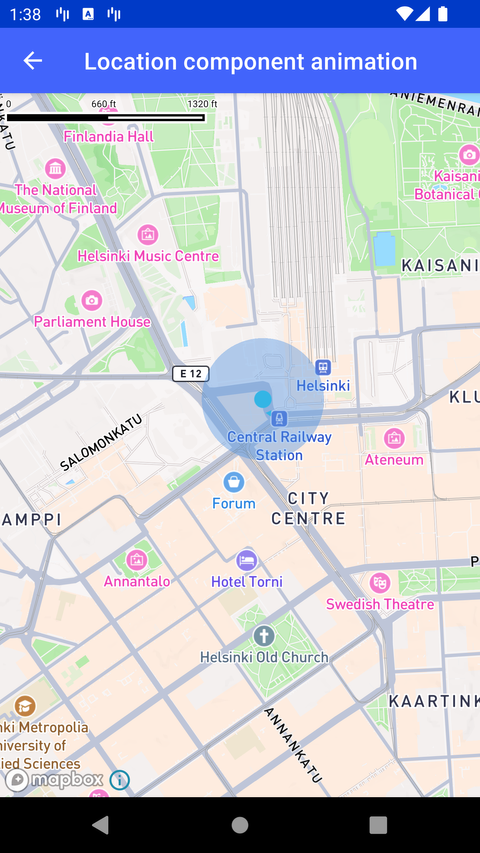

# 定位组件动画（Location component animation）

> 官方示例：[location-component-animation](https://docs.mapbox.com/android/maps/examples/android-view/location-component-animation/)

## 示例效果



## 功能说明

通过自定义 LocationProvider 更新驱动 puck 动画。

<details>
<summary>英文原文</summary>

This example illustrates the utilization of a custom LocationProvider and the transmission of location updates via LocationConsumer with the Mapbox Maps SDK for Android. The FakeLocationProvider class implemented in the example generates and emits fake location data. The emission frequency and animation parameters are dynamically adjusted during the sequence to show the effect on the smoothness and behavior of the location updates. Additionally, the example shows how to update the bearing of the location component's puck with specific transition settings.

</details>

## 示例 Activity

- `LocationComponentAnimationActivity.kt`

## 示例代码

```kotlin
package com.mapbox.maps.testapp.examples

import android.os.Bundle
import android.os.Handler
import android.os.Looper
import androidx.appcompat.app.AppCompatActivity
import androidx.interpolator.view.animation.FastOutSlowInInterpolator
import com.mapbox.geojson.Point
import com.mapbox.maps.CameraOptions
import com.mapbox.maps.ImageHolder
import com.mapbox.maps.MapboxMap
import com.mapbox.maps.Style
import com.mapbox.maps.plugin.LocationPuck2D
import com.mapbox.maps.plugin.PuckBearing
import com.mapbox.maps.plugin.locationcomponent.LocationConsumer
import com.mapbox.maps.plugin.locationcomponent.LocationProvider
import com.mapbox.maps.plugin.locationcomponent.location
import com.mapbox.maps.testapp.R
import com.mapbox.maps.testapp.databinding.ActivityLocationComponentAnimationBinding

/**
 * Example that demonstrates using custom [LocationProvider] and sending custom location updates
 * with [LocationConsumer] with using custom puck transition options.
 */
class LocationComponentAnimationActivity : AppCompatActivity() {

  private lateinit var mapboxMap: MapboxMap

  private var emitCount = 0
  private var delta = 0f
  private val handler = Handler(Looper.getMainLooper())

  private inner class FakeLocationProvider : LocationProvider {

    private var locationConsumer: LocationConsumer? = null

    private fun emitFakeLocations() {
      // after several first emits we update puck animator options
      if (emitCount == 5) {
        locationConsumer?.let {
          it.onPuckLocationAnimatorDefaultOptionsUpdated {
            // set same duration as our location emit frequency - it will make puck position change smooth
            duration = 2000
            interpolator = FastOutSlowInInterpolator()
          }
          it.onPuckBearingAnimatorDefaultOptionsUpdated {
            // set duration bigger than our location emit frequency -
            // this will result in cancelling ongoing animation and starting new one with a visible non-smooth `jump`
            duration = 5000
          }
        }
      }
      handler.postDelayed(
        {
          when (emitCount) {
            // set duration > location emit frequency -> location animator will interrupt running one
            // and start from last interpolated point. Because of constant change of target point
            // it will result in increasing puck speed.
            in 1..5 -> {
              locationConsumer?.onLocationUpdated(
                Point.fromLngLat(
                  POINT_LNG + delta,
                  POINT_LAT + delta
                )
              ) {
                duration = 4000
              }
            }
            // set duration = emit frequency -> location animators do not interrupt each other
            else -> {
              locationConsumer?.onLocationUpdated(
                Point.fromLngLat(
                  POINT_LNG + delta,
                  POINT_LAT + delta
                )
              )
            }
          }
          locationConsumer?.onBearingUpdated(BEARING + delta * 10000.0 * 5)
          delta += 0.001f
          emitCount++
          emitFakeLocations()
        },
        2000
      )
    }

    override fun registerLocationConsumer(locationConsumer: LocationConsumer) {
      this.locationConsumer = locationConsumer
      emitFakeLocations()
    }

    override fun unRegisterLocationConsumer(locationConsumer: LocationConsumer) {
      this.locationConsumer = null
      handler.removeCallbacksAndMessages(null)
    }
  }

  override fun onCreate(savedInstanceState: Bundle?) {
    super.onCreate(savedInstanceState)
    val binding = ActivityLocationComponentAnimationBinding.inflate(layoutInflater)
    setContentView(binding.root)
    mapboxMap = binding.mapView.mapboxMap.apply {
      loadStyle(
        Style.STANDARD
      ) {
        setCamera(
          CameraOptions.Builder()
            .zoom(14.0)
            .pitch(0.0)
            .bearing(0.0)
            .center(Point.fromLngLat(POINT_LNG, POINT_LAT))
            .build()
        )
        binding.mapView.location.apply {
          setLocationProvider(FakeLocationProvider())
          updateSettings {
            puckBearingEnabled = true
            puckBearing = PuckBearing.COURSE
            enabled = true
            locationPuck = LocationPuck2D(
              bearingImage = ImageHolder.from(R.drawable.mapbox_mylocation_icon_bearing),
            )
          }
        }
      }
    }
  }

  override fun onDestroy() {
    super.onDestroy()
    handler.removeCallbacksAndMessages(null)
  }

  companion object {
    private const val POINT_LAT = 60.1699
    private const val POINT_LNG = 24.9384
    private const val BEARING = 60.0
  }
}
```

## 在 Aura 项目中使用

- UI 框架：**Android View**（与 Aura 当前 `MapFragment` + `MapView` 一致）
- 包名请替换为 `com.catclaw.aura`
- 需在 `local.properties` 配置 `MAPBOX_ACCESS_TOKEN`
- 部分示例依赖 `assets/` 或额外布局文件，请参考 GitHub 示例工程

## 参考链接

- [官方文档（英文）](https://docs.mapbox.com/android/maps/examples/android-view/location-component-animation/)
- [GitHub 源码](https://github.com/mapbox/mapbox-maps-android/blob/v11.24.3/app/src/main/java/com/mapbox/maps/testapp/examples/LocationComponentAnimationActivity.kt)
- [Android View 示例索引](./README.md)
- [Mapbox 中文指南](../../README.md)
