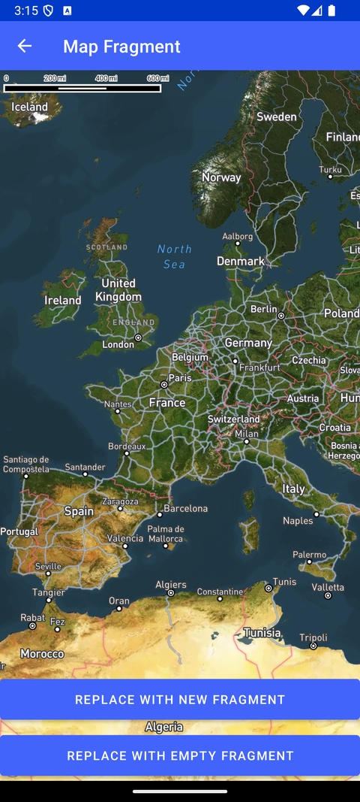

# Map Fragment（Map Fragment）

> 官方示例：[map-fragment](https://docs.mapbox.com/android/maps/examples/android-view/map-fragment/)

## 示例效果



## 功能说明

在 Fragment 中使用 MapView，并配合 Fragment 回退栈。

<details>
<summary>英文原文</summary>

This example demonstrates how to load a map within an Android fragment using the Mapbox Maps SDK for Android. The MapFragment in this example loads a satellite map style from Mapbox. The activity handles the addition of new fragments by replacing the current fragment with a new MapFragment instance, while managing the fragment back stack with unique identifiers. Additionally, a custom EmptyFragment class is included, displaying a text view within the fragment.

</details>

## 示例 Activity

- `FragmentBackStackActivity.kt`

## 示例代码

```kotlin
package com.mapbox.maps.testapp.examples

import android.annotation.SuppressLint
import android.os.Bundle
import android.view.LayoutInflater
import android.view.View
import android.view.ViewGroup
import android.widget.TextView
import androidx.appcompat.app.AppCompatActivity
import com.mapbox.maps.MapboxMap
import com.mapbox.maps.Style
import com.mapbox.maps.testapp.R
import com.mapbox.maps.testapp.databinding.ActivityEmptyFabBinding
import com.mapbox.maps.testapp.examples.fragment.MapFragment

class FragmentBackStackActivity : AppCompatActivity() {

  private lateinit var mapFragment: MapFragment

  override fun onCreate(savedInstanceState: Bundle?) {
    super.onCreate(savedInstanceState)
    val binding = ActivityEmptyFabBinding.inflate(layoutInflater)
    setContentView(binding.root)

    if (savedInstanceState == null) {
      mapFragment = MapFragment()
      mapFragment.getMapAsync {
        initMap(it)
      }
      supportFragmentManager.beginTransaction().apply {
        add(R.id.container, mapFragment, FRAGMENT_TAG)
      }.commit()
    } else {
      supportFragmentManager.findFragmentByTag(FRAGMENT_TAG)?.also { fragment ->
        if (fragment is MapFragment) {
          fragment.getMapAsync {
            initMap(it)
          }
        }
      }
    }

    binding.displayOnSecondDisplayButton.setOnClickListener { handleClick() }
    binding.fragmentButton.setOnClickListener { addNewFragment() }
  }

  private fun addNewFragment() {
    supportFragmentManager.beginTransaction().apply {
      replace(
        R.id.container,
        MapFragment().also {
          it.getMapAsync { mapboxMap -> initMap(mapboxMap) }
        }
      )
      addToBackStack("map_new_fragment_${System.currentTimeMillis()}")
    }.commit()
  }

  private fun initMap(mapboxMap: MapboxMap) {
    mapboxMap.loadStyle(Style.STANDARD_SATELLITE)
  }

  private fun handleClick() {
    supportFragmentManager.beginTransaction().apply {
      replace(R.id.container, EmptyFragment.newInstance())
      addToBackStack("map_empty_fragment")
    }.commit()
  }

  class EmptyFragment : androidx.fragment.app.Fragment() {

    companion object {
      fun newInstance(): EmptyFragment {
        return EmptyFragment()
      }
    }

    @SuppressLint("SetTextI18n")
    override fun onCreateView(
      inflater: LayoutInflater,
      container: ViewGroup?,
      savedInstanceState: Bundle?
    ): View {
      val textView = TextView(inflater.context)
      textView.text = "This is an empty Fragment"
      return textView
    }
  }

  companion object {
    private const val FRAGMENT_TAG = "map_fragment"
  }
}
```

## 在 Aura 项目中使用

- UI 框架：**Android View**（与 Aura 当前 `MapFragment` + `MapView` 一致）
- 包名请替换为 `com.catclaw.aura`
- 需在 `local.properties` 配置 `MAPBOX_ACCESS_TOKEN`
- 部分示例依赖 `assets/` 或额外布局文件，请参考 GitHub 示例工程

## 参考链接

- [官方文档（英文）](https://docs.mapbox.com/android/maps/examples/android-view/map-fragment/)
- [GitHub 源码](https://github.com/mapbox/mapbox-maps-android/blob/v11.24.3/app/src/main/java/com/mapbox/maps/testapp/examples/FragmentBackStackActivity.kt)
- [Android View 示例索引](./README.md)
- [Mapbox 中文指南](../../README.md)
