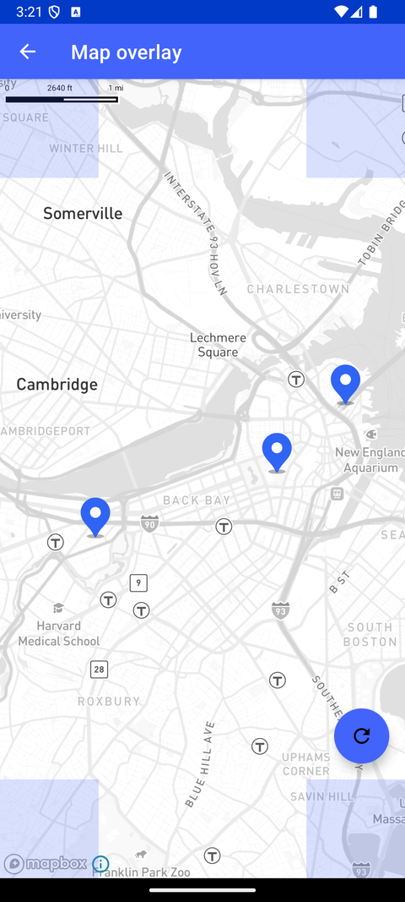

# 地图 Overlay（Map overlay）

> 官方示例：[map-overlay](https://docs.mapbox.com/android/maps/examples/android-view/map-overlay/)

## 示例效果



## 功能说明

使用 Map Overlay 功能。

<details>
<summary>英文原文</summary>

This example demonstrates using the MapOverlayPlugin to reframe dynamic map content within an overlay with the Mapbox Maps SDK for Android. This example creates an overlay layer with text views in each of the 4 corners of the viewport and includes 3 markers loading onto the map.  When clicking on the map, a new marker is added at every click location.  When a user clicks the FloatingActionButton in activity_map_overlay.xml the map moves to reframe all markers within the selected overlay area.

</details>

## 示例 Activity

- `MapOverlayActivity.kt`

## 示例代码

```kotlin
package com.mapbox.maps.testapp.examples

import android.os.Bundle
import androidx.appcompat.app.AppCompatActivity
import androidx.core.content.ContextCompat
import androidx.core.graphics.drawable.toBitmap
import com.mapbox.bindgen.Value
import com.mapbox.geojson.Feature
import com.mapbox.geojson.FeatureCollection
import com.mapbox.geojson.Point
import com.mapbox.maps.MapboxMap
import com.mapbox.maps.Style
import com.mapbox.maps.extension.style.image.image
import com.mapbox.maps.extension.style.layers.generated.symbolLayer
import com.mapbox.maps.extension.style.sources.generated.GeoJsonSource
import com.mapbox.maps.extension.style.sources.generated.geoJsonSource
import com.mapbox.maps.extension.style.sources.getSourceAs
import com.mapbox.maps.extension.style.style
import com.mapbox.maps.plugin.animation.MapAnimationOptions.Companion.mapAnimationOptions
import com.mapbox.maps.plugin.animation.camera
import com.mapbox.maps.plugin.gestures.OnMapClickListener
import com.mapbox.maps.plugin.gestures.addOnMapClickListener
import com.mapbox.maps.plugin.overlay.MapOverlayCoordinatesProvider
import com.mapbox.maps.plugin.overlay.MapOverlayPlugin
import com.mapbox.maps.plugin.overlay.mapboxOverlay
import com.mapbox.maps.testapp.R
import com.mapbox.maps.testapp.databinding.ActivityMapOverlayBinding

class MapOverlayActivity : AppCompatActivity(), OnMapClickListener {

  private val markerCoordinates = mutableListOf<Point>(
    Point.fromLngLat(-71.065634, 42.354950), // Boston Common Park
    Point.fromLngLat(-71.097293, 42.346645), // Fenway Park
    Point.fromLngLat(-71.053694, 42.363725) // The Paul Revere House
  )
  private lateinit var mapOverlayPlugin: MapOverlayPlugin
  private lateinit var mapboxMap: MapboxMap
  private val provider = MapOverlayCoordinatesProvider { markerCoordinates }
  private lateinit var binding: ActivityMapOverlayBinding

  override fun onCreate(savedInstanceState: Bundle?) {
    super.onCreate(savedInstanceState)
    binding = ActivityMapOverlayBinding.inflate(layoutInflater)
    setContentView(binding.root)

    mapboxMap = binding.mapView.mapboxMap
    mapboxMap.loadStyle(
      styleExtension = style(Style.STANDARD) {
        +geoJsonSource(sourceId) {
          featureCollection(
            FeatureCollection.fromFeatures(
              markerCoordinates.map {
                Feature.fromGeometry(it)
              }
            )
          )
        }
        // Add the marker image to map
        +image(
          imageId,
          ContextCompat.getDrawable(
            this@MapOverlayActivity,
            R.drawable.ic_blue_marker
          )!!.toBitmap()
        )
        +symbolLayer(layerId, sourceId) {
          iconImage(imageId)
          iconAllowOverlap(true)
          iconOffset(listOf(0.0, -9.0))
        }
      }
    ) {
      mapboxMap.addOnMapClickListener(this@MapOverlayActivity)
      mapboxMap.setStyleImportConfigProperty("basemap", "theme", Value.valueOf("monochrome"))
    }
    mapOverlayPlugin = binding.mapView.mapboxOverlay
      .apply {
        registerMapOverlayCoordinatesProvider(provider)
        registerOverlay(binding.locationTopLeft)
        registerOverlay(binding.locationTopRight)
        registerOverlay(binding.locationBottomLeft)
        registerOverlay(binding.locationBottomRight)
        registerOverlay(binding.reframeButton)
        setDisplayingAreaMargins(100, 50, 50, 50)
      }

    val cameraAnimationsPlugin = binding.mapView.camera
    binding.reframeButton.setOnClickListener {
      mapOverlayPlugin.reframe { it?.let { cameraAnimationsPlugin.flyTo(it, mapAnimationOptions { duration(1000L) }) } }
    }
  }

  override fun onMapClick(point: Point): Boolean {
    markerCoordinates.add(point)
    mapboxMap.style?.getSourceAs<GeoJsonSource>(sourceId)!!.featureCollection(
      FeatureCollection.fromFeatures(
        markerCoordinates.map {
          Feature.fromGeometry(it)
        }
      )
    )
    return true
  }

  companion object {
    private const val sourceId = "marker-source"
    private const val imageId = "marker-image"
    private const val layerId = "marker-layer"
  }
}
```

## 在 Aura 项目中使用

- UI 框架：**Android View**（与 Aura 当前 `MapFragment` + `MapView` 一致）
- 包名请替换为 `com.catclaw.aura`
- 需在 `local.properties` 配置 `MAPBOX_ACCESS_TOKEN`
- 部分示例依赖 `assets/` 或额外布局文件，请参考 GitHub 示例工程

## 参考链接

- [官方文档（英文）](https://docs.mapbox.com/android/maps/examples/android-view/map-overlay/)
- [GitHub 源码](https://github.com/mapbox/mapbox-maps-android/blob/v11.24.3/app/src/main/java/com/mapbox/maps/testapp/examples/MapOverlayActivity.kt)
- [Android View 示例索引](./README.md)
- [Mapbox 中文指南](../../README.md)
