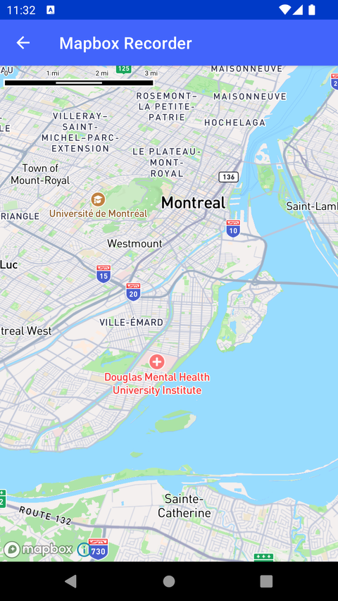

# Mapbox Recorder（Mapbox Recorder）

> 官方示例：[mapbox-recorder](https://docs.mapbox.com/android/maps/examples/android-view/mapbox-recorder/)

## 示例效果



## 功能说明

使用 MapboxMapRecorder 录制与回放地图会话。

<details>
<summary>英文原文</summary>

This example demonstrates how to use the MapboxMapRecorder to record and replay sessions with the Mapbox Maps SDK for Android. The example creates a map view (disabling map panning gestures) and initiates the recording process by starting the recorder. The map then animates to a specified location using cameraOptions and a flyTo animation. When the animation completes, the map recording is stopped, and the recorded sequence is stored for potential playback. The recorded sequence is then replayed twice at double speed by calling the replay method of the recorder and passing the desired MapPlayerOptions.

</details>

## 示例 Activity

- `MapboxMapRecorderActivity.kt`

## 示例代码

```kotlin
package com.mapbox.maps.testapp.examples

import android.animation.Animator
import android.animation.AnimatorListenerAdapter
import android.os.Bundle
import androidx.appcompat.app.AppCompatActivity
import com.mapbox.geojson.Point
import com.mapbox.maps.MapView
import com.mapbox.maps.MapboxExperimental
import com.mapbox.maps.MapboxMapRecorder
import com.mapbox.maps.Style
import com.mapbox.maps.dsl.cameraOptions
import com.mapbox.maps.logI
import com.mapbox.maps.mapPlayerOptions
import com.mapbox.maps.plugin.animation.MapAnimationOptions.Companion.mapAnimationOptions
import com.mapbox.maps.plugin.animation.flyTo
import com.mapbox.maps.plugin.gestures.gestures

/**
 * Showcase how to use [MapboxMapRecorder] to record and replay sessions.
 */
@OptIn(MapboxExperimental::class)
class MapboxMapRecorderActivity : AppCompatActivity() {

  private var activityStopped = false

  override fun onCreate(savedInstanceState: Bundle?) {
    super.onCreate(savedInstanceState)
    val mapView = MapView(this)
    setContentView(mapView)

    // do not allow panning the map in this activity
    mapView.gestures.scrollEnabled = false
    val mapboxMap = mapView.mapboxMap
    // Make the ``MapboxMapRecorder`` and start the recording
    val recorder = mapboxMap.createRecorder()
    recorder.startRecording()
    mapboxMap.loadStyle(Style.STANDARD) {
      // Build a new set of CameraOptions for the map to fly to
      val cameraOptions = cameraOptions {
        center(Point.fromLngLat(-73.581, 45.4588))
        zoom(11.0)
        pitch(35.0)
      }
      mapboxMap.flyTo(
        cameraOptions,
        mapAnimationOptions { duration(10_000L) },
        object : AnimatorListenerAdapter() {
          override fun onAnimationEnd(animation: Animator) {
            // When the camera animation is complete, stop the map recording
            val recording = recorder.stopRecording()
            if (activityStopped) {
              return
            }
            // Replay the camera animation twice at double speed by passing the recorded sequence returned from the stop method
            logI(TAG, "Replay started")
            recorder.replay(
              recording,
              mapPlayerOptions {
                playbackCount(2)
                playbackSpeedMultiplier(2.0)
                avoidPlaybackPauses(false)
              }
            ) {
              logI(TAG, "Replay ended, state = ${recorder.getPlaybackState()}")
            }
          }
        }
      )
    }
  }

  override fun onStop() {
    activityStopped = true
    // super.onStop will cancel the animation above and call onAnimationEnd
    super.onStop()
  }

  private companion object {
    private const val TAG = "MapboxMapRecorderActivity"
  }
}
```

## 在 Aura 项目中使用

- UI 框架：**Android View**（与 Aura 当前 `MapFragment` + `MapView` 一致）
- 包名请替换为 `com.catclaw.aura`
- 需在 `local.properties` 配置 `MAPBOX_ACCESS_TOKEN`
- 部分示例依赖 `assets/` 或额外布局文件，请参考 GitHub 示例工程

## 参考链接

- [官方文档（英文）](https://docs.mapbox.com/android/maps/examples/android-view/mapbox-recorder/)
- [GitHub 源码](https://github.com/mapbox/mapbox-maps-android/blob/v11.24.3/app/src/main/java/com/mapbox/maps/testapp/examples/MapboxMapRecorderActivity.kt)
- [Android View 示例索引](./README.md)
- [Mapbox 中文指南](../../README.md)
