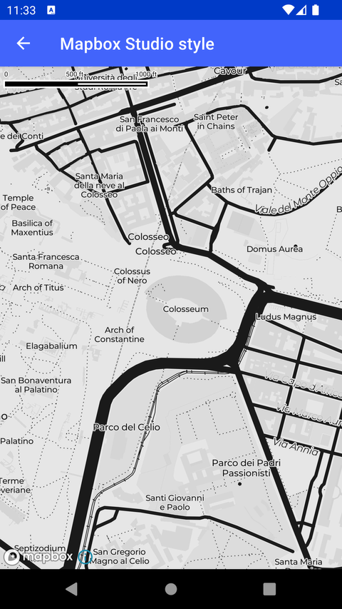

# Mapbox Studio 样式（Mapbox Studio style）

> 官方示例：[mapbox-studio-style](https://docs.mapbox.com/android/maps/examples/android-view/mapbox-studio-style/)

## 示例效果



## 功能说明

加载在 Mapbox Studio 中设计的自定义样式。

<details>
<summary>英文原文</summary>

This example demonstrates how to display a custom Mapbox-hosted style in using the Mapbox Maps SDK for Android. This example sets a default style URI specified in the layout file activity_style_mapbox_studio.xml. When the onCreate() method is called, it inflates the layout using the ActivityStyleMapboxStudioBinding and sets the content view to display the Mapbox-hosted style on the screen.

</details>

## 示例 Activity

- `MapboxStudioStyleActivity.kt`

## 示例代码

```kotlin
package com.mapbox.maps.testapp.examples

import android.os.Bundle
import androidx.appcompat.app.AppCompatActivity
import com.mapbox.maps.testapp.databinding.ActivityStyleMapboxStudioBinding

/**
 * Example of displaying a custom Mapbox-hosted style, the default style uri is set in layout file.
 */
class MapboxStudioStyleActivity : AppCompatActivity() {

  override fun onCreate(savedInstanceState: Bundle?) {
    super.onCreate(savedInstanceState)
    val binding = ActivityStyleMapboxStudioBinding.inflate(layoutInflater)
    setContentView(binding.root)
  }
}
```

## 在 Aura 项目中使用

- UI 框架：**Android View**（与 Aura 当前 `MapFragment` + `MapView` 一致）
- 包名请替换为 `com.catclaw.aura`
- 需在 `local.properties` 配置 `MAPBOX_ACCESS_TOKEN`
- 部分示例依赖 `assets/` 或额外布局文件，请参考 GitHub 示例工程

## 参考链接

- [官方文档（英文）](https://docs.mapbox.com/android/maps/examples/android-view/mapbox-studio-style/)
- [GitHub 源码](https://github.com/mapbox/mapbox-maps-android/blob/v11.24.3/app/src/main/java/com/mapbox/maps/testapp/examples/MapboxStudioStyleActivity.kt)
- [Android View 示例索引](./README.md)
- [Mapbox 中文指南](../../README.md)
