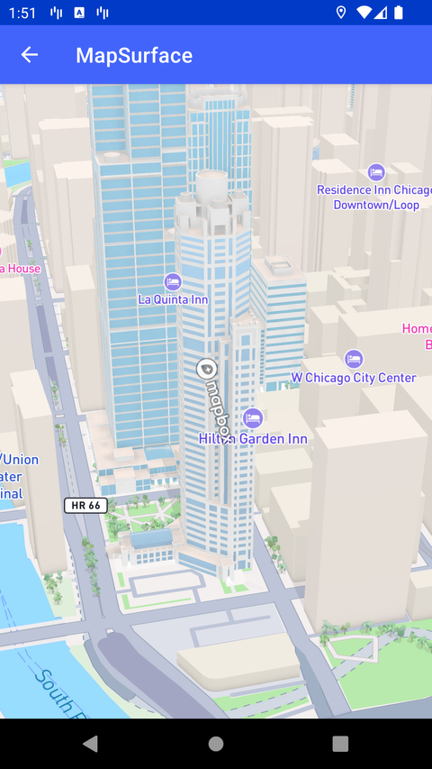

# MapSurface（MapSurface）

> 官方示例：[mapsurface](https://docs.mapbox.com/android/maps/examples/android-view/mapsurface/)

## 示例效果



## 功能说明

使用 MapSurface + SurfaceView 宿主与 Widget。

<details>
<summary>英文原文</summary>

This example demonstrates using the MapSurface class of the Mapbox Maps SDK for Android. MapSurface is used to setup an embeddable map interface and this example uses Android's native surfaceHolder to hold the surface.  The example loads a map style with tile borders visible, and it handles touch events in the SurfaceActivity class. The example adds two widgets which render the Mapbox logo on the map surface, one rotating in the center of the viewport and one static in the bottom left, to showcase rendering functionality and positioning.

</details>

## 示例 Activity

- `SurfaceActivity.kt`

## 示例代码

```kotlin
package com.mapbox.maps.testapp.examples

import android.animation.ValueAnimator
import android.annotation.SuppressLint
import android.content.Context
import android.graphics.BitmapFactory
import android.os.Bundle
import android.view.SurfaceHolder
import androidx.appcompat.app.AppCompatActivity
import com.mapbox.maps.*
import com.mapbox.maps.renderer.widget.BitmapWidget
import com.mapbox.maps.renderer.widget.WidgetPosition
import com.mapbox.maps.testapp.databinding.ActivitySurfaceBinding

/**
 * Example integration with MapSurface through using SurfaceView directly.
 */
@OptIn(MapboxExperimental::class)
class SurfaceActivity : AppCompatActivity(), SurfaceHolder.Callback {

  private lateinit var surfaceHolder: SurfaceHolder
  private lateinit var mapSurface: MapSurface
  private val animator = ValueAnimator.ofFloat(0f, 1f).also {
    it.duration = ANIMATION_DURATION
    it.repeatCount = ValueAnimator.INFINITE
  }

  @SuppressLint("ClickableViewAccessibility")
  public override fun onCreate(savedInstanceState: Bundle?) {
    super.onCreate(savedInstanceState)
    val binding = ActivitySurfaceBinding.inflate(layoutInflater)
    setContentView(binding.root)

    // Setup map surface
    surfaceHolder = binding.surface.holder
    surfaceHolder.addCallback(this)
    val mapOptions = MapInitOptions.getDefaultMapOptions(this).toBuilder().also {
      it.contextMode(ContextMode.SHARED)
    }.build()
    val mapInitOptions = MapInitOptions(this, mapOptions = mapOptions)
    mapSurface = MapSurface(
      this,
      surfaceHolder.surface,
      mapInitOptions,
    )

    // Show tile borders to make sure widgets are still rendered as expected
    mapSurface.mapboxMap.setDebug(
      listOf(MapDebugOptions.TILE_BORDERS),
      enabled = true
    )

    // Load a map style
    mapSurface.mapboxMap.loadStyle(Style.STANDARD)

    // Touch handling (verify plugin integration)
    binding.surface.setOnTouchListener { _, event -> mapSurface.onTouchEvent(event) }
    binding.surface.setOnGenericMotionListener { _, event -> mapSurface.onGenericMotionEvent(event) }

    val widgetPosition = WidgetPosition
      .Builder()
      .setHorizontalAlignment(WidgetPosition.Horizontal.CENTER)
      .setVerticalAlignment(WidgetPosition.Vertical.CENTER)
      .build()
    val rotatingWidget = LogoWidget(this, widgetPosition)
    mapSurface.addWidget(rotatingWidget)
    animator.addUpdateListener {
      val angle = (it.animatedFraction * 360f) % 360f
      rotatingWidget.setRotation(angle)
    }
    animator.start()

    // add second widget to make sure both are rendered
    val staticWidgetPosition = WidgetPosition
      .Builder()
      .setHorizontalAlignment(WidgetPosition.Horizontal.LEFT)
      .setVerticalAlignment(WidgetPosition.Vertical.BOTTOM)
      .setOffsetX(20f)
      .setOffsetY(-20f)
      .build()
    mapSurface.addWidget(LogoWidget(this, staticWidgetPosition))
  }

  override fun surfaceCreated(holder: SurfaceHolder) {
    mapSurface.surfaceCreated()
  }

  override fun surfaceChanged(holder: SurfaceHolder, format: Int, width: Int, height: Int) {
    mapSurface.surfaceChanged(width, height)
  }

  override fun surfaceDestroyed(holder: SurfaceHolder) {
    mapSurface.surfaceDestroyed()
  }

  override fun onStart() {
    super.onStart()
    mapSurface.onStart()
  }

  override fun onStop() {
    super.onStop()
    mapSurface.onStop()
  }

  override fun onDestroy() {
    super.onDestroy()
    mapSurface.onDestroy()
  }

  override fun onResume() {
    super.onResume()
    animator.resume()
  }

  override fun onPause() {
    super.onPause()
    animator.pause()
  }

  private companion object {
    private const val ANIMATION_DURATION = 10000L
  }

  private class LogoWidget constructor(context: Context, position: WidgetPosition) : BitmapWidget(
    BitmapFactory.decodeResource(context.resources, R.drawable.mapbox_logo_icon),
    position,
  )
}
```

## 在 Aura 项目中使用

- UI 框架：**Android View**（与 Aura 当前 `MapFragment` + `MapView` 一致）
- 包名请替换为 `com.catclaw.aura`
- 需在 `local.properties` 配置 `MAPBOX_ACCESS_TOKEN`
- 部分示例依赖 `assets/` 或额外布局文件，请参考 GitHub 示例工程

## 参考链接

- [官方文档（英文）](https://docs.mapbox.com/android/maps/examples/android-view/mapsurface/)
- [GitHub 源码](https://github.com/mapbox/mapbox-maps-android/blob/v11.24.3/app/src/main/java/com/mapbox/maps/testapp/examples/SurfaceActivity.kt)
- [Android View 示例索引](./README.md)
- [Mapbox 中文指南](../../README.md)
