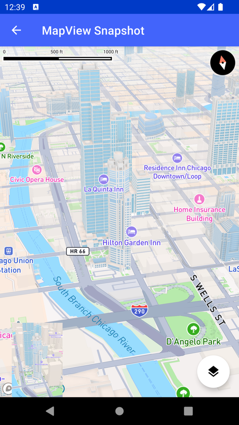

# MapView 快照（MapView Snapshot）

> 官方示例：[mapview-snapshot](https://docs.mapbox.com/android/maps/examples/android-view/mapview-snapshot/)

## 示例效果



## 功能说明

从 MapView 创建 Bitmap 快照。

<details>
<summary>英文原文</summary>

This example demonstrates how to capture a snapshot or screenshot of a map using the snapShot method of the Mapbox Maps SDK for Android. Clicking the floating action button (fab) triggers the snapshot method of the map view to take a snapshot of the map. The resulting bitmap image is then set as the image source of the ImageView using a post method, allowing the captured map snapshot to be displayed in the user interface. This example uses the snapShot method. This functionality can also be accomplished using the snapShotter class which provides more robust options for creating and handling snapshots.  See the DDS Snapshotter and Local Style MapSnapshotter examples for more information on using SnapShotter.

</details>

## 示例 Activity

- `MapViewSnapshotActivity.kt`

## 示例代码

```kotlin
package com.mapbox.maps.testapp.examples.snapshotter

import android.os.Bundle
import android.widget.ImageView
import androidx.appcompat.app.AppCompatActivity
import com.mapbox.maps.MapboxMap
import com.mapbox.maps.Snapshotter
import com.mapbox.maps.Style
import com.mapbox.maps.testapp.databinding.ActivityViewSnapshotBinding

/**
 * Example demonstrating taking simple snapshot or screenshot not using [Snapshotter] appearing
 * in bottom-left corner as [ImageView].
 */
class MapViewSnapshotActivity : AppCompatActivity() {

  private lateinit var mapboxMap: MapboxMap

  override fun onCreate(savedInstanceState: Bundle?) {
    super.onCreate(savedInstanceState)
    val binding = ActivityViewSnapshotBinding.inflate(layoutInflater)
    setContentView(binding.root)

    mapboxMap = binding.mapView.mapboxMap
    mapboxMap.loadStyle(Style.STANDARD)

    binding.fab.setOnClickListener {
      binding.mapView.snapshot { bitmap ->
        binding.imageView.post {
          binding.imageView.setImageBitmap(bitmap)
        }
      }
    }
  }
}
```

## 在 Aura 项目中使用

- UI 框架：**Android View**（与 Aura 当前 `MapFragment` + `MapView` 一致）
- 包名请替换为 `com.catclaw.aura`
- 需在 `local.properties` 配置 `MAPBOX_ACCESS_TOKEN`
- 部分示例依赖 `assets/` 或额外布局文件，请参考 GitHub 示例工程

## 参考链接

- [官方文档（英文）](https://docs.mapbox.com/android/maps/examples/android-view/mapview-snapshot/)
- [GitHub 源码](https://github.com/mapbox/mapbox-maps-android/blob/v11.24.3/app/src/main/java/com/mapbox/maps/testapp/examples/snapshotter/MapViewSnapshotActivity.kt)
- [Android View 示例索引](./README.md)
- [Mapbox 中文指南](../../README.md)
