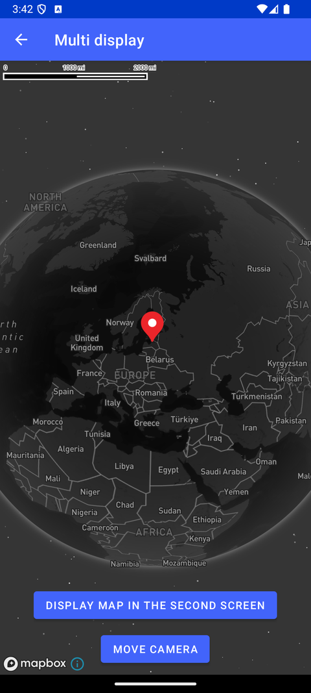

# 多屏显示（Multi display）

> 官方示例：[multi-display](https://docs.mapbox.com/android/maps/examples/android-view/multi-display/)

## 示例效果



## 功能说明

在副屏（第二显示器）上显示地图。

<details>
<summary>英文原文</summary>

This example demonstrates how to display a map on a secondary screen using the Mapbox Maps SDK for Android. The code includes functionality to load a map style, move the camera to a specific location, and display the map on a secondary screen. To use this example, a second display needs to be attached to the device or the simulated secondary display enabled in the developer settings. Within MultiDisplayActivity.kt, the map is loaded with a Mapbox Standard style with a night LightPreset in the main device screen and a day LightPreset in the secondary screen. By utilizing DisplayManager, it checks for available displays and uses ActivityOptions to select the secondary screen. If the app does not detect a second screen, it displays a toast message stating "Second screen not found." Note, the code below is only the main activity file and this utilizes the following resource layout files: activity_secondary_display_presentation.xml.

</details>

## 示例 Activity

- `MultiDisplayActivity.kt`

## 示例代码

```kotlin
<?xml version="1.0" encoding="utf-8"?>
<RelativeLayout xmlns:android="http://schemas.android.com/apk/res/android"
    xmlns:tools="http://schemas.android.com/tools"
    android:layout_width="match_parent"
    android:layout_height="match_parent"
    tools:context=".examples.MultiDisplayActivity">

    <com.mapbox.maps.MapView
        android:id="@+id/mapView"
        android:layout_width="match_parent"
        android:layout_height="match_parent" />

    <LinearLayout
        android:layout_width="wrap_content"
        android:layout_height="wrap_content"
        android:layout_centerHorizontal="true"
        android:layout_alignParentBottom="true"
        android:orientation="vertical"
        android:gravity="center"
        android:layout_marginBottom="10dp">

        <Button
            android:id="@+id/displayOnSecondDisplayButton"
            android:layout_width="wrap_content"
            android:layout_height="wrap_content"
            android:layout_marginBottom="10dp"
            android:text="@string/display_the_second_screen" />

        <Button
            android:id="@+id/moveCameraButton"
            android:layout_width="wrap_content"
            android:layout_height="wrap_content"
            android:text="@string/move_camera" />

    </LinearLayout>
</RelativeLayout>
```

## 在 Aura 项目中使用

- UI 框架：**Android View**（与 Aura 当前 `MapFragment` + `MapView` 一致）
- 包名请替换为 `com.catclaw.aura`
- 需在 `local.properties` 配置 `MAPBOX_ACCESS_TOKEN`
- 部分示例依赖 `assets/` 或额外布局文件，请参考 GitHub 示例工程

## 参考链接

- [官方文档（英文）](https://docs.mapbox.com/android/maps/examples/android-view/multi-display/)
- [GitHub 源码](https://github.com/mapbox/mapbox-maps-android/blob/main/app/src/main/res/layout/activity_multi_display.xml)
- [Android View 示例索引](./README.md)
- [Mapbox 中文指南](../../README.md)
