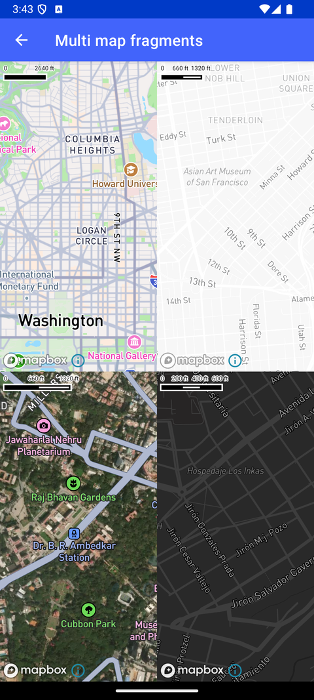

# 多 Map Fragment（Multi map fragments）

> 官方示例：[multi-map-fragments](https://docs.mapbox.com/android/maps/examples/android-view/multi-map-fragments/)

## 示例效果



## 功能说明

在同一 Activity 中使用多个地图 Fragment。

<details>
<summary>英文原文</summary>

This example demonstrates how to use multiple map views within a single activity using fragments and the Mapbox Maps SDK for Android. The code includes logic to create and set up four different map views with distinct styles and locations. Each map fragment is initialized with a specific style using the initFragmentStyle method, which loads the specified Style and sets the camera position using the CameraOptions generated by the generateCamera method.

</details>

## 示例 Activity

- `MultiMapActivity.kt`

## 示例代码

```kotlin
package com.mapbox.maps.testapp.examples

import android.os.Bundle
import androidx.appcompat.app.AppCompatActivity
import com.mapbox.geojson.Point
import com.mapbox.maps.CameraOptions
import com.mapbox.maps.Style
import com.mapbox.maps.testapp.R
import com.mapbox.maps.testapp.examples.fragment.MapFragment

/**
 * Example showing using several map views in one activity.
 */
class MultiMapActivity : AppCompatActivity() {

  override fun onCreate(savedInstanceState: Bundle?) {
    super.onCreate(savedInstanceState)
    setContentView(R.layout.activity_multi_map)
    initFragmentStyle(R.id.map1, Style.STANDARD, generateCamera(38.913187, -77.032546, 12.0))
    initFragmentStyle(R.id.map2, Style.LIGHT, generateCamera(37.775732, -122.413985, 13.0))
    initFragmentStyle(R.id.map3, Style.STANDARD_SATELLITE, generateCamera(12.97913, 77.59188, 14.0))
    initFragmentStyle(R.id.map4, Style.DARK, generateCamera(-13.155980, -74.217134, 15.0))
  }

  private fun initFragmentStyle(
    fragmentId: Int,
    styleId: String,
    cameraOptions: CameraOptions
  ) {
    val fragment = supportFragmentManager.findFragmentById(fragmentId) as MapFragment
    fragment.getMapAsync {
      it.setCamera(cameraOptions)
      it.loadStyle(styleId)
    }
  }

  private fun generateCamera(lat: Double, lng: Double, zoom: Double): CameraOptions {
    return CameraOptions.Builder().center(Point.fromLngLat(lng, lat)).zoom(zoom).build()
  }
}
```

## 在 Aura 项目中使用

- UI 框架：**Android View**（与 Aura 当前 `MapFragment` + `MapView` 一致）
- 包名请替换为 `com.catclaw.aura`
- 需在 `local.properties` 配置 `MAPBOX_ACCESS_TOKEN`
- 部分示例依赖 `assets/` 或额外布局文件，请参考 GitHub 示例工程

## 参考链接

- [官方文档（英文）](https://docs.mapbox.com/android/maps/examples/android-view/multi-map-fragments/)
- [GitHub 源码](https://github.com/mapbox/mapbox-maps-android/blob/v11.24.3/app/src/main/java/com/mapbox/maps/testapp/examples/MultiMapActivity.kt)
- [Android View 示例索引](./README.md)
- [Mapbox 中文指南](../../README.md)
