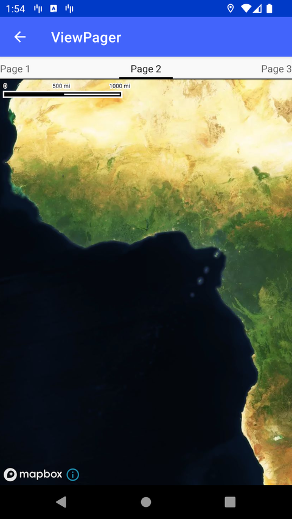

# ViewPager 多地图（Multiple Maps with ViewPager）

> 官方示例：[viewpager](https://docs.mapbox.com/android/maps/examples/android-view/viewpager/)

## 示例效果



## 功能说明

在 ViewPager 中嵌入多个 MapView。

<details>
<summary>英文原文</summary>

This example demonstrates the usage of the Android ViewPager widget to display multiple maps with different styles using a tabs interface. When the activity is created, the ViewPager is initialized with the MapFragmentAdapter. The onRestoreInstanceState method ensures that map fragments are loaded asynchronously based on the ViewPager's current and off-screen positions. The MapFragment class handles loading map styles based on the index provided. Each map fragment loads a specific style based on the index value passed using getStyleFromIndex. The getStyleFromIndex function returns a map style string based on the provided index, which corresponds to different styles available in the Style class such as Style.STANDARD, Style.DARK, Style.SATELLITE, and others.

</details>

## 示例 Activity

- `ViewPagerActivity.kt`

## 示例代码

```kotlin
package com.mapbox.maps.testapp.examples.fragment

import android.os.Bundle
import android.view.LayoutInflater
import android.view.View
import android.view.ViewGroup
import androidx.fragment.app.Fragment
import com.mapbox.maps.MapInitOptions
import com.mapbox.maps.MapView
import com.mapbox.maps.MapboxMap

class MapFragment : Fragment() {

  private lateinit var mapView: MapView
  private lateinit var mapboxMap: MapboxMap
  private lateinit var onMapReady: (MapboxMap) -> Unit

  override fun onCreateView(
    inflater: LayoutInflater,
    container: ViewGroup?,
    savedInstanceState: Bundle?
  ): View {
    mapView = MapView(
      inflater.context,
      // Use TextureView as render surface for the MapView, for smooth transitions following holding views, e.g. in a ViewPager.
      MapInitOptions(inflater.context, textureView = true, mapName = "fragmentMap")
    )
    return mapView
  }

  override fun onViewCreated(view: View, savedInstanceState: Bundle?) {
    super.onViewCreated(view, savedInstanceState)
    mapboxMap = mapView.mapboxMap
    if (::onMapReady.isInitialized) {
      onMapReady.invoke(mapboxMap)
    }
  }

  fun getMapAsync(callback: (MapboxMap) -> Unit) = if (::mapboxMap.isInitialized) {
    callback.invoke(mapboxMap)
  } else this.onMapReady = callback

  fun getMapView(): MapView {
    return mapView
  }
}
```

## 在 Aura 项目中使用

- UI 框架：**Android View**（与 Aura 当前 `MapFragment` + `MapView` 一致）
- 包名请替换为 `com.catclaw.aura`
- 需在 `local.properties` 配置 `MAPBOX_ACCESS_TOKEN`
- 部分示例依赖 `assets/` 或额外布局文件，请参考 GitHub 示例工程

## 参考链接

- [官方文档（英文）](https://docs.mapbox.com/android/maps/examples/android-view/viewpager/)
- [GitHub 源码](https://github.com/mapbox/mapbox-maps-android/blob/main/app/src/main/java/com/mapbox/maps/testapp/examples/fragment/MapFragment.kt)
- [Android View 示例索引](./README.md)
- [Mapbox 中文指南](../../README.md)
