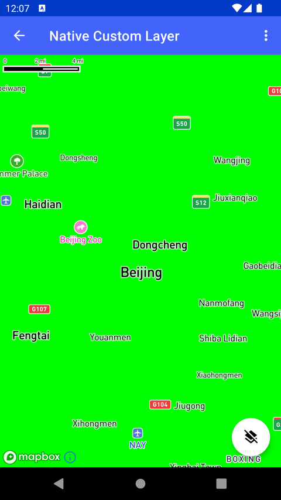

# Native 自定义图层（C++）（Native Custom Layer）

> 官方示例：[native-custom-layer](https://docs.mapbox.com/android/maps/examples/android-view/native-custom-layer/)

## 示例效果



## 功能说明

使用 C++ 实现 Native Custom Layer。

<details>
<summary>英文原文</summary>

This example demonstrates the Custom Layer API in the Mapbox Maps SDK for Android by implementing custom layers and painting them with different colors. The code below instantiates a map containing a custom layer with a specific layerId and provides options to interact with the custom layer, such as swapping its position, updating the layer appearance, and changing the color dynamically. Users can trigger layer updates, set the color to red, green, or blue using corresponding menu options, and swap the custom layer position between the middle and bottom slots using a floating action button.

</details>

## 示例 Activity

- `NativeCustomLayerActivity.kt`

## 示例代码

```kotlin
package com.mapbox.maps.testapp.examples.customlayer

import android.os.Bundle
import android.view.Menu
import android.view.MenuItem
import androidx.appcompat.app.AppCompatActivity
import com.mapbox.geojson.Point
import com.mapbox.maps.*
import com.mapbox.maps.dsl.cameraOptions
import com.mapbox.maps.extension.style.layers.CustomLayer
import com.mapbox.maps.extension.style.layers.addLayer
import com.mapbox.maps.extension.style.layers.customLayer
import com.mapbox.maps.extension.style.style
import com.mapbox.maps.testapp.R
import com.mapbox.maps.testapp.databinding.ActivityCustomLayerBinding

/**
 * Test activity showcasing the Custom Layer API where [CustomLayerHost] is implemented in C++.
 *
 * Additionally we make use of `slot` here initially placing custom layer in the "middle"
 * and placing it in the "bottom" when turning it on / off.
 */
class NativeCustomLayerActivity : AppCompatActivity() {

  private lateinit var mapboxMap: MapboxMap
  private val nativeCustomLayer = NativeExampleCustomLayer()
  private lateinit var binding: ActivityCustomLayerBinding

  override fun onCreate(savedInstanceState: Bundle?) {
    super.onCreate(savedInstanceState)
    binding = ActivityCustomLayerBinding.inflate(layoutInflater)
    setContentView(binding.root)
    mapboxMap = binding.mapView.mapboxMap
    mapboxMap.loadStyle(
      style(Style.STANDARD) {
        +customLayer(
          layerId = CUSTOM_LAYER_ID,
          host = nativeCustomLayer
        ) {
          slot("middle")
        }
      }
    ) {
      mapboxMap.setCamera(
        cameraOptions {
          center(Point.fromLngLat(116.39053, 39.91448))
          pitch(0.0)
          bearing(0.0)
          zoom(10.0)
        }
      )
      initFab()
    }
  }

  private fun initFab() {
    binding.fab.setOnClickListener {
      swapCustomLayer()
    }
  }

  private fun swapCustomLayer() {
    mapboxMap.style?.let { style ->
      if (style.styleLayerExists(CUSTOM_LAYER_ID)) {
        style.removeStyleLayer(CUSTOM_LAYER_ID)
        binding.fab.setImageResource(R.drawable.ic_layers)
      } else {
        style.addLayer(
          CustomLayer(CUSTOM_LAYER_ID, nativeCustomLayer).apply { slot("bottom") },
        )
        binding.fab.setImageResource(R.drawable.ic_layers_clear)
      }
    }
  }

  private fun updateLayer() {
    mapboxMap.triggerRepaint()
  }

  override fun onCreateOptionsMenu(menu: Menu): Boolean {
    menuInflater.inflate(R.menu.menu_custom_layer, menu)
    return true
  }

  override fun onOptionsItemSelected(item: MenuItem): Boolean {
    return when (item.itemId) {
      R.id.action_update_layer -> {
        updateLayer()
        true
      }
      R.id.action_set_color_red -> {
        nativeCustomLayer.setColor(1.0f, 0.0f, 0.0f, 1.0f)
        true
      }
      R.id.action_set_color_green -> {
        nativeCustomLayer.setColor(0.0f, 1.0f, 0.0f, 1.0f)
        true
      }
      R.id.action_set_color_blue -> {
        nativeCustomLayer.setColor(0.0f, 0.0f, 1.0f, 1.0f)
        true
      }
      else -> super.onOptionsItemSelected(item)
    }
  }

  companion object {
    private const val CUSTOM_LAYER_ID = "customId"
  }
}
```

## 在 Aura 项目中使用

- UI 框架：**Android View**（与 Aura 当前 `MapFragment` + `MapView` 一致）
- 包名请替换为 `com.catclaw.aura`
- 需在 `local.properties` 配置 `MAPBOX_ACCESS_TOKEN`
- 部分示例依赖 `assets/` 或额外布局文件，请参考 GitHub 示例工程

## 参考链接

- [官方文档（英文）](https://docs.mapbox.com/android/maps/examples/android-view/native-custom-layer/)
- [GitHub 源码](https://github.com/mapbox/mapbox-maps-android/blob/v11.24.3/app/src/main/java/com/mapbox/maps/testapp/examples/customlayer/NativeCustomLayerActivity.kt)
- [Android View 示例索引](./README.md)
- [Mapbox 中文指南](../../README.md)
