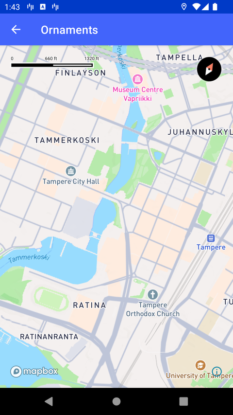

# 装饰控件（Ornaments）（Ornaments）

> 官方示例：[ornaments](https://docs.mapbox.com/android/maps/examples/android-view/ornaments/)

## 示例效果



## 功能说明

地图旋转时动态更新 logo、比例尺等装饰控件边距。

<details>
<summary>英文原文</summary>

This example demonstrates how to validate margin displacement of ornaments when the map rotates using the Mapbox Maps SDK for Android. The code below implements functionality to handle rotation gestures and updates to the margins of the logo, attribution, scale bar, and compass components presented on the map. When the map rotates, the margins of the ornaments are adjusted based on the map's bearing to keep their positions relative to the map view. The onRotate is utilized to track rotation gestures and calculate the necessary margin adjustments for the ornaments.

</details>

## 示例 Activity

- `OrnamentMarginActivity.kt`

## 示例代码

```kotlin
package com.mapbox.maps.testapp.examples

import android.os.Bundle
import android.view.Gravity
import androidx.appcompat.app.AppCompatActivity
import com.mapbox.android.gestures.RotateGestureDetector
import com.mapbox.geojson.Point
import com.mapbox.maps.CameraOptions
import com.mapbox.maps.MapView
import com.mapbox.maps.plugin.attribution.attribution
import com.mapbox.maps.plugin.compass.compass
import com.mapbox.maps.plugin.gestures.OnRotateListener
import com.mapbox.maps.plugin.gestures.addOnRotateListener
import com.mapbox.maps.plugin.logo.logo
import com.mapbox.maps.plugin.scalebar.scalebar

/**
 * Test activity to validate correct margin displacement of ornaments when the map rotates.
 */
class OrnamentMarginActivity : AppCompatActivity(), OnRotateListener {

  private lateinit var mapView: MapView

  override fun onCreate(savedInstanceState: Bundle?) {
    super.onCreate(savedInstanceState)
    mapView = MapView(this)
    setContentView(mapView)
    with(mapView.mapboxMap) {
      mapView.attribution.position = Gravity.END or Gravity.BOTTOM
      setCamera(
        CameraOptions.Builder()
          .center(Point.fromLngLat(23.760833, 61.498056))
          .zoom(14.0)
          .build()
      )
      addOnRotateListener(this@OrnamentMarginActivity)
    }
  }

  override fun onRotate(detector: RotateGestureDetector) {
    val bearing = mapView.mapboxMap.cameraState.bearing.toFloat()
    val margin = 2f * if (bearing <= 180f) bearing else 180f - (bearing % 180f)
    with(mapView.logo) {
      marginLeft = margin
      marginBottom = margin
      marginRight = margin
      marginTop = margin
    }
    with(mapView.attribution) {
      marginLeft = margin
      marginBottom = margin
      marginRight = margin
      marginTop = margin
    }
    with(mapView.scalebar) {
      marginLeft = margin
      marginBottom = margin
      marginRight = margin
      marginTop = margin
    }
    with(mapView.compass) {
      marginLeft = margin
      marginBottom = margin
      marginRight = margin
      marginTop = margin
    }
  }

  override fun onRotateEnd(detector: RotateGestureDetector) {
  }

  override fun onRotateBegin(detector: RotateGestureDetector) {
  }
}
```

## 在 Aura 项目中使用

- UI 框架：**Android View**（与 Aura 当前 `MapFragment` + `MapView` 一致）
- 包名请替换为 `com.catclaw.aura`
- 需在 `local.properties` 配置 `MAPBOX_ACCESS_TOKEN`
- 部分示例依赖 `assets/` 或额外布局文件，请参考 GitHub 示例工程

## 参考链接

- [官方文档（英文）](https://docs.mapbox.com/android/maps/examples/android-view/ornaments/)
- [GitHub 源码](https://github.com/mapbox/mapbox-maps-android/blob/v11.24.3/app/src/main/java/com/mapbox/maps/testapp/examples/OrnamentMarginActivity.kt)
- [Android View 示例索引](./README.md)
- [Mapbox 中文指南](../../README.md)
