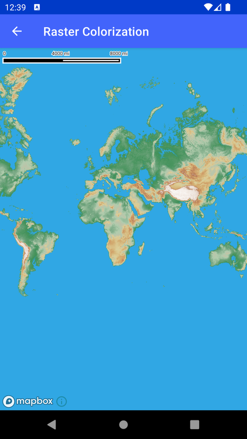

# 栅格着色（Raster Colorization）

> 官方示例：[raster-colorization](https://docs.mapbox.com/android/maps/examples/android-view/raster-colorization/)

## 示例效果



## 功能说明

使用 raster-color 对栅格图层着色。

<details>
<summary>英文原文</summary>

This example demonstrates how to implement raster colorization using the rasterColor property in Mapbox Maps SDK for Android. The code below loads a custom style containing terrain type data and creates a raster layer with rasterColor. A raster layer made with rasterColor creates the layer by coloring the pixels across the layer. In this example, we color the layer by using the interpolate function to set color values based on the terrain type (yellow for desert, green for forest etc.) across the map.

</details>

## 示例 Activity

- `RasterColorizationActivity.kt`

## 示例代码

```kotlin
package com.mapbox.maps.testapp.examples.style

import android.os.Bundle
import androidx.appcompat.app.AppCompatActivity
import com.mapbox.maps.MapView
import com.mapbox.maps.extension.style.expressions.dsl.generated.interpolate
import com.mapbox.maps.extension.style.expressions.generated.Expression
import com.mapbox.maps.extension.style.layers.generated.backgroundLayer
import com.mapbox.maps.extension.style.layers.generated.rasterLayer
import com.mapbox.maps.extension.style.sources.generated.rasterSource
import com.mapbox.maps.extension.style.style

/**
 * Example of raster colorization using raster-color property.
 */
class RasterColorizationActivity : AppCompatActivity() {

  override fun onCreate(savedInstanceState: Bundle?) {
    super.onCreate(savedInstanceState)
    val mapView = MapView(this)
    setContentView(mapView)
    mapView.mapboxMap
      .apply {
        loadStyle(
          styleExtension = style {
            +rasterSource(RASTER_SOURCE_ID) {
              url("mapbox://mapbox.terrain-rgb")
              tileSize(256)
            }

            +backgroundLayer(BACKGROUND_LAYER_ID) {
              backgroundColor(Expression.rgb(4.0, 7.0, 14.0))
            }
            +rasterLayer(RASTER_LAYER_ID, RASTER_SOURCE_ID) {
              rasterColor(
                interpolate {
                  linear()
                  rasterValue()
                  stop {
                    literal(35.392)
                    rgb(48.0, 167.0, 228.0)
                  }
                  stop {
                    literal(44.24)
                    rgb(57.0, 143.0, 83.0)
                  }
                  stop {
                    literal(274.288)
                    rgb(116.0, 166.0, 129.0)
                  }
                  stop {
                    literal(486.64)
                    rgb(178.0, 205.0, 174.0)
                  }
                  stop {
                    literal(672.448)
                    rgb(188.0, 195.0, 169.0)
                  }
                  stop {
                    literal(955.584)
                    rgb(221.0, 207.0, 153.0)
                  }
                  stop {
                    literal(1353.744)
                    rgb(211.0, 174.0, 114.0)
                  }
                  stop {
                    literal(1813.84)
                    rgb(207.0, 155.0, 103.0)
                  }
                  stop {
                    literal(2450.896)
                    rgb(179.0, 120.0, 85.0)
                  }
                  stop {
                    literal(3318)
                    rgb(227.0, 210.0, 197.0)
                  }
                  stop {
                    literal(5839.68)
                    rgb(255.0, 255.0, 255.0)
                  }
                }
              )
              rasterColorMix(
                listOf(
                  1667721.6,
                  6553.6,
                  25.6,
                  -10000.0
                )
              )
              rasterColorRange(listOf(0.0, 8848.0))
            }
          }
        )
      }
  }

  companion object {
    private const val RASTER_SOURCE_ID = "raster-source-id"
    private const val BACKGROUND_LAYER_ID = "background-layer-id"
    private const val RASTER_LAYER_ID = "raster-layer-id"
  }
}
```

## 在 Aura 项目中使用

- UI 框架：**Android View**（与 Aura 当前 `MapFragment` + `MapView` 一致）
- 包名请替换为 `com.catclaw.aura`
- 需在 `local.properties` 配置 `MAPBOX_ACCESS_TOKEN`
- 部分示例依赖 `assets/` 或额外布局文件，请参考 GitHub 示例工程

## 参考链接

- [官方文档（英文）](https://docs.mapbox.com/android/maps/examples/android-view/raster-colorization/)
- [GitHub 源码](https://github.com/mapbox/mapbox-maps-android/blob/v11.24.3/app/src/main/java/com/mapbox/maps/testapp/examples/style/RasterColorizationActivity.kt)
- [Android View 示例索引](./README.md)
- [Mapbox 中文指南](../../README.md)
