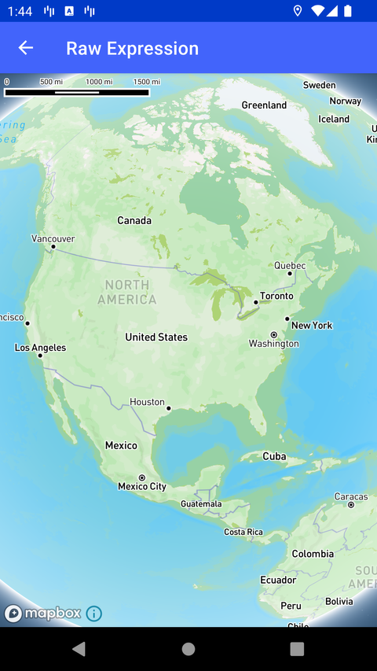

# Raw Expression（Raw Expression）

> 官方示例：[raw-expression](https://docs.mapbox.com/android/maps/examples/android-view/raw-expression/)

## 示例效果



## 功能说明

通过 JSON 字符串定义 Expression。

<details>
<summary>英文原文</summary>

This example showcases how to use an expression to adjust the style of a map through the Value API in the Mapbox Maps SDK for Android. The code below manipulates the water fill layer by adjusting the hue of the fill color according to the zoom level. The assigned expression uses the interpolate operator to smoothly transition between different hues as the zoom changes.

</details>

## 示例 Activity

- `RawExpressionActivity.kt`

## 示例代码

```kotlin
package com.mapbox.maps.testapp.examples

import android.os.Bundle
import androidx.appcompat.app.AppCompatActivity
import com.mapbox.maps.MapInitOptions
import com.mapbox.maps.MapView
import com.mapbox.maps.Style
import com.mapbox.maps.extension.style.expressions.generated.Expression
import com.mapbox.maps.extension.style.layers.generated.FillLayer
import com.mapbox.maps.extension.style.layers.getLayerAs

/**
 * Example showcasing raw expression support through the Value API.
 * This example manipulates the water fill layer of mapbox-streets to:
 * ```
 *         {
 *           "id": "water",
 *           "type": "fill",
 *           "source": "composite",
 *           "source-layer": "water",
 *           "layout": {},
 *           "paint": {
 *               "fill-color": [
 *                   "interpolate",
 *                   ["linear"],
 *                   ["zoom"],
 *                   0, "hsl(103, 80%, 70%)",
 *                   8.53, "hsl(360, 80%, 70%)",
 *                   22, "hsl(196, 80%, 70%)"
 *               ]
 *           }
 *       }
 * ```
 */
class RawExpressionActivity : AppCompatActivity() {

  override fun onCreate(savedInstanceState: Bundle?) {
    super.onCreate(savedInstanceState)
    val mapView = MapView(this, MapInitOptions(context = this, styleUri = Style.MAPBOX_STREETS))
    setContentView(mapView)
    mapView.mapboxMap.getStyle {
      addExpressionToStyle(it)
    }
  }

  private fun addExpressionToStyle(style: Style) {
    style.getLayerAs<FillLayer>("water")?.fillColor(
      Expression.fromRaw(
        """
        [
          "interpolate",
           ["linear"],
           ["zoom"],
           0, "hsl(103, 80%, 70%)",
           8.53, "hsl(360, 80%, 70%)",
           22, "hsl(196, 80%, 70%)"
         ]  
        """.trimIndent()
      )
    )
  }
}
```

## 在 Aura 项目中使用

- UI 框架：**Android View**（与 Aura 当前 `MapFragment` + `MapView` 一致）
- 包名请替换为 `com.catclaw.aura`
- 需在 `local.properties` 配置 `MAPBOX_ACCESS_TOKEN`
- 部分示例依赖 `assets/` 或额外布局文件，请参考 GitHub 示例工程

## 参考链接

- [官方文档（英文）](https://docs.mapbox.com/android/maps/examples/android-view/raw-expression/)
- [GitHub 源码](https://github.com/mapbox/mapbox-maps-android/blob/v11.24.3/app/src/main/java/com/mapbox/maps/testapp/examples/RawExpressionActivity.kt)
- [Android View 示例索引](./README.md)
- [Mapbox 中文指南](../../README.md)
