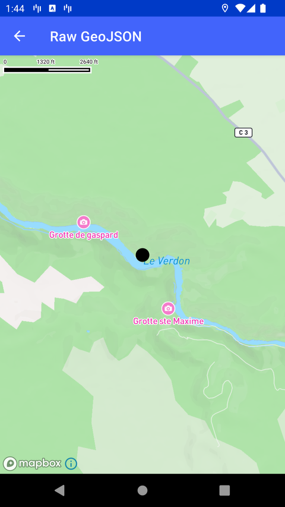

# Raw GeoJSON（Raw GeoJSON）

> 官方示例：[raw-geojson](https://docs.mapbox.com/android/maps/examples/android-view/raw-geojson/)

## 示例效果



## 功能说明

通过 Value API 使用 GeoJSON 字符串作为数据源。

<details>
<summary>英文原文</summary>

This example demonstrates how to convert raw GeoJSON data to a Value object in the Mapbox Maps SDK for Android. The code below parses a GeoJSON source that represents a Point and converts it to a Value object, using the Value.fromJson function and creates a circle layer to represent the point location.

</details>

## 示例 Activity

- `RawGeoJsonActivity.kt`

## 示例代码

```kotlin
package com.mapbox.maps.testapp.examples

import android.graphics.Color
import android.os.Bundle
import androidx.appcompat.app.AppCompatActivity
import com.mapbox.bindgen.Value
import com.mapbox.geojson.Point
import com.mapbox.maps.CameraOptions
import com.mapbox.maps.MapView
import com.mapbox.maps.MapboxMap
import com.mapbox.maps.Style
import com.mapbox.maps.extension.style.layers.addLayer
import com.mapbox.maps.extension.style.layers.generated.circleLayer

/**
 * Example showcasing raw geojson conversion support through the Value API.
 * This converts the following geojson to a value object:
 * ```
 * {
 *  "type": "FeatureCollection",
 *  "features": [
 *    {
 *      "type": "Feature",
 *      "properties": {},
 *      "geometry": {
 *        "type": "Point",
 *        "coordinates": [
 *          6.0033416748046875,
 *          43.70908256335716
 *        ]
 *      }
 *    }
 *   ]
 * }
 * ```
 */
class RawGeoJsonActivity : AppCompatActivity() {

  private lateinit var mapboxMap: MapboxMap

  override fun onCreate(savedInstanceState: Bundle?) {
    super.onCreate(savedInstanceState)
    val mapView = MapView(this)
    setContentView(mapView)
    mapboxMap = mapView.mapboxMap.apply {
      setCamera(
        CameraOptions.Builder()
          .center(Point.fromLngLat(6.0033416748046875, 43.70908256335716))
          .zoom(16.0)
          .build()
      )
      loadStyle(Style.STANDARD) { addGeoJsonSource(it) }
    }
  }

  private fun addGeoJsonSource(style: Style) {
    val geojson = Value.fromJson(
      """
      {
        "type": "FeatureCollection",
        "features": [
          {
            "type": "Feature",
            "properties": {},
            "geometry": {
              "type": "Point",
              "coordinates": [
                6.0033416748046875,
                43.70908256335716
              ]
            }
          }
        ]
      }
      """.trimIndent()
    )

    if (geojson.isError) {
      throw RuntimeException("Invalid GeoJson:" + geojson.error)
    }

    val sourceParams = HashMap<String, Value>()
    sourceParams["type"] = Value("geojson")
    sourceParams["data"] = geojson.value!!
    val expected = style.addStyleSource("source", Value(sourceParams))

    if (expected.isError) {
      throw RuntimeException("Invalid GeoJson:" + expected.error)
    }

    style.addLayer(
      circleLayer("circle", "source") {
        circleColor(Color.BLACK)
        circleRadius(10.0)
      }
    )
  }
}
```

## 在 Aura 项目中使用

- UI 框架：**Android View**（与 Aura 当前 `MapFragment` + `MapView` 一致）
- 包名请替换为 `com.catclaw.aura`
- 需在 `local.properties` 配置 `MAPBOX_ACCESS_TOKEN`
- 部分示例依赖 `assets/` 或额外布局文件，请参考 GitHub 示例工程

## 参考链接

- [官方文档（英文）](https://docs.mapbox.com/android/maps/examples/android-view/raw-geojson/)
- [GitHub 源码](https://github.com/mapbox/mapbox-maps-android/blob/v11.24.3/app/src/main/java/com/mapbox/maps/testapp/examples/RawGeoJsonActivity.kt)
- [Android View 示例索引](./README.md)
- [Mapbox 中文指南](../../README.md)
