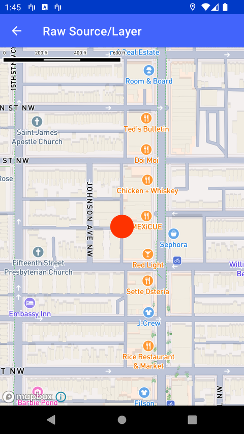

# Raw Source/Layer（Raw Source/Layer）

> 官方示例：[raw-source-layer](https://docs.mapbox.com/android/maps/examples/android-view/raw-source-layer/)

## 示例效果



## 功能说明

通过 JSON 字符串定义 Source/Layer。

<details>
<summary>英文原文</summary>

This example demonstrates the conversion of raw source and layer JSON objects with the Mapbox Maps SDK for Android. The code below parses a GeoJSON source and a circle layer that represents a Point and converts them both to a Value object, using the Value.fromJson function. This creates a circle layer at a specified set of coordinates, while giving the ability to create a circle layer with certain styling properties such as color and radius.

</details>

## 示例 Activity

- `RawSourceLayerActivity.kt`

## 示例代码

```kotlin
package com.mapbox.maps.testapp.examples

import android.os.Bundle
import androidx.appcompat.app.AppCompatActivity
import com.mapbox.bindgen.Value
import com.mapbox.geojson.Point
import com.mapbox.maps.CameraOptions
import com.mapbox.maps.MapView
import com.mapbox.maps.Style

/**
 * Example showcasing raw source/layer json conversion support through the Value API.
 *
 * Source:
 * ```
 * {
 *    "type": "geojson",
 *    "data": {
 *        "type": "Feature",
 *        "geometry": {
 *        "type": "Point",
 *          "coordinates": [-77.032667, 38.913175]
 *        },
 *        "properties": {
 *          "title": "Mapbox DC",
 *          "marker-symbol": "monument"
 *        }
 *    }
 * }
 * ```
 *
 * Layer:
 * ```
 * {
 *    "id": "custom",
 *    "type": "circle",
 *    "source": "source",
 *    "source-layer": "",
 *    "layout": {},
 *    "paint": {
 *        "circle-radius": 20,
 *        "circle-color": "#FF3300",
 *        "circle-pitch-alignment": "map"
 *    }
 * }
 * ```
 */
class RawSourceLayerActivity : AppCompatActivity() {

  override fun onCreate(savedInstanceState: Bundle?) {
    super.onCreate(savedInstanceState)
    val mapView = MapView(this)
    setContentView(mapView)
    mapView.mapboxMap.apply {
      setCamera(
        CameraOptions.Builder()
          .center(Point.fromLngLat(-77.032667, 38.913175))
          .zoom(16.0)
          .build()
      )
      loadStyle(Style.STANDARD) { addGeoJsonSource(it) }
    }
  }

  private fun addGeoJsonSource(style: Style) {
    val source = Value.fromJson(
      """
        {
          "type": "geojson",
          "data": {
            "type": "Feature",
            "geometry": {
              "type": "Point",
              "coordinates": [-77.032667, 38.913175]
            },
            "properties": {
              "title": "Mapbox Garage",
              "marker-symbol": "monument"
            }
          }
        }
      """.trimIndent()
    )

    if (source.isError) {
      throw RuntimeException("Invalid GeoJson:" + source.error)
    }

    val expected = style.addStyleSource("source", source.value!!)
    if (expected.isError) {
      throw RuntimeException("Invalid GeoJson:" + expected.error)
    }

    val layer = Value.fromJson(
      """
        {
            "id": "custom",
            "type": "circle",
            "source": "source",
            "source-layer": "",
            "layout": {},
            "paint": {
                "circle-radius": 20,
                "circle-color": "#FF3300",
                "circle-pitch-alignment": "map"
            }
        }
      """.trimIndent()
    )

    if (layer.isError) {
      throw RuntimeException("Invalid GeoJson:" + layer.error)
    }

    val expectedLayer = style.addStyleLayer(layer.value!!, null)

    if (expectedLayer.isError) {
      throw RuntimeException("Invalid GeoJson:" + expectedLayer.error)
    }
  }
}
```

## 在 Aura 项目中使用

- UI 框架：**Android View**（与 Aura 当前 `MapFragment` + `MapView` 一致）
- 包名请替换为 `com.catclaw.aura`
- 需在 `local.properties` 配置 `MAPBOX_ACCESS_TOKEN`
- 部分示例依赖 `assets/` 或额外布局文件，请参考 GitHub 示例工程

## 参考链接

- [官方文档（英文）](https://docs.mapbox.com/android/maps/examples/android-view/raw-source-layer/)
- [GitHub 源码](https://github.com/mapbox/mapbox-maps-android/blob/v11.24.3/app/src/main/java/com/mapbox/maps/testapp/examples/RawSourceLayerActivity.kt)
- [Android View 示例索引](./README.md)
- [Mapbox 中文指南](../../README.md)
