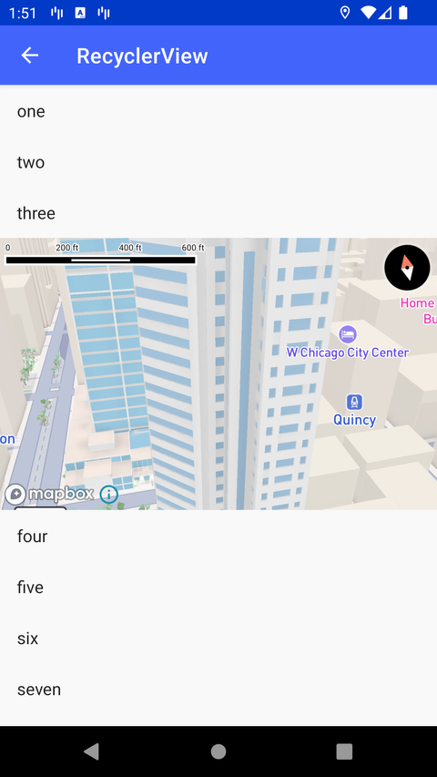

# RecyclerView 中的 MapView（RecyclerView）

> 官方示例：[recyclerview](https://docs.mapbox.com/android/maps/examples/android-view/recyclerview/)

## 示例效果



## 功能说明

在 RecyclerView 列表项中集成 MapView。

<details>
<summary>英文原文</summary>

This example illustrates how to host multiple maps and allow users to cycle through them with the Mapbox Maps SDK for Android. The code below integration attaches and detaches each different MapView to the android class RecyclerView by starting and stopping the MapView and changing out the assigned map to cycle through them. Map items are stored in the MapItem data class and binds the data to the corresponding ViewHolder.

</details>

## 示例 Activity

- `SurfaceRecyclerViewActivity.kt`

## 示例代码

```kotlin
package com.mapbox.maps.testapp.examples

import android.annotation.SuppressLint
import android.os.Bundle
import android.view.LayoutInflater
import android.view.ViewGroup
import android.widget.TextView
import androidx.appcompat.app.AppCompatActivity
import androidx.recyclerview.widget.LinearLayoutManager
import androidx.recyclerview.widget.RecyclerView
import com.mapbox.maps.MapView
import com.mapbox.maps.Style
import com.mapbox.maps.plugin.gestures.gestures
import com.mapbox.maps.testapp.R
import com.mapbox.maps.testapp.databinding.ActivityRecyclerBinding

/**
 * Test activity showcasing how to integrate multiple SurfaceView MapViews in a RecyclerView.
 *
 * It requires calling the correct lifecycle methods when detaching and attaching the View to
 * the RecyclerView with onViewAttachedToWindow and onViewDetachedFromWindow.
 *
 */
@SuppressLint("ClickableViewAccessibility")
class SurfaceRecyclerViewActivity : AppCompatActivity() {

  private lateinit var mapView: MapView

  override fun onCreate(savedInstanceState: Bundle?) {
    super.onCreate(savedInstanceState)
    val binding = ActivityRecyclerBinding.inflate(layoutInflater)
    setContentView(binding.root)
    binding.recyclerView.layoutManager = LinearLayoutManager(this)
    binding.recyclerView.adapter = ItemAdapter(this, LayoutInflater.from(this))
  }

  fun getMapItemLayoutId(): Int {
    return R.layout.item_map
  }

  class ItemAdapter(
    private val activity: SurfaceRecyclerViewActivity,
    private val inflater: LayoutInflater
  ) : RecyclerView.Adapter<RecyclerView.ViewHolder>() {

    private val items = List(75) {
      if (it == 4)
        MapItem(Style.STANDARD)
      else
        "Row $it"
    }

    private var mapHolders: MutableList<MapHolder> = mutableListOf()

    companion object {
      const val TYPE_MAP = 0
      const val TYPE_TEXT = 1
    }

    override fun onCreateViewHolder(parent: ViewGroup, viewType: Int): RecyclerView.ViewHolder {
      return if (viewType == TYPE_MAP) {
        activity.mapView = inflater.inflate(activity.getMapItemLayoutId(), parent, false) as MapView
        val mapHolder = MapHolder(activity.mapView)
        mapHolders.add(mapHolder)
        return mapHolder
      } else {
        TextHolder(inflater.inflate(android.R.layout.simple_list_item_1, parent, false) as TextView)
      }
    }

    override fun onViewAttachedToWindow(holder: RecyclerView.ViewHolder) {
      super.onViewAttachedToWindow(holder)
      if (holder is MapHolder) {
        val mapView = holder.mapView
        mapView.onStart()
      }
    }

    override fun onViewDetachedFromWindow(holder: RecyclerView.ViewHolder) {
      super.onViewDetachedFromWindow(holder)
      if (holder is MapHolder) {
        val mapView = holder.mapView
        mapView.onStop()
      }
    }

    override fun getItemCount(): Int {
      return items.count()
    }

    override fun onBindViewHolder(holder: RecyclerView.ViewHolder, position: Int) {
      if (holder is TextHolder) {
        holder.bind(items[position] as String)
      } else if (holder is MapHolder) {
        holder.bind(items[position] as MapItem)
      }
    }

    override fun getItemViewType(position: Int): Int {
      return if (items[position] is MapItem) {
        TYPE_MAP
      } else {
        TYPE_TEXT
      }
    }

    data class MapItem(val style: String)
    class MapHolder(val mapView: MapView) : RecyclerView.ViewHolder(mapView) {

      init {
        // unfortunately, if there are multiple maps hosted in one activity, state saving is not possible
        mapView.setOnTouchListener { view, motionEvent ->
          // Disallow the touch request for recyclerView scroll
          view.parent.requestDisallowInterceptTouchEvent(true)
          mapView.onTouchEvent(motionEvent)
          true
        }
      }

      fun bind(mapItem: MapItem) {
        mapView.gestures.scrollEnabled = false
        mapView.mapboxMap.loadStyle(mapItem.style)
      }
    }
  }

  class TextHolder(private val textView: TextView) : RecyclerView.ViewHolder(textView) {
    fun bind(item: String) {
      this.textView.text = item
    }
  }
}
```

## 在 Aura 项目中使用

- UI 框架：**Android View**（与 Aura 当前 `MapFragment` + `MapView` 一致）
- 包名请替换为 `com.catclaw.aura`
- 需在 `local.properties` 配置 `MAPBOX_ACCESS_TOKEN`
- 部分示例依赖 `assets/` 或额外布局文件，请参考 GitHub 示例工程

## 参考链接

- [官方文档（英文）](https://docs.mapbox.com/android/maps/examples/android-view/recyclerview/)
- [GitHub 源码](https://github.com/mapbox/mapbox-maps-android/blob/v11.24.3/app/src/main/java/com/mapbox/maps/testapp/examples/SurfaceRecyclerViewActivity.kt)
- [Android View 示例索引](./README.md)
- [Mapbox 中文指南](../../README.md)
