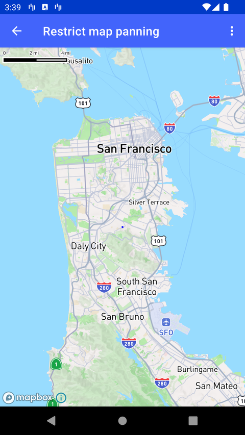

# 限制地图平移（Restrict map panning）

> 官方示例：[restrict-map-panning](https://docs.mapbox.com/android/maps/examples/android-view/restrict-map-panning/)

## 示例效果



## 功能说明

限制手势平移的可视范围（编程方式仍可改变 viewport）。

<details>
<summary>英文原文</summary>

This example demonstrates how to restrict user gestures within a specified bounds using the Mapbox Maps SDK for Android. Using the example UI, users can select between 4 different options to set the map bounds to: The code below set the different bounds by grabbing the longitude and latitude of two or four different point on the maps and creating CoordinateBounds, and then passing that bounds and the zoom level onto mapboxMap.setBounds which creates the boundary and then is passed into the CameraBoundsOptions.

</details>

## 示例 Activity

- `RestrictBoundsActivity.kt`

## 示例代码

```kotlin
package com.mapbox.maps.testapp.examples.camera

import android.annotation.SuppressLint
import android.graphics.Color
import android.os.Bundle
import android.view.Gravity
import android.view.Menu
import android.view.MenuItem
import android.view.View
import android.widget.FrameLayout
import androidx.appcompat.app.AppCompatActivity
import com.mapbox.geojson.FeatureCollection
import com.mapbox.geojson.Point
import com.mapbox.geojson.Polygon
import com.mapbox.maps.CameraBoundsOptions
import com.mapbox.maps.CoordinateBounds
import com.mapbox.maps.MapboxMap
import com.mapbox.maps.Style
import com.mapbox.maps.extension.style.layers.generated.FillLayer
import com.mapbox.maps.extension.style.layers.generated.fillLayer
import com.mapbox.maps.extension.style.layers.getLayerAs
import com.mapbox.maps.extension.style.layers.properties.generated.Visibility
import com.mapbox.maps.extension.style.sources.generated.GeoJsonSource
import com.mapbox.maps.extension.style.sources.generated.geoJsonSource
import com.mapbox.maps.extension.style.sources.getSourceAs
import com.mapbox.maps.extension.style.style
import com.mapbox.maps.testapp.R
import com.mapbox.maps.testapp.databinding.ActivityRestrictBoundsBinding

/**
 * Test activity showcasing restricting user gestures to a bounds around Iceland, almost worldview and IDL.
 */
class RestrictBoundsActivity : AppCompatActivity() {

  private lateinit var mapboxMap: MapboxMap
  private lateinit var binding: ActivityRestrictBoundsBinding

  override fun onCreate(savedInstanceState: Bundle?) {
    super.onCreate(savedInstanceState)
    binding = ActivityRestrictBoundsBinding.inflate(layoutInflater)
    setContentView(binding.root)
    mapboxMap = binding.mapView.mapboxMap
    mapboxMap.loadStyle(
      style(Style.STANDARD) {
        +geoJsonSource(BOUNDS_ID) {
          featureCollection(FeatureCollection.fromFeatures(listOf()))
        }
        +fillLayer(BOUNDS_ID, BOUNDS_ID) {
          fillColor(Color.RED)
          fillOpacity(0.15)
          visibility(Visibility.NONE)
          slot("bottom")
        }
      }
    ) { setupBounds(SAN_FRANCISCO_BOUND) }
    showCrosshair()
  }

  override fun onCreateOptionsMenu(menu: Menu): Boolean {
    menuInflater.inflate(R.menu.menu_bounds, menu)
    return true
  }

  override fun onOptionsItemSelected(item: MenuItem): Boolean {
    return when (item.itemId) {
      R.id.menu_action_san_francisco_bounds -> {
        setupBounds(SAN_FRANCISCO_BOUND)
        true
      }
      R.id.menu_action_allmost_world_bounds -> {
        setupBounds(ALMOST_WORLD_BOUNDS)
        true
      }
      R.id.menu_action_cross_idl -> {
        setupBounds(CROSS_IDL_BOUNDS)
        true
      }
      R.id.menu_action_reset -> {
        setupBounds(INFINITE_BOUNDS)
        true
      }
      R.id.menu_action_toggle_bounds -> {
        toggleShowBounds()
        true
      }
      else -> {
        super.onOptionsItemSelected(item)
      }
    }
  }

  private fun toggleShowBounds() {
    mapboxMap.getStyle {
      val boundsFillLayer = it.getLayerAs<FillLayer>(BOUNDS_ID)!!
      val visibility: Visibility = boundsFillLayer.visibility!!
      when (visibility) {
        Visibility.NONE -> boundsFillLayer.visibility(Visibility.VISIBLE)
        Visibility.VISIBLE -> boundsFillLayer.visibility(Visibility.NONE)
      }
    }
  }

  private fun setupBounds(bounds: CameraBoundsOptions) {
    mapboxMap.getStyle { style ->
      setupBoundsArea(bounds, style)
    }
  }

  private fun setupBoundsArea(boundsOptions: CameraBoundsOptions, style: Style) {
    mapboxMap.setBounds(boundsOptions)
    // In this example we always have bounds
    val bounds = boundsOptions.bounds!!
    if (!bounds.infiniteBounds) {
      val northEast = bounds.northeast
      val southWest = bounds.southwest
      val northWest = Point.fromLngLat(southWest.longitude(), northEast.latitude())
      val southEast = Point.fromLngLat(northEast.longitude(), southWest.latitude())
      val boundsBox = listOf(northEast, southEast, southWest, northWest, northEast)
      // Update the source with the new bounds
      style.getSourceAs<GeoJsonSource>(BOUNDS_ID)!!.geometry(
        // We only want one polygon: the box around the bounds
        Polygon.fromLngLats(listOf(boundsBox))
      )
    }
  }

  private fun showCrosshair() {
    val crosshair = View(this)
    crosshair.layoutParams = FrameLayout.LayoutParams(10, 10, Gravity.CENTER)
    crosshair.setBackgroundColor(Color.BLUE)
    binding.mapView.addView(crosshair)
  }

  companion object {
    private const val BOUNDS_ID = "BOUNDS_ID"
    private val SAN_FRANCISCO_BOUND: CameraBoundsOptions = CameraBoundsOptions.Builder()
      .bounds(
        CoordinateBounds(
          Point.fromLngLat(-122.66336, 37.492987),
          Point.fromLngLat(-122.250481, 37.87165),
          false
        )
      )
      .minZoom(10.0)
      .build()

    private val ALMOST_WORLD_BOUNDS: CameraBoundsOptions = CameraBoundsOptions.Builder()
      .bounds(
        CoordinateBounds(
          Point.fromLngLat(-170.0, -20.0),
          Point.fromLngLat(170.0, 20.0),
          false
        )
      )
      .minZoom(2.0)
      .build()

    @SuppressLint("Range")
    private val CROSS_IDL_BOUNDS: CameraBoundsOptions = CameraBoundsOptions.Builder()
      .bounds(
        CoordinateBounds(
          Point.fromLngLat(170.0202020, -20.0),
          Point.fromLngLat(190.0, 20.0),
          false
        )
      )
      .minZoom(2.0)
      .build()

    private val INFINITE_BOUNDS: CameraBoundsOptions = CameraBoundsOptions.Builder()
      .bounds(
        CoordinateBounds(
          Point.fromLngLat(0.0, 0.0),
          Point.fromLngLat(0.0, 0.0),
          true
        )
      )
      .build()
  }
}
```

## 在 Aura 项目中使用

- UI 框架：**Android View**（与 Aura 当前 `MapFragment` + `MapView` 一致）
- 包名请替换为 `com.catclaw.aura`
- 需在 `local.properties` 配置 `MAPBOX_ACCESS_TOKEN`
- 部分示例依赖 `assets/` 或额外布局文件，请参考 GitHub 示例工程

## 参考链接

- [官方文档（英文）](https://docs.mapbox.com/android/maps/examples/android-view/restrict-map-panning/)
- [GitHub 源码](https://github.com/mapbox/mapbox-maps-android/blob/v11.24.3/app/src/main/java/com/mapbox/maps/testapp/examples/camera/RestrictBoundsActivity.kt)
- [Android View 示例索引](./README.md)
- [Mapbox 中文指南](../../README.md)
