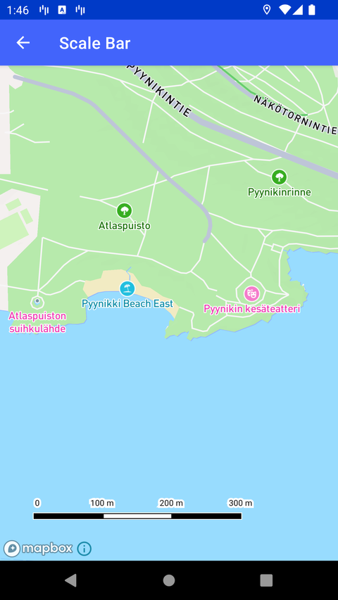

# 比例尺（Scale Bar）

> 官方示例：[scale-bar](https://docs.mapbox.com/android/maps/examples/android-view/scale-bar/)

## 示例效果



## 功能说明

在自定义位置显示比例尺。

<details>
<summary>英文原文</summary>

This example demonstrates how to create a scale bar using XML with the Mapbox Maps SDK for Android. The code below sets adds a scale bar to the activity layout to show how many miles a segment of the map covers. This XML element renders the R.layout.activity_scale_bar visual which shifts in scale as you zoom in and out of the map.

</details>

## 示例 Activity

- `ScaleBarActivity.kt`

## 示例代码

```kotlin
package com.mapbox.maps.testapp.examples

import android.os.Bundle
import androidx.appcompat.app.AppCompatActivity
import com.mapbox.maps.testapp.R

/**
 * Activity to showcase scale bar custom configuration using xml attributes.
 */
class ScaleBarActivity : AppCompatActivity() {

  override fun onCreate(savedInstanceState: Bundle?) {
    super.onCreate(savedInstanceState)
    setContentView(R.layout.activity_scale_bar)
  }
}
```

## 在 Aura 项目中使用

- UI 框架：**Android View**（与 Aura 当前 `MapFragment` + `MapView` 一致）
- 包名请替换为 `com.catclaw.aura`
- 需在 `local.properties` 配置 `MAPBOX_ACCESS_TOKEN`
- 部分示例依赖 `assets/` 或额外布局文件，请参考 GitHub 示例工程

## 参考链接

- [官方文档（英文）](https://docs.mapbox.com/android/maps/examples/android-view/scale-bar/)
- [GitHub 源码](https://github.com/mapbox/mapbox-maps-android/blob/v11.24.3/app/src/main/java/com/mapbox/maps/testapp/examples/ScaleBarActivity.kt)
- [Android View 示例索引](./README.md)
- [Mapbox 中文指南](../../README.md)
