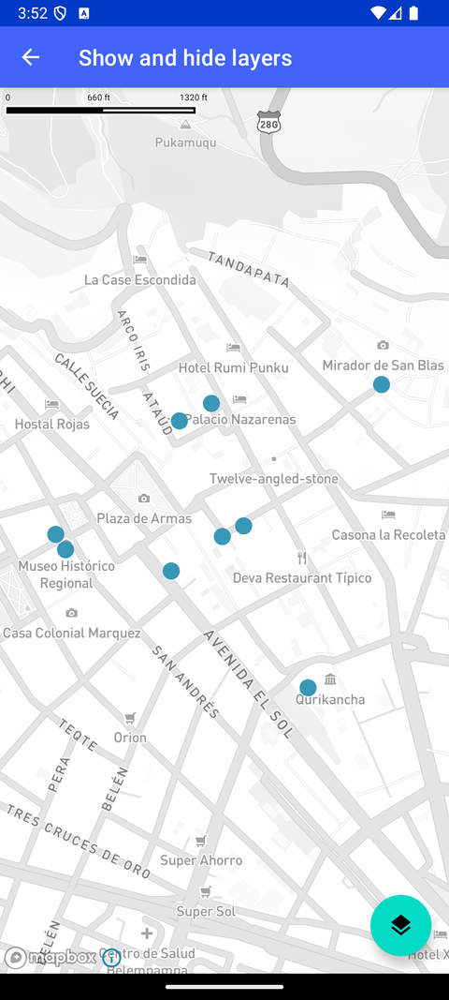

# 显示/隐藏图层（Show and hide layers）

> 官方示例：[show-and-hide-layers](https://docs.mapbox.com/android/maps/examples/android-view/show-and-hide-layers/)

## 示例效果



## 功能说明

允许用户切换 CircleLayer 的可见性。

<details>
<summary>英文原文</summary>

This example demonstrates how to show and hide layers with a toggle with the Mapbox Maps SDK for Android. The code below renders a layer containing a dataset of museums represented by circles. The layer's visibility can then be toggled with a button, referenced as the fabLayerToggle. On the setOnClickListener event for the fabLayerToggle, the function grabs the style and then the layer from the style, were the visibility of the layer is toggled using layer.visibility.

</details>

## 示例 Activity

- `ShowHideLayersActivity.kt`

## 示例代码

```kotlin
package com.mapbox.maps.testapp.examples

import android.graphics.Color
import android.os.Bundle
import androidx.appcompat.app.AppCompatActivity
import com.mapbox.bindgen.Value
import com.mapbox.maps.Style
import com.mapbox.maps.extension.style.layers.generated.circleLayer
import com.mapbox.maps.extension.style.layers.getLayer
import com.mapbox.maps.extension.style.layers.properties.generated.Visibility
import com.mapbox.maps.extension.style.sources.generated.vectorSource
import com.mapbox.maps.extension.style.style
import com.mapbox.maps.testapp.databinding.ActivityShowHideLayersBinding

/**
 * Allow the user to toggle the visibility of a CircleLayer on a map.
 */
class ShowHideLayersActivity : AppCompatActivity() {

  override fun onCreate(savedInstanceState: Bundle?) {
    super.onCreate(savedInstanceState)
    val binding = ActivityShowHideLayersBinding.inflate(layoutInflater)
    setContentView(binding.root)
    binding.mapView.mapboxMap.loadStyle(
      style(Style.STANDARD) {
        +vectorSource(SOURCE_ID) {
          url(SOURCE_URL)
        }
        +circleLayer(LAYER_ID, SOURCE_ID) {
          sourceLayer(SOURCE_LAYER)
          visibility(Visibility.VISIBLE)
          circleRadius(8.0)
          circleColor(Color.argb(255, 55, 148, 179))
        }
      }
    ) {
      binding.mapView.mapboxMap.setStyleImportConfigProperty("basemap", "theme", Value.valueOf("monochrome"))
    }
    binding.fabLayerToggle.setOnClickListener {
      binding.mapView.mapboxMap.getStyle {
        it.getLayer(LAYER_ID)?.let { layer ->
          if (layer.visibility == Visibility.VISIBLE) {
            layer.visibility(Visibility.NONE)
          } else {
            layer.visibility(Visibility.VISIBLE)
          }
        }
      }
    }
  }

  companion object {
    private const val SOURCE_ID = "museums_source"
    private const val SOURCE_URL = "mapbox://mapbox.2opop9hr"
    private const val SOURCE_LAYER = "museum-cusco"
    private const val LAYER_ID = "museums"
  }
}
```

## 在 Aura 项目中使用

- UI 框架：**Android View**（与 Aura 当前 `MapFragment` + `MapView` 一致）
- 包名请替换为 `com.catclaw.aura`
- 需在 `local.properties` 配置 `MAPBOX_ACCESS_TOKEN`
- 部分示例依赖 `assets/` 或额外布局文件，请参考 GitHub 示例工程

## 参考链接

- [官方文档（英文）](https://docs.mapbox.com/android/maps/examples/android-view/show-and-hide-layers/)
- [GitHub 源码](https://github.com/mapbox/mapbox-maps-android/blob/v11.24.3/app/src/main/java/com/mapbox/maps/testapp/examples/ShowHideLayersActivity.kt)
- [Android View 示例索引](./README.md)
- [Mapbox 中文指南](../../README.md)
