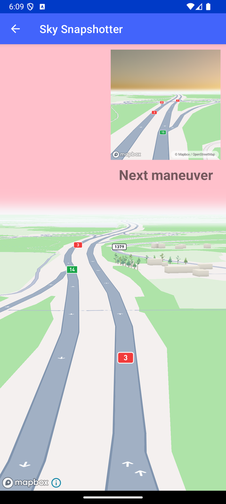

# Sky Snapshotter（Sky Snapshotter）

> 官方示例：[sky-snapshotter](https://docs.mapbox.com/android/maps/examples/android-view/sky-snapshotter/)

## 示例效果



## 功能说明

将 Snapshotter 生成的图片叠加在 MapView 上。

<details>
<summary>英文原文</summary>

This example demonstrates using Snapshotter to generate a static map image based on the main MapView and display it to the user. Additional configuration is applied to the snapshot image, setting a custom skyLayer gradient. In this case, the use case for the snapshot is to display a future maneuver to a user that is navigating a route. The implementation sets up a MapView with a specific camera configuration, enabling a pitched and tilted view of the map for a 3D perspective. A SkyLayer is added to the map style to render a gradient sky effect, transitioning from yellow to pink. The Snapshotter generates a snapshot of the map with a different sky effect using the SkyType.ATMOSPHERE. Once the snapshot is ready, it is displayed in an ImageView.

</details>

## 示例 Activity

- `SkyLayerSnapshotterActivity.kt`

## 示例代码

```kotlin
package com.mapbox.maps.testapp.examples.sky

import android.os.Bundle
import android.view.View
import android.widget.Toast
import androidx.appcompat.app.AppCompatActivity
import com.mapbox.geojson.Point
import com.mapbox.maps.*
import com.mapbox.maps.extension.style.expressions.dsl.generated.interpolate
import com.mapbox.maps.extension.style.layers.addLayer
import com.mapbox.maps.extension.style.layers.generated.skyLayer
import com.mapbox.maps.extension.style.layers.properties.generated.SkyType
import com.mapbox.maps.extension.style.style
import com.mapbox.maps.plugin.compass.compass
import com.mapbox.maps.plugin.scalebar.scalebar
import com.mapbox.maps.testapp.databinding.ActivitySkySnapshotterBinding

/**
 * Prototype for Junction view showing upcoming maneuver.
 */
class SkyLayerSnapshotterActivity : AppCompatActivity() {

  private var snapshotter: Snapshotter? = null
  private lateinit var binding: ActivitySkySnapshotterBinding

  override fun onCreate(savedInstanceState: Bundle?) {
    super.onCreate(savedInstanceState)
    binding = ActivitySkySnapshotterBinding.inflate(layoutInflater)
    setContentView(binding.root)
    binding.mapView.scalebar.enabled = false
    binding.mapView.compass.enabled = false
    binding.mapView.mapboxMap.setCamera(
      CameraOptions.Builder()
        .center(Point.fromLngLat(24.827187523937795, 60.55932732152849))
        .zoom(16.0)
        .pitch(85.0)
        .bearing(330.1)
        .build()
    )
    binding.mapView.mapboxMap.loadStyle(
      styleExtension = style(Style.STANDARD) {
        +skyLayer("sky") {
          skyType(SkyType.GRADIENT)
          skyGradient(
            interpolate {
              linear()
              skyRadialProgress()
              literal(0.0)
              literal("yellow")
              literal(1.0)
              literal("pink")
            }
          )
          skyGradientCenter(listOf(-34.0, 90.0))
          skyGradientRadius(8.0)
        }
      }
    ) { prepareSnapshotter() }
  }

  private fun prepareSnapshotter() {
    val snapshotMapOptions = MapSnapshotOptions.Builder()
      .size(Size(512.0f, 512.0f))
      .build()

    snapshotter = Snapshotter(this, snapshotMapOptions).apply {
      setStyleListener(object : SnapshotStyleListener {
        override fun onDidFinishLoadingStyle(style: Style) {
          style.addLayer(
            skyLayer("sky_snapshotter") {
              skyType(SkyType.ATMOSPHERE)
              skyAtmosphereSun(listOf(0.0, 90.0))
            }
          )
        }
      })
      setCamera(
        CameraOptions.Builder()
          .center(Point.fromLngLat(24.81958807097479, 60.56524768721757))
          .zoom(16.0)
          .pitch(85.0)
          .bearing(330.1)
          .build()
      )
      setStyleUri(Style.STANDARD)
      start { bitmap, error ->
        if (bitmap != null) {
          binding.maneuverView.setImageBitmap(bitmap)
          binding.maneuverCaption.visibility = View.VISIBLE
        } else {
          Toast.makeText(
            this@SkyLayerSnapshotterActivity,
            "Snapshotter error: $error",
            Toast.LENGTH_SHORT
          ).show()
        }
      }
    }
  }

  override fun onDestroy() {
    super.onDestroy()
    snapshotter?.cancel()
  }
}
```

## 在 Aura 项目中使用

- UI 框架：**Android View**（与 Aura 当前 `MapFragment` + `MapView` 一致）
- 包名请替换为 `com.catclaw.aura`
- 需在 `local.properties` 配置 `MAPBOX_ACCESS_TOKEN`
- 部分示例依赖 `assets/` 或额外布局文件，请参考 GitHub 示例工程

## 参考链接

- [官方文档（英文）](https://docs.mapbox.com/android/maps/examples/android-view/sky-snapshotter/)
- [GitHub 源码](https://github.com/mapbox/mapbox-maps-android/blob/v11.24.3/app/src/main/java/com/mapbox/maps/testapp/examples/sky/SkyLayerSnapshotterActivity.kt)
- [Android View 示例索引](./README.md)
- [Mapbox 中文指南](../../README.md)
