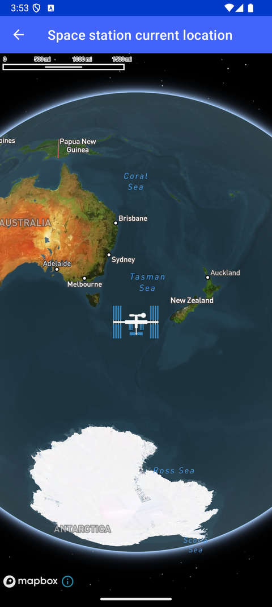

# 空间站实时位置（Space station current location）

> 官方示例：[space-station-current-location](https://docs.mapbox.com/android/maps/examples/android-view/space-station-current-location/)

## 示例效果



## 功能说明

实时更新 marker 位置（国际空间站示例）。

<details>
<summary>英文原文</summary>

This example demonstrates real-time marker location updates using the Mapbox Maps SDK for Android. It initializes a MapView using the STANDARD_SATELLITE style. It utilizes Handler for scheduling API calls at regular intervals and fetching real-time location data of the International Space Station. The app uses Retrofit for network operations and updates the space station marker on the map. Upon creation, the activity sets up symbol layers to display the space station icon and implements methods to manage API calls, update marker positions, and handle callbacks. The initSpaceStationSymbolLayer method configures the symbol layer with the space station icon, and the updateMarkerPosition method updates the marker's location on the map while smoothly animating the camera movement. The example also incorporates toast notifications and ensures API calls are properly managed during activity lifecycle events.

</details>

## 示例 Activity

- `SpaceStationLocationActivity.kt`

## 示例代码

```kotlin
package com.mapbox.maps.testapp.examples

import android.graphics.BitmapFactory
import android.os.Bundle
import android.os.Handler
import android.os.Looper
import android.widget.Toast
import androidx.appcompat.app.AppCompatActivity
import com.mapbox.geojson.Feature
import com.mapbox.geojson.FeatureCollection
import com.mapbox.geojson.Point
import com.mapbox.maps.CameraOptions
import com.mapbox.maps.MapInitOptions
import com.mapbox.maps.MapView
import com.mapbox.maps.MapboxMap
import com.mapbox.maps.Style
import com.mapbox.maps.extension.style.layers.addLayer
import com.mapbox.maps.extension.style.layers.generated.symbolLayer
import com.mapbox.maps.extension.style.sources.addSource
import com.mapbox.maps.extension.style.sources.generated.GeoJsonSource
import com.mapbox.maps.extension.style.sources.generated.geoJsonSource
import com.mapbox.maps.extension.style.sources.getSource
import com.mapbox.maps.logE
import com.mapbox.maps.logW
import com.mapbox.maps.plugin.animation.MapAnimationOptions.Companion.mapAnimationOptions
import com.mapbox.maps.plugin.animation.flyTo
import com.mapbox.maps.testapp.R
import com.mapbox.maps.testapp.model.IssModel
import retrofit2.Call
import retrofit2.Callback
import retrofit2.Response
import retrofit2.Retrofit
import retrofit2.converter.gson.GsonConverterFactory
import retrofit2.http.GET

/**
 * Display the space station's real-time location
 */
class SpaceStationLocationActivity : AppCompatActivity() {

  private val handler = Handler(Looper.getMainLooper())
  private var runnable: (() -> Unit) = {}
  private var call: Call<IssModel>? = null
  private lateinit var mapboxMap: MapboxMap

  override fun onCreate(savedInstanceState: Bundle?) {
    super.onCreate(savedInstanceState)
    val mapView = MapView(this, MapInitOptions(context = this, styleUri = Style.STANDARD_SATELLITE))
    setContentView(mapView)
    mapboxMap = mapView.mapboxMap
    mapboxMap.getStyle {
      initSpaceStationSymbolLayer(it)
      callApi()
      showHintToast()
    }

    mapboxMap.setCamera(CameraOptions.Builder().zoom(2.0).build())
  }

  private fun showHintToast() = Toast.makeText(
    this@SpaceStationLocationActivity,
    R.string.space_station_toast,
    Toast.LENGTH_LONG
  ).show()

  private fun callApi() {

    // Build our client, The API we are using is very basic only returning a handful of
    // information, mainly, the current latitude and longitude of the International Space Station.
    val client = Retrofit.Builder()
      .baseUrl("http://api.open-notify.org/")
      .addConverterFactory(GsonConverterFactory.create())
      .build()
    val service = client.create(IssApiService::class.java)

    // A handler is needed to called the API every x amount of seconds.
    runnable = {
      call = service.loadLocation()
      call?.enqueue(object : Callback<IssModel?> {

        override fun onResponse(
          call: Call<IssModel?>,
          response: Response<IssModel?>
        ) {

          // We only need the latitude and longitude from the API.
          val latitude = response.body()?.issPosition?.latitude
          val longitude = response.body()?.issPosition?.longitude
          if (latitude != null && longitude != null) {
            updateMarkerPosition(longitude = longitude, latitude = latitude)
          } else {
            logW(TAG, "Wrong response position")
          }
        }

        override fun onFailure(
          call: Call<IssModel?>,
          throwable: Throwable
        ) {
          // If retrofit fails or the API was unreachable, an error will be called.
          // to check if throwable is null, then give a custom message.
          if (throwable.message == null) {
            logE(TAG, "Http connection failed")
          } else {
            logE(TAG, "onFailure: ${throwable.message}")
          }
        }
      })

      // Schedule the next execution time for this runnable.
      handler.postDelayed(runnable, apiCallTime.toLong())
    }

    // The first time this runs we don't need a delay so we immediately post.
    handler.post(runnable)
  }

  private fun initSpaceStationSymbolLayer(style: Style) {
    style.addImage(
      "space-station-icon-id",
      BitmapFactory.decodeResource(
        this.resources, R.drawable.iss
      )
    )

    style.addSource(
      geoJsonSource("source-id") {
        feature(Feature.fromGeometry(Point.fromLngLat(0.0, 0.0)))
      }
    )

    style.addLayer(
      symbolLayer("layer-id", "source-id") {
        iconImage("space-station-icon-id")
        iconIgnorePlacement(true)
        iconAllowOverlap(true)
        iconSize(.7)
      }
    )
  }

  private fun updateMarkerPosition(longitude: Double, latitude: Double) {
    // This method is where we update the marker position once we have new coordinates. First we
    // check if this is the first time we are executing this handler, the best way to do this is
    // check if marker is null;

    val geoPoint = Point.fromLngLat(longitude, latitude)

    mapboxMap.getStyle {
      val spaceStationSource = it.getSource("source-id") as? GeoJsonSource
      spaceStationSource?.featureCollection(
        FeatureCollection.fromFeature(
          Feature.fromGeometry(
            geoPoint
          )
        )
      )
    }

    // Lastly, animate the camera to the new position so the user
    // wont have to search for the marker and then return.
    mapboxMap.flyTo(
      CameraOptions.Builder().center(geoPoint).build(),
      mapAnimationOptions { duration(300) }
    )
  }

  // Interface used for Retrofit.
  fun interface IssApiService {
    @GET("iss-now")
    fun loadLocation(): Call<IssModel>?
  }

  override fun onStart() {
    super.onStart()
    // When the user returns to the activity we want to resume the API calling.
    handler.post(runnable)
  }

  override fun onStop() {
    super.onStop()
    // When the user leaves the activity, there is no need in calling the API since the map
    // isn't in view.
    handler.removeCallbacksAndMessages(null)
    call?.cancel()
  }

  companion object {
    private const val TAG = "SpaceStationActivity"

    // apiCallTime is the time interval when we call the API in milliseconds, by default this is set
    // to 2000 and you should only increase the value, reducing the interval will only cause server
    // traffic, the latitude and longitude values aren't updated that frequently.
    private const val apiCallTime = 2000
  }
}
```

## 在 Aura 项目中使用

- UI 框架：**Android View**（与 Aura 当前 `MapFragment` + `MapView` 一致）
- 包名请替换为 `com.catclaw.aura`
- 需在 `local.properties` 配置 `MAPBOX_ACCESS_TOKEN`
- 部分示例依赖 `assets/` 或额外布局文件，请参考 GitHub 示例工程

## 参考链接

- [官方文档（英文）](https://docs.mapbox.com/android/maps/examples/android-view/space-station-current-location/)
- [GitHub 源码](https://github.com/mapbox/mapbox-maps-android/blob/v11.24.2/app/src/main/java/com/mapbox/maps/testapp/examples/SpaceStationLocationActivity.kt)
- [Android View 示例索引](./README.md)
- [Mapbox 中文指南](../../README.md)
