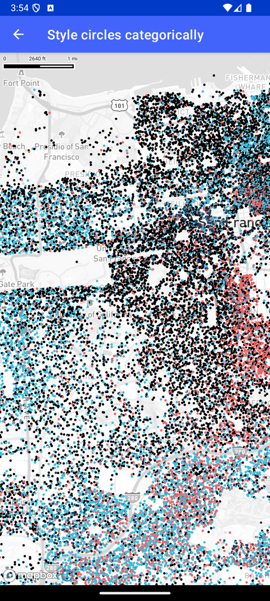

# 分类着色圆点（Style circles categorically）

> 官方示例：[style-circles-categorically](https://docs.mapbox.com/android/maps/examples/android-view/style-circles-categorically/)

## 示例效果



## 功能说明

从矢量瓦片集加载点数据，用 match/get 表达式按属性为 CircleLayer 着色。

<details>
<summary>英文原文</summary>

This example demonstrates adding point data to a Maps SDK for Android style from a vector tileset. It utilizes the match and get expressions to assign colors to each point in a CircleLayer based on a specific data property. The implementation includes setting up a vectorSource with a URL to the tileset data, defining a CircleLayer with population data and specifying the circle's radius using an exponential interpolator. The colors of the circles are determined by a match expression that maps different ethnicity values to corresponding RGB color values, with a fallback color provided. The map is centered on a specific location and zoomed in to a certain level using CameraOptions. There are several ways to add markers, annotations, and other shapes to the map using the Maps SDK. To choose the appropriate approach for your application, read the Markers and annotations guide.

</details>

## 示例 Activity

- `StyleCirclesCategoricallyActivity.kt`

## 示例代码

```kotlin
package com.mapbox.maps.testapp.examples

import android.os.Bundle
import androidx.appcompat.app.AppCompatActivity
import com.mapbox.bindgen.Value
import com.mapbox.common.MapboxOptions
import com.mapbox.geojson.Point
import com.mapbox.maps.CameraOptions
import com.mapbox.maps.MapView
import com.mapbox.maps.MapboxMap
import com.mapbox.maps.Style
import com.mapbox.maps.extension.style.expressions.generated.Expression
import com.mapbox.maps.extension.style.expressions.generated.Expression.Companion.exponentialInterpolator
import com.mapbox.maps.extension.style.expressions.generated.Expression.Companion.literal
import com.mapbox.maps.extension.style.expressions.generated.Expression.Companion.match
import com.mapbox.maps.extension.style.expressions.generated.Expression.Companion.rgb
import com.mapbox.maps.extension.style.expressions.generated.Expression.Companion.zoom
import com.mapbox.maps.extension.style.layers.generated.circleLayer
import com.mapbox.maps.extension.style.sources.generated.vectorSource
import com.mapbox.maps.extension.style.style

/**
 * Add point data to a style from a vector tileset and use the match and
 * get expressions to assign the color of each point in a CircleLayer
 * based on a data property.
 */
class StyleCirclesCategoricallyActivity : AppCompatActivity() {

  private lateinit var mapboxMap: MapboxMap

  override fun onCreate(savedInstanceState: Bundle?) {
    super.onCreate(savedInstanceState)
    val mapView = MapView(this)
    setContentView(mapView)
    mapboxMap = mapView.mapboxMap
    mapboxMap.loadStyle(
      style(Style.STANDARD) {

        +vectorSource("ethnicity-source") {
          url("http://api.mapbox.com/v4/examples.8fgz4egr.json?access_token=" + MapboxOptions.accessToken)
        }

        +circleLayer("population", "ethnicity-source") {
          sourceLayer("sf2010")
          circleRadius(
            exponentialInterpolator(
              base = 1.75,
              input = zoom(),
              stops = arrayOf(
                literal(12) to literal(2),
                literal(22) to literal(180)
              )
            )
          )
          circleColor(
            match(
              input = Expression.get("ethnicity"),
              stops = arrayOf(
                literal("white") to rgb(251.0, 176.0, 59.0),
                literal("Black") to rgb(34.0, 59.0, 83.0),
                literal("Hispanic") to rgb(229.0, 94.0, 94.0),
                literal("Asian") to rgb(59.0, 178.0, 208.0),
                literal("Other") to rgb(204.0, 204.0, 204.0),
              ),
              fallback = rgb(0.0, 0.0, 0.0)
            )
          )
        }
      }
    ) {
      mapboxMap.setStyleImportConfigProperty("basemap", "theme", Value.valueOf("monochrome"))
    }

    mapboxMap.setCamera(
      CameraOptions.Builder()
        .center(Point.fromLngLat(-122.447303, 37.753574))
        .zoom(12.0)
        .build()
    )
  }
}
```

## 在 Aura 项目中使用

- UI 框架：**Android View**（与 Aura 当前 `MapFragment` + `MapView` 一致）
- 包名请替换为 `com.catclaw.aura`
- 需在 `local.properties` 配置 `MAPBOX_ACCESS_TOKEN`
- 部分示例依赖 `assets/` 或额外布局文件，请参考 GitHub 示例工程

## 参考链接

- [官方文档（英文）](https://docs.mapbox.com/android/maps/examples/android-view/style-circles-categorically/)
- [GitHub 源码](https://github.com/mapbox/mapbox-maps-android/blob/v11.24.3/app/src/main/java/com/mapbox/maps/testapp/examples/StyleCirclesCategoricallyActivity.kt)
- [Android View 示例索引](./README.md)
- [Mapbox 中文指南](../../README.md)
