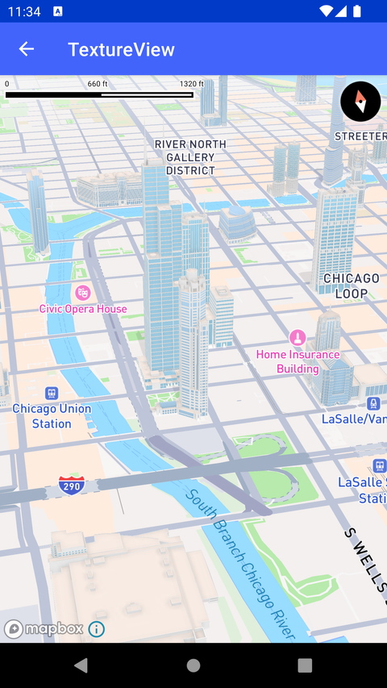

# TextureView 渲染（TextureView）

> 官方示例：[textureview](https://docs.mapbox.com/android/maps/examples/android-view/textureview/)

## 示例效果



## 功能说明

使用 TextureView 作为地图渲染表面。

<details>
<summary>英文原文</summary>

This example demonstrates how to display a map using a TextureView as the render surface. The code snippet includes a class TextureViewActivity extending AppCompatActivity, where an instance of MapboxMap is created. The onCreate method initializes the MapboxMap instance, inflates the layout from ActivityTextureViewBinding, sets the content view, and loads the Mapbox Standard map style using mapboxMap.loadStyle(Style.STANDARD).

</details>

## 示例 Activity

- `TextureViewActivity.kt`

## 示例代码

```kotlin
package com.mapbox.maps.testapp.examples

import android.os.Bundle
import androidx.appcompat.app.AppCompatActivity
import com.mapbox.maps.MapboxMap
import com.mapbox.maps.Style
import com.mapbox.maps.testapp.databinding.ActivityTextureViewBinding

/**
 * Example of displaying a map using TextureView as render surface.
 */
class TextureViewActivity : AppCompatActivity() {

  private lateinit var mapboxMap: MapboxMap

  override fun onCreate(savedInstanceState: Bundle?) {
    super.onCreate(savedInstanceState)
    val binding = ActivityTextureViewBinding.inflate(layoutInflater)
    setContentView(binding.root)
    mapboxMap = binding.mapView.mapboxMap
    mapboxMap.loadStyle(Style.STANDARD)
  }
}
```

## 在 Aura 项目中使用

- UI 框架：**Android View**（与 Aura 当前 `MapFragment` + `MapView` 一致）
- 包名请替换为 `com.catclaw.aura`
- 需在 `local.properties` 配置 `MAPBOX_ACCESS_TOKEN`
- 部分示例依赖 `assets/` 或额外布局文件，请参考 GitHub 示例工程

## 参考链接

- [官方文档（英文）](https://docs.mapbox.com/android/maps/examples/android-view/textureview/)
- [GitHub 源码](https://github.com/mapbox/mapbox-maps-android/blob/v11.24.3/app/src/main/java/com/mapbox/maps/testapp/examples/TextureViewActivity.kt)
- [Android View 示例索引](./README.md)
- [Mapbox 中文指南](../../README.md)
