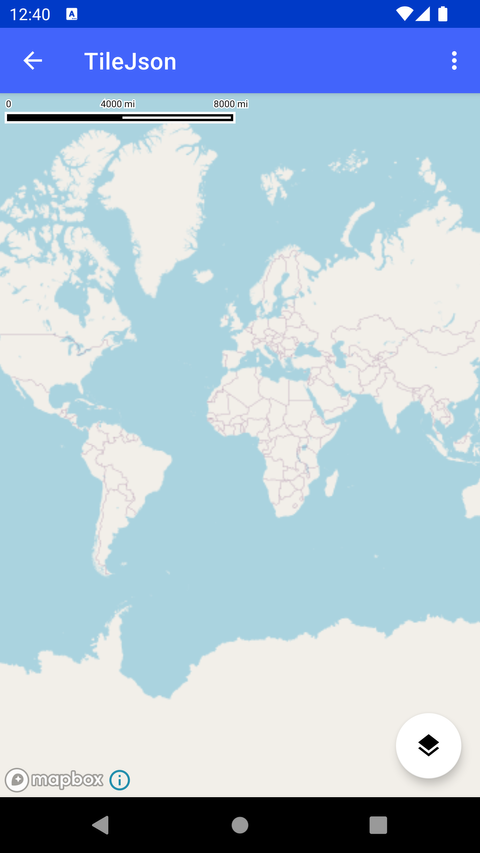

# TileJSON 栅格源（TileJson）

> 官方示例：[tilejson](https://docs.mapbox.com/android/maps/examples/android-view/tilejson/)

## 示例效果



## 功能说明

使用 TileSet 类通过 raster source/layer 渲染 OSM 瓦片。

<details>
<summary>英文原文</summary>

This example showcases the usage of TileSet to load a TileJSON compatible configuration as a source using the Maps SDK for Android. It utilizes OpenStreetMap (OSM) tiles as a raster source and visualizes them using a raster layer. The activity initializes a MapView and configures a TileSet with specifications such as version, URL, name, description, attribution, zoom levels, bounds, and center location. The map style is loaded with the specified source and layer, displaying the OpenStreetMap tiles on the map view. The example also includes functionality for setting tile request delays and network request delays through menu options, allowing users to adjust the delays based on preferences. A Floating Action Button is implemented to print out the properties of the tile set as JSON, providing insights and information about the loaded source. Users can interact with the map to visualize and explore the raster tiles from the OpenStreetMap source efficiently.

</details>

## 示例 Activity

- `TileJsonActivity.kt`

## 示例代码

```kotlin
package com.mapbox.maps.testapp.examples.style

import android.os.Bundle
import android.view.Menu
import android.view.MenuItem
import android.widget.Toast
import androidx.appcompat.app.AppCompatActivity
import com.google.android.material.floatingactionbutton.FloatingActionButton
import com.mapbox.common.ValueConverter
import com.mapbox.maps.MapView
import com.mapbox.maps.MapboxMap
import com.mapbox.maps.extension.style.layers.addLayer
import com.mapbox.maps.extension.style.layers.generated.rasterLayer
import com.mapbox.maps.extension.style.sources.TileSet
import com.mapbox.maps.extension.style.sources.addSource
import com.mapbox.maps.extension.style.sources.generated.RasterSource
import com.mapbox.maps.extension.style.sources.generated.Scheme
import com.mapbox.maps.extension.style.sources.generated.rasterSource
import com.mapbox.maps.extension.style.sources.getSourceAs
import com.mapbox.maps.logI
import com.mapbox.maps.testapp.R

/**
 * Activity showcases usage of TileSet to load a TileJSON compatible configuration as a source.
 *
 * This example uses OSM tiles as a raster source and visualises them using a raster layer.
 */
class TileJsonActivity : AppCompatActivity() {

  private lateinit var mapboxMap: MapboxMap

  override fun onCreate(savedInstanceState: Bundle?) {
    super.onCreate(savedInstanceState)
    setContentView(R.layout.activity_custom_layer)
    val mapView: MapView = findViewById(R.id.mapView)

    val tileSet = TileSet.Builder(TILE_JSON_VERSION, listOf(OSM_RASTER_TILE_URL))
      .name(TILE_JSON_NAME)
      .description(TILE_JSON_DESCRIPTION)
      .attribution(TILE_JSON_ATTRIBUTION)
      .scheme(Scheme.XYZ)
      .minZoom(TILE_JSON_MIN_ZOOM)
      .maxZoom(TILE_JSON_MAX_ZOOM)
      .bounds(MERCATOR_BOUNDS)
      .center(CENTER_MAP_LOCATION)
      .build()

    mapboxMap = mapView.mapboxMap
    mapboxMap.loadStyle("{}") {
      it.addSource(
        rasterSource(SOURCE_ID) {
          tileSet(tileSet)
          tileSize(RASTER_TILE_SIZE_PIXELS)
        }
      )
      it.addLayer(rasterLayer(LAYER_ID, SOURCE_ID) {})
    }

    // Click on button to print out tile set information
    findViewById<FloatingActionButton>(R.id.fab).setOnClickListener {
      if (::mapboxMap.isInitialized) {
        mapboxMap.getStyle {
          val properties = it.getStyleSourceProperties(SOURCE_ID).value!!
          val propertiesJson = ValueConverter.toJson(properties)
          logI(TAG, propertiesJson)
          Toast.makeText(this, propertiesJson, Toast.LENGTH_LONG).show()
        }
      }
    }
  }

  override fun onCreateOptionsMenu(menu: Menu): Boolean {
    menuInflater.inflate(R.menu.menu_tilejson, menu)
    return true
  }

  override fun onOptionsItemSelected(item: MenuItem): Boolean {
    return when (item.itemId) {
      R.id.menu_set_tile_request_delay -> {
        item.isChecked = !item.isChecked
        setTileDelay(TILE_REQUEST, item.isChecked)
        true
      }
      R.id.menu_set_tile_network_request_delay -> {
        item.isChecked = !item.isChecked
        setTileDelay(NETWORK_REQUEST, item.isChecked)
        true
      }
      else -> {
        super.onOptionsItemSelected(item)
      }
    }
  }

  private fun setTileDelay(requestType: String, isChecked: Boolean = false) {
    mapboxMap.getStyle {
      it.getSourceAs<RasterSource>(SOURCE_ID)?.apply {
        if (requestType == TILE_REQUEST) {
          tileRequestsDelay(if (isChecked) RASTER_TILE_DELAY else DEFAULT_RASTER_TILE_DELAY)
        }
        if (requestType == NETWORK_REQUEST) {
          tileNetworkRequestsDelay(if (isChecked) RASTER_TILE_DELAY else DEFAULT_RASTER_TILE_DELAY)
        }
      }
    }
  }

  private companion object {
    const val SOURCE_ID = "osm"
    const val LAYER_ID = SOURCE_ID
    const val TAG = SOURCE_ID

    const val TILE_JSON_VERSION = "2.0.0"
    const val TILE_JSON_NAME = "OpenStreetMap"
    const val TILE_JSON_DESCRIPTION = "A free editable map of the whole world."
    const val TILE_JSON_ATTRIBUTION = "&copy; OpenStreetMap contributors, CC-BY-SA"
    const val TILE_JSON_MIN_ZOOM = 0
    const val TILE_JSON_MAX_ZOOM = 18

    const val RASTER_TILE_DELAY = 2000.0
    const val DEFAULT_RASTER_TILE_DELAY = 0.0
    const val TILE_REQUEST = "tile"
    const val NETWORK_REQUEST = "network"
    const val OSM_RASTER_TILE_URL = "http://tile.openstreetmap.org/{z}/{x}/{y}.png"
    const val RASTER_TILE_SIZE_PIXELS = 256L

    val MERCATOR_BOUNDS = listOf(-180.0, -85.0, 180.0, 85.0)
    val CENTER_MAP_LOCATION = listOf(11.9, 57.7, 8.0)
  }
}
```

## 在 Aura 项目中使用

- UI 框架：**Android View**（与 Aura 当前 `MapFragment` + `MapView` 一致）
- 包名请替换为 `com.catclaw.aura`
- 需在 `local.properties` 配置 `MAPBOX_ACCESS_TOKEN`
- 部分示例依赖 `assets/` 或额外布局文件，请参考 GitHub 示例工程

## 参考链接

- [官方文档（英文）](https://docs.mapbox.com/android/maps/examples/android-view/tilejson/)
- [GitHub 源码](https://github.com/mapbox/mapbox-maps-android/blob/v11.24.3/app/src/main/java/com/mapbox/maps/testapp/examples/style/TileJsonActivity.kt)
- [Android View 示例索引](./README.md)
- [Mapbox 中文指南](../../README.md)
