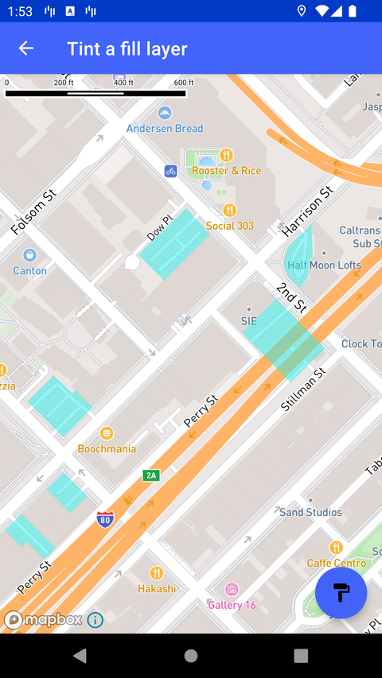

# Fill 图层着色（Tint a fill layer）

> 官方示例：[tint-a-fill-layer](https://docs.mapbox.com/android/maps/examples/android-view/tint-a-fill-layer/)

## 示例效果



## 功能说明

向样式添加图片，并在 landuse FillLayer 中显示填充图案。

<details>
<summary>英文原文</summary>

This example demonstrates adding an image to a map's style and using it to present a pattern within the landuse FillLayer of the Mapbox Streets style. This example uses classic Mapbox styles (for example: MAPBOX_STREETS,SATELLITE, OUTDOORS, etc). These styles are no longer maintained and may not include the latest features or updates. Developers are encouraged to use the Mapbox Standard or Mapbox Standard Satellite styles](https://docs.mapbox.com/map-styles/standard/guides#mapbox-standard-satellite) or to build a custom style using Mapbox Studio. The implementation dynamically changes the fill pattern color on a button click event, configuring the opacity based on zoom level transitions, and applying filters to specific features within the map layer. Key components utilized in this example include the style class for defining the map style, fillLayer for creating the landuse fill layer, addImage for adding the image used for the pattern, and linearInterpolator for setting opacity levels based on zoom levels. The code showcases how to customize map layers with unique patterns and colors for enhanced map visualization.

</details>

## 示例 Activity

- `TintFillPatternActivity.kt`

## 示例代码

```kotlin
package com.mapbox.maps.testapp.examples

import android.graphics.Bitmap
import android.graphics.BitmapFactory
import android.graphics.Canvas
import android.graphics.Paint
import android.graphics.PorterDuff
import android.graphics.PorterDuffColorFilter
import android.os.Bundle
import androidx.annotation.ColorInt
import androidx.appcompat.app.AppCompatActivity
import com.mapbox.maps.Style
import com.mapbox.maps.extension.style.expressions.dsl.generated.eq
import com.mapbox.maps.extension.style.expressions.dsl.generated.literal
import com.mapbox.maps.extension.style.expressions.dsl.generated.zoom
import com.mapbox.maps.extension.style.expressions.generated.Expression.Companion.linearInterpolator
import com.mapbox.maps.extension.style.image.image
import com.mapbox.maps.extension.style.layers.generated.fillLayer
import com.mapbox.maps.extension.style.style
import com.mapbox.maps.testapp.R
import com.mapbox.maps.testapp.databinding.ActivityRtsFillPatternTintBinding

/**
 * Add an image to a style and use it to display a pattern in the landuse
 * FillLayer in the Mapbox Streets style.
 */
class TintFillPatternActivity : AppCompatActivity() {

  private lateinit var initialBitmap: Bitmap

  public override fun onCreate(savedInstanceState: Bundle?) {
    super.onCreate(savedInstanceState)
    val binding = ActivityRtsFillPatternTintBinding.inflate(layoutInflater)
    setContentView(binding.root)

    initialBitmap = BitmapFactory.decodeResource(resources, R.drawable.fill_pattern)

    binding.fabPaint.setOnClickListener {
      binding.mapView.mapboxMap.style?.apply {
        addImage(FILL_PATTERN_ID, changeBitmapColor(initialBitmap, randomColor()))
      }
    }

    binding.mapView.mapboxMap.loadStyle(
      style(Style.MAPBOX_STREETS) {
        +image(FILL_PATTERN_ID, changeBitmapColor(initialBitmap, randomColor()))
        +fillLayer(FILL_LAYER_ID, STREETS_SOURCE_ID) {
          sourceLayer(SOURCE_LAYER)
          fillPattern(FILL_PATTERN_ID)
          fillOpacity(
            linearInterpolator(
              input = zoom(),
              stops = arrayOf(
                literal(13.0) to literal(0.0),
                literal(15.0) to literal(0.5),
                literal(17.0) to literal(0.75)
              )
            )
          )
          filter(
            eq {
              get { literal(FILTER_FIELD) }
              literal(FILTER_VALUE)
            }
          )
        }
      }
    )
  }

  private fun changeBitmapColor(sourceBitmap: Bitmap, @ColorInt color: Int): Bitmap {
    val config = sourceBitmap.config ?: return sourceBitmap
    val resultBitmap: Bitmap = sourceBitmap.copy(config, true)
    val paint = Paint()
    paint.colorFilter = PorterDuffColorFilter(color, PorterDuff.Mode.SRC_IN)
    val canvas = Canvas(resultBitmap)
    canvas.drawBitmap(resultBitmap, 0f, 0f, paint)
    return resultBitmap
  }

  private fun randomColor(): Int {
    return (Math.random() * 16777215).toInt() or (0xFF shl 24)
  }

  companion object {
    private const val FILL_LAYER_ID = "fill_layer_id"
    private const val FILL_PATTERN_ID = "fill_pattern_id"
    private const val STREETS_SOURCE_ID = "composite"
    private const val SOURCE_LAYER = "landuse"
    private const val FILTER_FIELD = "class"
    private const val FILTER_VALUE = "parking"
  }
}
```

## 在 Aura 项目中使用

- UI 框架：**Android View**（与 Aura 当前 `MapFragment` + `MapView` 一致）
- 包名请替换为 `com.catclaw.aura`
- 需在 `local.properties` 配置 `MAPBOX_ACCESS_TOKEN`
- 部分示例依赖 `assets/` 或额外布局文件，请参考 GitHub 示例工程

## 参考链接

- [官方文档（英文）](https://docs.mapbox.com/android/maps/examples/android-view/tint-a-fill-layer/)
- [GitHub 源码](https://github.com/mapbox/mapbox-maps-android/blob/v11.24.3/app/src/main/java/com/mapbox/maps/testapp/examples/TintFillPatternActivity.kt)
- [Android View 示例索引](./README.md)
- [Mapbox 中文指南](../../README.md)
