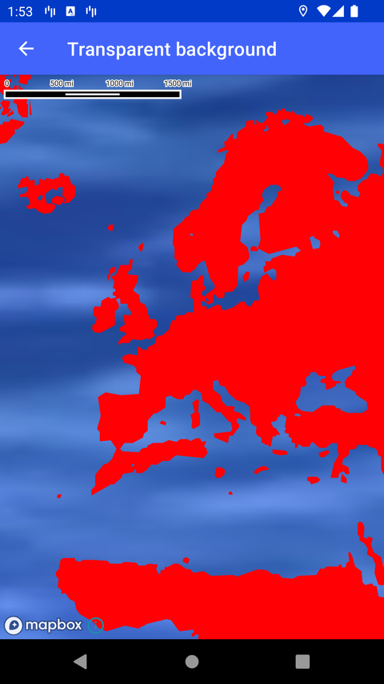

# 透明背景（Transparent background）

> 官方示例：[transparent-background](https://docs.mapbox.com/android/maps/examples/android-view/transparent-background/)

## 示例效果



## 功能说明

创建透明背景的 MapView，可在地图后方显示视频等内容。

<details>
<summary>英文原文</summary>

This example demonstrates using a custom video as a background for a MapView in the Mapbox Maps SDK for Android. By leveraging the texture_view rendering for the MapView, the background video can have alpha channel translucency. The TransparentBackgroundActivity class extends AppCompatActivity and includes functionality to load a custom video (moving_background_water) as the background video. In the onCreate method, the custom JSON style containing map layer information is loaded using mapboxMap.loadStyle. This method initializes the background video view (videoView) by setting the video URI and starting playback. When the video playback completes, the app automatically sets it to replay. The onDestroy method ensures the video playback is stopped when the activity is destroyed.

</details>

## 示例 Activity

- `TransparentBackgroundActivity.kt`

## 示例代码

```kotlin
package com.mapbox.maps.testapp.examples

import android.net.Uri
import android.os.Bundle
import androidx.appcompat.app.AppCompatActivity
import com.mapbox.maps.testapp.R
import com.mapbox.maps.testapp.databinding.ActivityTransparentBackgroundBinding

/**
 * Example of using custom video as a background for MapView.
 * This is possible when using `texture_view` rendering for MapView because it supports alpha channel translucency.
 */
class TransparentBackgroundActivity : AppCompatActivity() {

  private lateinit var binding: ActivityTransparentBackgroundBinding

  private fun initVideoView() {
    val path = "android.resource://" + packageName + "/" + R.raw.moving_background_water
    binding.videoView.apply {
      setVideoURI(Uri.parse(path))
      start()
      setOnCompletionListener { binding.videoView.start() }
    }
  }

  override fun onCreate(savedInstanceState: Bundle?) {
    super.onCreate(savedInstanceState)
    binding = ActivityTransparentBackgroundBinding.inflate(layoutInflater)
    setContentView(binding.root)

    binding.mapView.mapboxMap.loadStyle(
      """
      {
        "version": 8,
        "name": "Land",
        "metadata": {
          "mapbox:autocomposite": true
        },
        "sources": {
          "composite": {
            "url": "mapbox://mapbox.mapbox-terrain-v2",
            "type": "vector"
          }
        },
        "glyphs": "mapbox://fonts/mapbox/{fontstack}/{range}.pbf",
        "layers": [
          {
            "layout": {
              "visibility": "visible"
            },
            "type": "fill",
            "source": "composite",
            "id": "admin",
            "paint": {
              "fill-color": "hsl(359, 100%, 50%)",
              "fill-opacity": 1
            },
            "source-layer": "landcover"
          },
          {
            "layout": {
              "visibility": "visible"
            },
            "type": "fill",
            "source": "composite",
            "id": "layer-0",
            "paint": {
              "fill-opacity": 1,
              "fill-color": "hsl(359, 100%, 50%)"
            },
            "source-layer": "Layer_0"
          }
        ]
      }
      """.trimIndent()
    ) { initVideoView() }
  }

  override fun onDestroy() {
    super.onDestroy()
    binding.videoView.stopPlayback()
  }
}
```

## 在 Aura 项目中使用

- UI 框架：**Android View**（与 Aura 当前 `MapFragment` + `MapView` 一致）
- 包名请替换为 `com.catclaw.aura`
- 需在 `local.properties` 配置 `MAPBOX_ACCESS_TOKEN`
- 部分示例依赖 `assets/` 或额外布局文件，请参考 GitHub 示例工程

## 参考链接

- [官方文档（英文）](https://docs.mapbox.com/android/maps/examples/android-view/transparent-background/)
- [GitHub 源码](https://github.com/mapbox/mapbox-maps-android/blob/v11.24.3/app/src/main/java/com/mapbox/maps/testapp/examples/TransparentBackgroundActivity.kt)
- [Android View 示例索引](./README.md)
- [Mapbox 中文指南](../../README.md)
