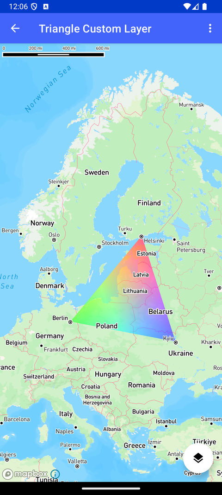

# 三角形自定义图层（Triangle Custom Layer）

> 官方示例：[triangle-custom-layer](https://docs.mapbox.com/android/maps/examples/android-view/triangle-custom-layer/)

## 示例效果



## 功能说明

使用 CustomLayer 向样式添加自定义三角形图层。

<details>
<summary>英文原文</summary>

This example demonstrates adding a custom layer with CustomLayer using the Mapbox Maps SDK for Android. It includes functions for adding, swapping, and updating custom layers dynamically on the map. The custom layer consists of a triangular shape that can be customized with different colors. The activity initializes the Mapbox map with a custom layer positioned below the standard building layers and uses the ProjectionName.MERCATOR projection to display the triangle correctly on the map. Users can interact with the custom layer by swapping it on and off the map, updating its properties, and changing its color through options available in the menu. The example uses various classes and methods such as MapboxMap, CameraOptions, CustomLayer, style, and triggerRepaint to manage custom layers and interactions on the map.

</details>

## 示例 Activity

- `TriangleCustomLayerActivity.kt`

## 示例代码

```kotlin
package com.mapbox.maps.testapp.examples.customlayer

import android.os.Bundle
import android.view.Menu
import android.view.MenuItem
import androidx.appcompat.app.AppCompatActivity
import com.mapbox.geojson.Point
import com.mapbox.maps.CameraOptions
import com.mapbox.maps.MapboxMap
import com.mapbox.maps.Style
import com.mapbox.maps.extension.style.layers.addLayer
import com.mapbox.maps.extension.style.layers.customLayer
import com.mapbox.maps.extension.style.layers.properties.generated.ProjectionName
import com.mapbox.maps.extension.style.projection.generated.projection
import com.mapbox.maps.extension.style.style
import com.mapbox.maps.testapp.R
import com.mapbox.maps.testapp.databinding.ActivityCustomLayerBinding

/**
 * Test activity showcasing the Custom Layer API
 */
class TriangleCustomLayerActivity : AppCompatActivity() {
  private lateinit var mapboxMap: MapboxMap
  private lateinit var binding: ActivityCustomLayerBinding

  override fun onCreate(savedInstanceState: Bundle?) {
    super.onCreate(savedInstanceState)
    binding = ActivityCustomLayerBinding.inflate(layoutInflater)
    setContentView(binding.root)
    mapboxMap = binding.mapView.mapboxMap
    mapboxMap.loadStyle(
      style(Style.STANDARD) {
        +customLayer(
          layerId = CUSTOM_LAYER_ID,
          host = TriangleCustomLayer()
        ).slot("middle")
        // triangle is floating when using default ProjectionName.GLOBE
        +projection(ProjectionName.MERCATOR)
      }
    ) {
      mapboxMap.setCamera(CAMERA)
      initFab()
    }
  }

  private fun addCustomLayer(style: Style) {
    style.addLayer(
      customLayer(CUSTOM_LAYER_ID, TriangleCustomLayer()) {
        slot("middle")
      }
    )
    binding.fab.setImageResource(R.drawable.ic_layers_clear)
  }

  private fun initFab() {
    binding.fab.setOnClickListener {
      swapCustomLayer()
    }
  }

  private fun swapCustomLayer() {
    mapboxMap.style?.let { style ->
      if (style.styleLayerExists(CUSTOM_LAYER_ID)) {
        style.removeStyleLayer(CUSTOM_LAYER_ID)
        binding.fab.setImageResource(R.drawable.ic_layers)
      } else {
        addCustomLayer(style)
      }
    }
  }

  private fun updateLayer() {
    mapboxMap.triggerRepaint()
  }

  override fun onCreateOptionsMenu(menu: Menu): Boolean {
    menuInflater.inflate(R.menu.menu_custom_layer, menu)
    return true
  }

  override fun onOptionsItemSelected(item: MenuItem): Boolean {
    return when (item.itemId) {
      R.id.action_update_layer -> {
        updateLayer()
        true
      }

      R.id.action_set_color_red -> {
        TriangleCustomLayer.color = floatArrayOf(
          1.0f, 0.0f, 0.0f, 0.5f,
          0.0f, 1.0f, 0.0f, 0.5f,
          0.0f, 0.0f, 1.0f, 0.5f,
        )
        true
      }

      R.id.action_set_color_green -> {
        TriangleCustomLayer.color = floatArrayOf(
          0.0f, 1.0f, 0.0f, 0.5f,
          0.0f, 0.0f, 1.0f, 0.5f,
          1.0f, 0.0f, 0.0f, 0.5f,
        )
        true
      }

      R.id.action_set_color_blue -> {
        TriangleCustomLayer.color = floatArrayOf(
          0.0f, 0.0f, 1.0f, 0.5f,
          1.0f, 0.0f, 0.0f, 0.5f,
          0.0f, 1.0f, 0.0f, 0.5f,
        )
        true
      }

      else -> super.onOptionsItemSelected(item)
    }
  }

  companion object {
    private const val CUSTOM_LAYER_ID = "customId"
    private val CAMERA =
      CameraOptions.Builder().center(Point.fromLngLat(20.0, 58.0)).pitch(0.0).zoom(3.0).build()
  }
}
```

## 在 Aura 项目中使用

- UI 框架：**Android View**（与 Aura 当前 `MapFragment` + `MapView` 一致）
- 包名请替换为 `com.catclaw.aura`
- 需在 `local.properties` 配置 `MAPBOX_ACCESS_TOKEN`
- 部分示例依赖 `assets/` 或额外布局文件，请参考 GitHub 示例工程

## 参考链接

- [官方文档（英文）](https://docs.mapbox.com/android/maps/examples/android-view/triangle-custom-layer/)
- [GitHub 源码](https://github.com/mapbox/mapbox-maps-android/blob/v11.24.3/app/src/main/java/com/mapbox/maps/testapp/examples/customlayer/TriangleCustomLayerActivity.kt)
- [Android View 示例索引](./README.md)
- [Mapbox 中文指南](../../README.md)
