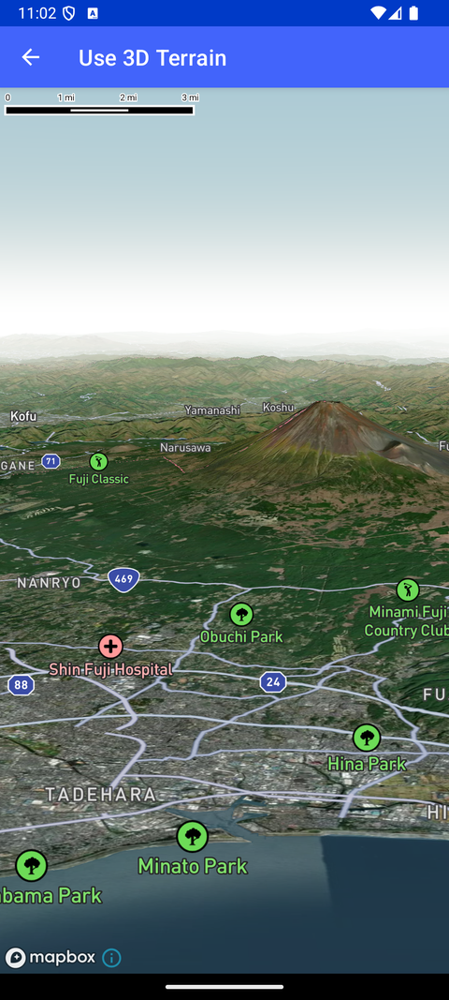

# 3D 地形（Use 3D Terrain）

> 官方示例：[use-3d-terrain](https://docs.mapbox.com/android/maps/examples/android-view/use-3d-terrain/)

## 示例效果



## 功能说明

添加 3D 地形与大气天空层，打造更真实的地图效果。

<details>
<summary>英文原文</summary>

This example demonstrates how to create a realistic 3D terrain map with atmospheric and sky effects using the Mapbox Maps SDK for Android. It sets up a map styled with the Style.STANDARD_SATELLITE style, incorporating a raster DEM (Digital Elevation Model) source to render detailed elevation data. The terrain uses tiles from the Mapbox Terrain-DEM v1 tileset. The map also includes an atmospheric sky layer configured with SkyType.ATMOSPHERE to simulate realistic daylight conditions. The globe projection is enabled to provide an accurate representation of the Earth's curvature. This setup offers a visually engaging and immersive experience, highlighting the advanced capabilities of the Maps SDK for creating dynamic 3D environments.

</details>

## 示例 Activity

- `Terrain3DShowcaseActivity.kt`

## 示例代码

```kotlin
package com.mapbox.maps.testapp.examples.terrain3D

import android.os.Bundle
import androidx.appcompat.app.AppCompatActivity
import com.mapbox.maps.MapboxMap
import com.mapbox.maps.Style
import com.mapbox.maps.extension.style.atmosphere.generated.atmosphere
import com.mapbox.maps.extension.style.layers.generated.skyLayer
import com.mapbox.maps.extension.style.layers.properties.generated.ProjectionName
import com.mapbox.maps.extension.style.layers.properties.generated.SkyType
import com.mapbox.maps.extension.style.projection.generated.projection
import com.mapbox.maps.extension.style.sources.generated.rasterDemSource
import com.mapbox.maps.extension.style.style
import com.mapbox.maps.extension.style.terrain.generated.terrain
import com.mapbox.maps.testapp.databinding.ActivityTerrainShowcaseBinding

/**
 * Example that demonstrates realistic map with 3D terrain and atmosphere sky layer.
 */
class Terrain3DShowcaseActivity : AppCompatActivity() {

  private lateinit var mapboxMap: MapboxMap

  override fun onCreate(savedInstanceState: Bundle?) {
    super.onCreate(savedInstanceState)
    val binding = ActivityTerrainShowcaseBinding.inflate(layoutInflater)
    setContentView(binding.root)
    mapboxMap = binding.mapView.mapboxMap
    mapboxMap.loadStyle(
      styleExtension = style(Style.STANDARD_SATELLITE) {
        +rasterDemSource(SOURCE) {
          url(TERRAIN_URL_TILE_RESOURCE)
          // 514 specifies padded DEM tile and provides better performance than 512 tiles.
          tileSize(514)
        }
        +terrain(SOURCE)
        +skyLayer(SKY_LAYER) {
          skyType(SkyType.ATMOSPHERE)
          skyAtmosphereSun(listOf(-50.0, 90.2))
        }
        +atmosphere { }
        +projection(ProjectionName.GLOBE)
      }
    )
  }

  companion object {
    private const val SOURCE = "TERRAIN_SOURCE"
    private const val SKY_LAYER = "sky"
    private const val TERRAIN_URL_TILE_RESOURCE = "mapbox://mapbox.mapbox-terrain-dem-v1"
  }
}
```

## 在 Aura 项目中使用

- UI 框架：**Android View**（与 Aura 当前 `MapFragment` + `MapView` 一致）
- 包名请替换为 `com.catclaw.aura`
- 需在 `local.properties` 配置 `MAPBOX_ACCESS_TOKEN`
- 部分示例依赖 `assets/` 或额外布局文件，请参考 GitHub 示例工程

## 参考链接

- [官方文档（英文）](https://docs.mapbox.com/android/maps/examples/android-view/use-3d-terrain/)
- [GitHub 源码](https://github.com/mapbox/mapbox-maps-android/blob/v11.24.3/app/src/main/java/com/mapbox/maps/testapp/examples/terrain3D/Terrain3DShowcaseActivity.kt)
- [Android View 示例索引](./README.md)
- [Mapbox 中文指南](../../README.md)
