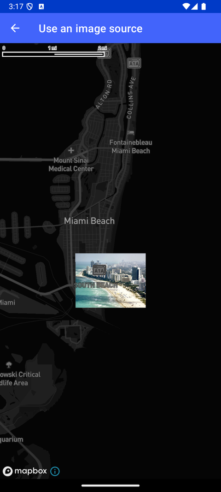

# Image Source（Use an image source）

> 官方示例：[use-an-image-source](https://docs.mapbox.com/android/maps/examples/android-view/use-an-image-source/)

## 示例效果



## 功能说明

使用 Image Source 在地图上叠加图片。

<details>
<summary>英文原文</summary>

This example demonstrates adding an image source and a raster layer to a map using the Mapbox Maps SDK for Android. In the onCreate method, a map is loaded with the Mapbox Standard style using the night LightPreset, an ImageSource, and a RasterLayer. The image source is defined with specific geographic coordinates as its corner points, and an image is loaded onto this source using a drawable resource converted to a bitmap.

</details>

## 示例 Activity

- `ImageSourceActivity.kt`

## 示例代码

```kotlin
package com.mapbox.maps.testapp.examples

import android.os.Bundle
import androidx.appcompat.app.AppCompatActivity
import com.mapbox.bindgen.Value
import com.mapbox.maps.Style
import com.mapbox.maps.extension.style.layers.generated.rasterLayer
import com.mapbox.maps.extension.style.sources.generated.ImageSource
import com.mapbox.maps.extension.style.sources.generated.imageSource
import com.mapbox.maps.extension.style.sources.getSourceAs
import com.mapbox.maps.extension.style.sources.updateImage
import com.mapbox.maps.extension.style.style
import com.mapbox.maps.testapp.R
import com.mapbox.maps.testapp.databinding.ActivityImageSourceBinding
import com.mapbox.maps.testapp.utils.BitmapUtils.bitmapFromDrawableRes

class ImageSourceActivity : AppCompatActivity() {

  override fun onCreate(savedInstanceState: Bundle?) {
    super.onCreate(savedInstanceState)
    val binding = ActivityImageSourceBinding.inflate(layoutInflater)
    setContentView(binding.root)
    val map = binding.mapView.mapboxMap

    map.loadStyle(
      style(style = Style.STANDARD) {
        +imageSource(ID_IMAGE_SOURCE) {
          coordinates(
            listOf(
              listOf(-80.11725, 25.7836),
              listOf(-80.1397431334, 25.783548),
              listOf(-80.13964, 25.7680),
              listOf(-80.11725, 25.76795)
            )
          )
        }
        +rasterLayer(ID_IMAGE_LAYER, ID_IMAGE_SOURCE) {
          rasterEmissiveStrength(1.0)
        }
      }
    ) {
      val imageSource: ImageSource = it.getSourceAs(ID_IMAGE_SOURCE)!!
      imageSource.updateImage(bitmapFromDrawableRes(R.drawable.miami_beach))
      map.setStyleImportConfigProperty("basemap", "theme", Value.valueOf("monochrome"))
      map.setStyleImportConfigProperty("basemap", "lightPreset", Value.valueOf("night"))
    }
  }

  companion object {
    private const val ID_IMAGE_SOURCE = "image_source-id"
    private const val ID_IMAGE_LAYER = "image_layer-id"
  }
}
```

## 在 Aura 项目中使用

- UI 框架：**Android View**（与 Aura 当前 `MapFragment` + `MapView` 一致）
- 包名请替换为 `com.catclaw.aura`
- 需在 `local.properties` 配置 `MAPBOX_ACCESS_TOKEN`
- 部分示例依赖 `assets/` 或额外布局文件，请参考 GitHub 示例工程

## 参考链接

- [官方文档（英文）](https://docs.mapbox.com/android/maps/examples/android-view/use-an-image-source/)
- [GitHub 源码](https://github.com/mapbox/mapbox-maps-android/blob/v11.24.3/app/src/main/java/com/mapbox/maps/testapp/examples/ImageSourceActivity.kt)
- [Android View 示例索引](./README.md)
- [Mapbox 中文指南](../../README.md)
