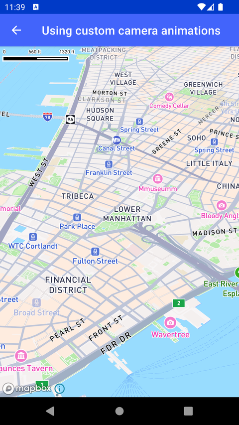

# 自定义相机动画（Using custom camera animations）

> 官方示例：[using-custom-camera-animations](https://docs.mapbox.com/android/maps/examples/android-view/using-custom-camera-animations/)

## 示例效果



## 功能说明

使用 Camera Animator 独立动画化 zoom、bearing、center 等属性。

<details>
<summary>英文原文</summary>

This example demonstrates animated camera movements using the Mapbox Maps SDK for Android. It includes functionalities such as setting the camera target, loading map style, and animating the camera with specific options. The activity initializes a MapView to display the map, creates and customizes animations for bearing, zoom, and pitch using CameraAnimatorOptions, and applies a sequential animation to the camera movement. The camera is targeted to a specific geographic point defined by longitude and latitude coordinates, with the animation interpolator set to AccelerateDecelerateInterpolator for smooth transition effects. Additionally, the animation durations and starting values for zoom, bearing, and pitch are configured to create a visually appealing camera movement experience. To experiment with camera pitch, bearing, tilt, and zoom and get values to use in your code, try our Location Helper tool.

</details>

## 示例 Activity

- `LowLevelCameraAnimatorActivity.kt`

## 示例代码

```kotlin
package com.mapbox.maps.testapp.examples.camera

import android.os.Bundle
import android.view.animation.AccelerateDecelerateInterpolator
import androidx.appcompat.app.AppCompatActivity
import com.mapbox.geojson.Point
import com.mapbox.maps.MapView
import com.mapbox.maps.MapboxMap
import com.mapbox.maps.Style
import com.mapbox.maps.dsl.cameraOptions
import com.mapbox.maps.plugin.animation.CameraAnimatorOptions.Companion.cameraAnimatorOptions
import com.mapbox.maps.plugin.animation.camera

class LowLevelCameraAnimatorActivity : AppCompatActivity() {

  private lateinit var mapboxMap: MapboxMap

  override fun onCreate(savedInstanceState: Bundle?) {
    super.onCreate(savedInstanceState)
    val mapView = MapView(this)
    setContentView(mapView)
    mapboxMap = mapView.mapboxMap
    mapboxMap.setCamera(CAMERA_TARGET)
    mapboxMap.loadStyle(
      Style.STANDARD
    ) {
      mapView.camera.apply {
        val bearing = createBearingAnimator(cameraAnimatorOptions(-45.0)) {
          duration = 4000
          interpolator = AccelerateDecelerateInterpolator()
        }
        val zoom = createZoomAnimator(
          cameraAnimatorOptions(14.0) {
            startValue(3.0)
          }
        ) {
          duration = 4000
          interpolator = AccelerateDecelerateInterpolator()
        }
        val pitch = createPitchAnimator(
          cameraAnimatorOptions(55.0) {
            startValue(0.0)
          }
        ) {
          duration = 4000
          interpolator = AccelerateDecelerateInterpolator()
        }
        playAnimatorsSequentially(zoom, pitch, bearing)
      }
    }
  }

  private companion object {
    private val CAMERA_TARGET = cameraOptions {
      center(Point.fromLngLat(-74.0060, 40.7128))
      zoom(3.0)
    }
  }
}
```

## 在 Aura 项目中使用

- UI 框架：**Android View**（与 Aura 当前 `MapFragment` + `MapView` 一致）
- 包名请替换为 `com.catclaw.aura`
- 需在 `local.properties` 配置 `MAPBOX_ACCESS_TOKEN`
- 部分示例依赖 `assets/` 或额外布局文件，请参考 GitHub 示例工程

## 参考链接

- [官方文档（英文）](https://docs.mapbox.com/android/maps/examples/android-view/using-custom-camera-animations/)
- [GitHub 源码](https://github.com/mapbox/mapbox-maps-android/blob/v11.24.3/app/src/main/java/com/mapbox/maps/testapp/examples/camera/LowLevelCameraAnimatorActivity.kt)
- [Android View 示例索引](./README.md)
- [Mapbox 中文指南](../../README.md)
