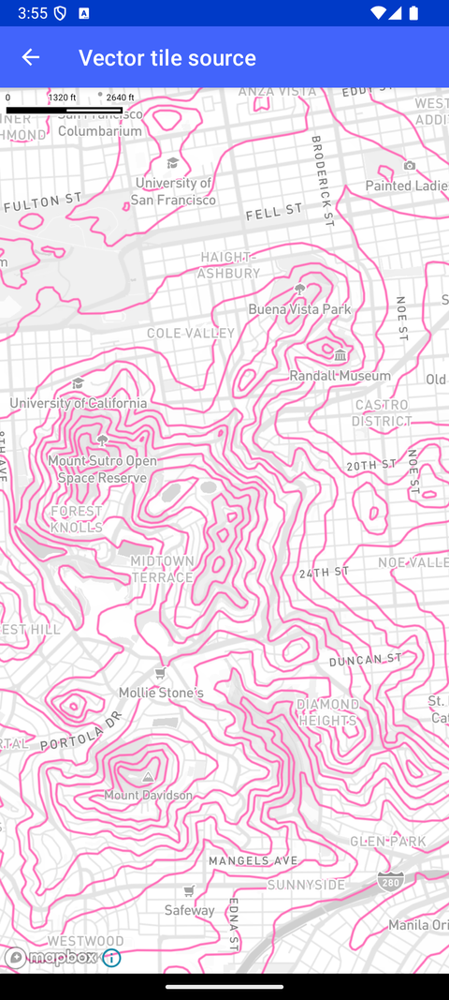

# 矢量瓦片源（Vector tile source）

> 官方示例：[vector-tile-source](https://docs.mapbox.com/android/maps/examples/android-view/vector-tile-source/)

## 示例效果



## 功能说明

添加矢量数据源与 LineLayer。

<details>
<summary>英文原文</summary>

This examples shows how to add a vector source and a corresponding line layer to a map using the Mapbox Maps SDK for Android. In the onCreate method, the Standard style is loaded, and a vectorSource is used to add the Mapbox Terrain v2 vector tileset. A line layer is then created in the same style block using the lineLayer function with specific properties like source layer, line join, line cap, line color, and line width configured to display the vector data. Finally, the line layer is positioned below the layer road-label-simple on the map. By visualizing the vector source with a line layer, developers can effectively display geographical data on the map with customization options like color and width.

</details>

## 示例 Activity

- `VectorTileSourceActivity.kt`

## 示例代码

```kotlin
package com.mapbox.maps.testapp.examples

import android.graphics.Color
import android.os.Bundle
import androidx.appcompat.app.AppCompatActivity
import com.mapbox.bindgen.Value
import com.mapbox.maps.Style
import com.mapbox.maps.extension.style.layers.generated.lineLayer
import com.mapbox.maps.extension.style.layers.properties.generated.LineCap
import com.mapbox.maps.extension.style.layers.properties.generated.LineJoin
import com.mapbox.maps.extension.style.sources.generated.vectorSource
import com.mapbox.maps.extension.style.style
import com.mapbox.maps.testapp.databinding.ActivityStyleVectorSourceBinding

/**
 * Add a vector source to a map using an URL and visualize it with a line layer.
 */
class VectorTileSourceActivity : AppCompatActivity() {

  override fun onCreate(savedInstanceState: Bundle?) {
    super.onCreate(savedInstanceState)
    val binding = ActivityStyleVectorSourceBinding.inflate(layoutInflater)
    setContentView(binding.root)
    binding.mapView.mapboxMap.loadStyle(
      style(Style.STANDARD) {
        +vectorSource("terrain-data") {
          url("mapbox://mapbox.mapbox-terrain-v2")
        }
        +lineLayer("terrain-data", "terrain-data") {
          sourceLayer("contour")
          lineJoin(LineJoin.ROUND)
          lineCap(LineCap.ROUND)
          lineColor(Color.parseColor("#ff69b4"))
          lineWidth(1.9)
          slot("middle")
        }
      }
    ) {
      binding.mapView.mapboxMap.setStyleImportConfigProperty("basemap", "theme", Value.valueOf("monochrome"))
    }
  }
}
```

## 在 Aura 项目中使用

- UI 框架：**Android View**（与 Aura 当前 `MapFragment` + `MapView` 一致）
- 包名请替换为 `com.catclaw.aura`
- 需在 `local.properties` 配置 `MAPBOX_ACCESS_TOKEN`
- 部分示例依赖 `assets/` 或额外布局文件，请参考 GitHub 示例工程

## 参考链接

- [官方文档（英文）](https://docs.mapbox.com/android/maps/examples/android-view/vector-tile-source/)
- [GitHub 源码](https://github.com/mapbox/mapbox-maps-android/blob/v11.24.3/app/src/main/java/com/mapbox/maps/testapp/examples/VectorTileSourceActivity.kt)
- [Android View 示例索引](./README.md)
- [Mapbox 中文指南](../../README.md)
