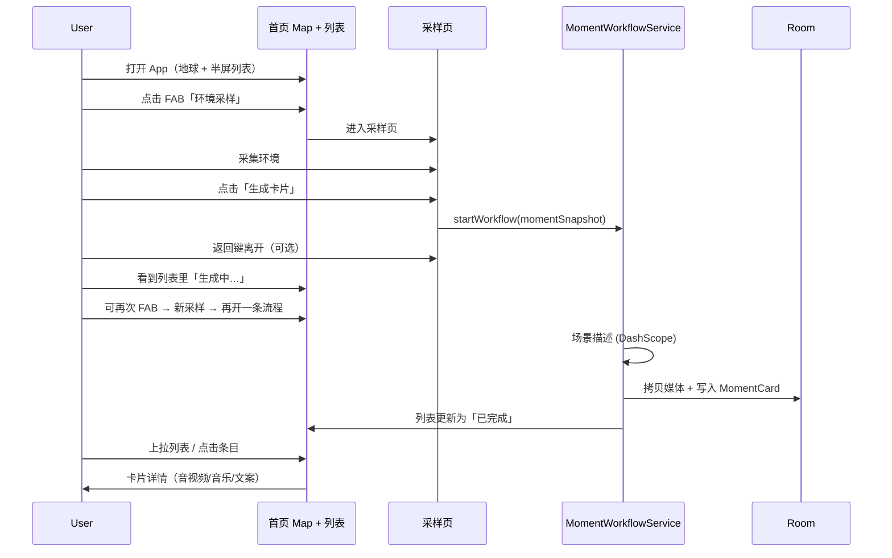
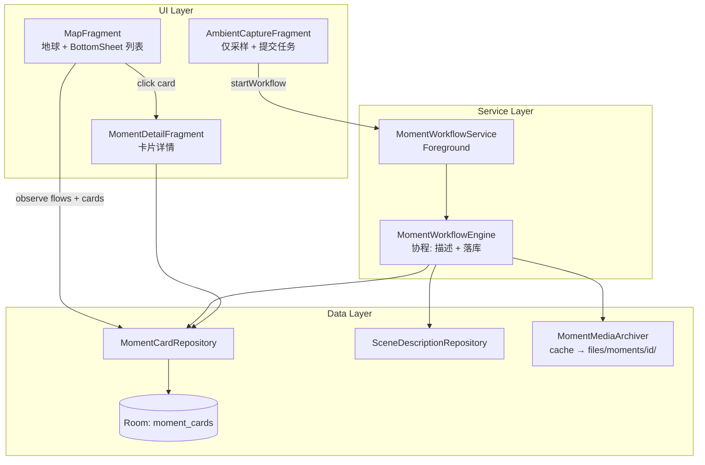

# 环境瞬间卡片 + 首页列表 — 实现计划

> **状态：已实现（用户确认：1B 2是 3半屏 4圆角全屏Fragment 5并行5 6不删除）**  
> **前置**：环境采样、场景描述（百炼）已调通。

---

## 1. 目标与范围

### 1.1 你要达成的体验

| # | 需求 | 说明 |
|---|------|------|
| 1 | **生成时可离开** | 场景描述 / 卡片生成在后台继续，可返回地球首页 |
| 2 | **可并行多流程** | 离开后可再次进入采样页，发起**新的**生成流程 |
| 3 | **Service 统一调度** | 用 Service 管理各流程状态（非 Fragment 绑死） |
| 4 | **完成后落卡片** | 采样数据 + AI 描述 → 一条**卡片**持久化 |
| 5 | **首页半屏列表** | 地球 Map 保留；下半屏可拖拽 Bottom Sheet（半屏 ↔ 全屏） |
| 6 | **点开看详情** | 列表项 → 详情页/层，展示全部可播放媒体 + 文案，排版美观 |

### 1.2 本阶段不做（可后续迭代）

- 云端同步、分享、编辑卡片、删除/搜索（除非你确认要一起做）
- 在**无相机界面**时后台自动采样（CameraX 仍需采样页）
- 地图上与卡片点位联动（可 Phase 2）

---

## 2. 用户动线（User Journey）



**说明**：**采样**仍在 `AmbientCaptureFragment`（需要 Preview）；**生成描述 + 组装卡片**交给 Service，这样离开页面不会取消协程。

---

## 3. 架构方案对比（2～3 种）

### 方案 A：仅 Application 内 Coordinator（无 Service）

- `MomentWorkflowManager`（`Application` 作用域 + `StateFlow`）排队/并行任务  
- **优点**：实现快、与现有 MVVM 一致  
- **缺点**：进程被杀任务中断；不符合你「要 Service」的诉求  

### 方案 B：前台 Service + 内存/DB 状态（**推荐**）

- `MomentWorkflowService`（`foregroundServiceType = dataSync` 或 `specialUse`，带轻量通知）  
- 通过 `startForegroundService` + `Intent`/`Binder` 提交任务；UI 只订阅状态  
- **优点**：符合需求、离开页面可继续、系统不易杀、可多任务并行  
- **缺点**：需通知渠道；实现量中等  

### 方案 C：WorkManager 只做 AI，Service 只做调度

- 描述生成用 `WorkManager`，Service 只发事件  
- **优点**：杀进程后可恢复（若持久化 moment）  
- **缺点**：链路割裂、调试复杂；首版过重  

### 推荐：**方案 B**

- 满足「Service 控制不同流程」  
- 首版不引入 WorkManager；任务状态写 Room，进程重启后列表仍显示「失败/已完成」，**进行中的**标为失败可接受（Phase 2 再恢复）

---

## 4. 总体架构



### 4.1 包结构（建议）

```
com.catclaw.aura/
  service/moment/
    MomentWorkflowService.kt
    MomentWorkflowEngine.kt
    MomentWorkflowState.kt          // 运行中任务（内存）
  data/moment/
    model/MomentCard.kt             // 领域模型
    local/                          // Room Entity / Dao / Database
    MomentCardRepository.kt
    MomentMediaArchiver.kt
  ui/home/                          // 可选：从 map 拆出 BottomSheet 逻辑
  ui/moment/
    MomentCardListAdapter.kt
    MomentDetailFragment.kt
    MomentDetailViewModel.kt
  ui/map/
    MapFragment.kt                  // 集成 BottomSheet + 列表
```

与现有 `data/ambient/`、`data/scenedescription/` **解耦**：Service 只消费 `AmbientMoment` 快照 + 路径，不反向依赖 UI。

---

## 5. 流程与 Service 设计

### 5.1 工作流（Workflow）生命周期

| 阶段 | 枚举 | UI 展示 |
|------|------|---------|
| 已提交 | `QUEUED` | 列表底部或顶部「排队中」 |
| 生成描述 | `GENERATING_DESCRIPTION` | 「正在生成场景描述…」 |
| 归档媒体 | `ARCHIVING_MEDIA` | 「正在保存…」（很快，可合并显示） |
| 完成 | `COMPLETED` | 正常卡片项 |
| 失败 | `FAILED` | 红色角标 + 错误摘要 |

每个流程有 **`workflowId: String`（UUID）**，与最终 **`cardId`** 可相同（简化）。

### 5.2 `MomentWorkflowService` 职责

- `onStartCommand`：`ACTION_START_WORKFLOW`，携带**可序列化**的 moment 快照（见 6.1）  
- 启动 **前台通知**：`Aura · 正在生成 1 项` / `2 项进行中`（合并计数）  
- 内部 `SupervisorJob` + 线程池：每个 workflow 独立协程，**互不影响**  
- 暴露状态：`SharedFlow` / `StateFlow` 经 `MomentWorkflowRepository` 给 UI（`Service` + `bindService` 或单例 Bus；推荐 **Repository 注册 Service 回调 + LocalBroadcast/Flow**）

**并行**：最多同时 N 个描述请求（建议 **2**，避免 DashScope 并发限流）；超出排队。

### 5.3 采样页改动

| 现在 | 计划 |
|------|------|
| ViewModel 内 `generateSceneDescription()` | 改为 `startCardGeneration()` → 调 Service |
| 生成中按钮 loading | 提交成功后即可 **pop 返回**；可选 Toast「已在后台生成」 |
| 同页等待结果 | 详情不再依赖采样页；结果进列表 |

按钮文案建议：**「生成卡片」**（含描述 + 入库），替代仅「生成场景描述」。

### 5.4 是否自动触发生成？

| 选项 | 行为 |
|------|------|
| **A（推荐首版）** | 采样成功后用户点 **「生成卡片」** 才启动 Service（与现习惯一致，省 API） |
| B | 采样成功自动排队生成（可设置页开关，Phase 2） |

请确认选 **A 还是 B**（见第 10 节）。

---

## 6. 数据模型与持久化

### 6.1 问题：`AmbientMoment` 含 `Uri`，进程/页面间传递

- 采样结果目前在 `cache/`，会被新采样覆盖  
- **归档**：Service 开始时 `MomentMediaArchiver` 拷贝到  
  `files/moments/{cardId}/poster.jpg | clip.mp4 | audio.m4a`  
- DB 只存 **相对路径或 file:// URI 字符串**

### 6.2 `MomentCard`（领域实体，示意）

```kotlin
data class MomentCard(
    val id: String,
    val createdAtEpochMs: Long,
    // 媒体（归档后路径）
    val posterPath: String?,
    val videoPath: String?,
    val audioPath: String?,
    val videoDurationMs: Long,
    val audioDurationMs: Long,
    // 音乐
    val musicTitle: String?, val musicArtist: String?, val musicAlbum: String?,
    val musicActive: Boolean, val musicStatusMessage: String,
    // 位置
    val latitude: Double?, val longitude: Double?, val locationAccuracy: Float?,
    // AI
    val sceneDescription: String?,
    val sceneDescriptionError: String?, // 若失败仍建卡，文案区展示错误
    // 元数据
    val captureErrorSummary: String?,   // 各子模块失败摘要
)
```

### 6.3 Room

- 表 `moment_cards`，字段与上一致；`scene_description` Text  
- `MomentCardDao`：`observeAll(): Flow<List<MomentCardEntity>>` 按 `created_at DESC`  
- 启用 **KSP** + `room-compiler`（`RoomPlaceholder` 替换为真实 `AuraDatabase`）

### 6.4 列表项 vs 进行中任务

- **进行中**：内存 `StateFlow<List<ActiveWorkflow>>`，不入库（或入 `workflow_queue` 表，首版可仅内存）  
- **已完成**：Room 卡片；列表 UI = `activeWorkflows + cards` 合并展示（进行中置顶）

---

## 7. 首页 UI：地球 + 可拖拽半屏列表

### 7.1 布局结构

```
CoordinatorLayout (fragment_map 根)
├── FrameLayout @id/map_container          // 全屏地球（现有）
├── ExtendedFAB @id/fab_ambient              // 右下「环境采样」（需避开 sheet）
└── FrameLayout @id/moment_sheet             // BottomSheetBehavior
    ├── 拖拽把手（Material shape 圆角 top）
    ├── 标题行：「我的瞬间」+ 进行中数量 Chip
    └── RecyclerView                         // 卡片列表
```

- **默认**：`STATE_HALF_EXPANDED`（屏高 **50%**）  
- **上拉**：`STATE_EXPANDED`（接近全屏，保留状态栏 inset）  
- **下拉**：回到半屏；再下拉是否隐藏？—— 建议 **最小保留 peek 80dp** 或半屏，避免完全看不见列表（你可选用「半屏为最低」）

依赖：`androidx.coordinatorlayout` + `Material BottomSheetBehavior`（`libs.material` 已包含）。

### 7.2 列表项（卡片 Row）排版要点

- 左：**圆角缩略图**（poster，Coil 或 `ImageView` + `File`）  
- 右：标题行时间 `MMM d HH:mm`；主文案 2 行 `sceneDescription` 摘要  
- 副信息：音乐一行 🎵、定位 📍（有则显示）  
- 状态：生成中显示 `CircularProgressIndicator` + 阶段文案  

### 7.3 交互

- 点击 **已完成** 项 → `MomentDetailFragment`（`addToBackStack`）  
- 点击 **生成中** 项 → 可选进入采样页仅查看进度，或 Toast 提示后台进行中  
- FAB：仍在 Map 上；sheet 展开时 FAB 上移（`CoordinatorLayout.Behavior` 或 margin 联动）

---

## 8. 卡片详情页 UI（`MomentDetailFragment`）

### 8.1 信息架构（自上而下）

1. **Hero**：大图 poster（16:9 裁切）+ 顶部渐变遮罩 + 时间/地点小字  
2. **场景描述**：Material 3 `ElevatedCard`，正文 `sceneDescription`（失败则显示 `sceneDescriptionError` + 重试按钮 Phase 2）  
3. **动态瞬间**：封面 + 长按播放 3s 无声视频（复用现有 `VideoView` 逻辑）  
4. **环境音**：现有播放条 + SeekBar  
5. **正在播放**：曲目/歌手/专辑/来源 App  
6. **位置**：文字坐标 + 可选小 Map 预览（复用 `AmbientLocationCapture` 预览逻辑，高度 ~160dp）

### 8.2 视觉风格（与 Aura 一致）

- 深色地图页 + **浅色 Sheet/详情**（对比清晰）  
- 字体：`textAppearanceHeadlineSmall` 标题、`BodyLarge` 描述  
- 间距：16dp 外边距，卡片 12dp 圆角，`MaterialCardView` elevation 1～2  

---

## 9. 与现有模块的衔接

| 模块 | 改动 |
|------|------|
| `AmbientCaptureViewModel` | 采样保留；生成改为 `MomentWorkflowService.start(...)` |
| `SceneDescriptionRepository` | **不改接口**，由 `MomentWorkflowEngine` 调用 |
| `AmbientCaptureFragment` | 可简化：去掉大块描述 UI，或保留只读预览 +「生成卡片」 |
| `MainActivity` | 增加 `showMomentDetailFragment(cardId)` |
| `AndroidManifest` | 注册 Service + `FOREGROUND_SERVICE` 权限 + `POST_NOTIFICATIONS`（API 33+） |

---

## 10. 实施阶段（确认后编码顺序）

| 阶段 | 内容 | 验收 |
|------|------|------|
| **P0** | Room + `MomentCard` + Archiver + Repository | 可手动插入假数据，列表能显示 |
| **P1** | `MomentWorkflowService` + Engine（描述+归档+入库） | 采样页提交后返回首页，通知+列表「生成中→完成」 |
| **P2** | `MapFragment` BottomSheet + `RecyclerView` 列表 | 半屏/全屏拖拽，FAB 不挡 |
| **P3** | `MomentDetailFragment` 详情 + 播放能力 | 点开卡片全部字段可播可看 |
| **P4** | 并行第二流程 + 错误态 + 字符串/无障碍 | 两条同时生成互不杀；失败可辨 |

预估：**首版 4～6 个 PR 量级文件簇**，不改 Mapbox 地球核心逻辑。

---

## 11. 需要你确认的问题（确认后再写代码）

请直接回复选项或简短说明：

1. **触发生成**：**A** 手动点「生成卡片」 / **B** 采样后自动生成？  
2. **生成失败是否仍建卡**：**是**（仅描述为空+错误提示）/ **否**（失败不入列表）？  
3. **BottomSheet 最低状态**：**半屏为底** / **可收到只剩一条 peek 横条**？  
4. **详情导航**：**独立 Fragment 全屏**（推荐）/ **BottomSheet 二层展开**？  
5. **并行上限**：同时跑几个百炼请求？默认 **2** 是否可以？  
6. **删除卡片**：首版要不要长按删除？（默认 **不做**，Phase 2）

---

## 12. 确认后编码 Checklist

- [ ] `docs/moment-cards-home-plan.md` 你已确认  
- [ ] KSP + Room 实体与 Dao  
- [ ] `MomentMediaArchiver` + `MomentCardRepository`  
- [ ] `MomentWorkflowService` + `Engine` + Manifest 权限  
- [ ] 采样页接入 Service，可离开  
- [ ] `fragment_map` BottomSheet + 列表 Adapter  
- [ ] `MomentDetailFragment` 布局与 ViewModel  
- [ ] `assembleDebug` 通过  

---

**请你先看第 3～9 节与第 11 节问题，确认或调整后我再开始实现。**
