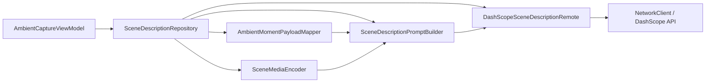

# 环境瞬间 → 百炼场景描述 — 实现计划

> 状态：Plan（待确认后编码）  
> 目标：在 **无自建服务端** 前提下，将 `AmbientMoment` 组织为多模态请求，调用阿里云百炼（DashScope OpenAI 兼容接口）生成中文场景描述。

---

## 1. 安全与配置

### 1.1 API Key 存放（与 Mapbox 一致）

| 项 | 做法 |
|----|------|
| 真实 Key | 仅写入项目根目录 `local.properties` → `DASHSCOPE_API_KEY=sk-...` |
| 版本库 | `local.properties` 已在 `.gitignore`，**禁止**写入 Kotlin / `strings.xml` / 文档 |
| 示例 | 新增 `local.properties.example`，占位 `DASHSCOPE_API_KEY=` |
| 构建 | `app/build.gradle` 读取 Key，注入 `BuildConfig.DASHSCOPE_API_KEY`（或仅运行时从 Gradle 注入到 `NetworkConfig`，不暴露到 `res`） |
| 请求头 | `Authorization: Bearer ${BuildConfig.DASHSCOPE_API_KEY}` 仅由网络层添加 |

**重要：** Key 曾在聊天中明文出现，建议在百炼控制台 **轮换** 后只更新 `local.properties`。

### 1.2 端点与模型（Phase 1）

| 配置项 | 值 |
|--------|-----|
| Base URL | `https://dashscope.aliyuncs.com/compatible-mode/v1/` |
| Path | `chat/completions` |
| 模型 | `qwen3-omni-flash`（图 + 音频 + 视频 + 文本；3s/5s 短媒体可用 Base64） |
| 媒体策略 | 单文件 Base64 编码后 &lt; 10MB；原始文件建议 &lt; 7MB |

---

## 2. 目录结构（独立模块，与 `ambient` 解耦）

在 `app/src/main/java/com/catclaw/aura/data/` 下新增 **`scenedescription/`**，与 `ambient/`、`network/` 平级。

```
data/scenedescription/
├── SceneDescriptionRepository.kt      # 对外唯一入口（用例层）
├── config/
│   └── SceneDescriptionConfig.kt      # 模型名、超时、是否附带音视频、prompt 模板
├── model/
│   ├── SceneDescription.kt            # 领域结果：text, model, errorMessage
│   └── SceneCapturePayload.kt         # 提交前结构化载荷（纯数据，无 Base64）
├── organization/                      # 「数据组织」层
│   ├── AmbientMomentPayloadMapper.kt  # AmbientMoment → SceneCapturePayload
│   └── SceneMediaEncoder.kt           # Uri/文件 → Base64 data URI（可开关、限大小）
├── remote/                            # 「提交给大模型服务端」层
│   ├── DashScopeChatApi.kt            # Retrofit 接口（或专用 OkHttp，见 3.2）
│   ├── dto/
│   │   ├── DashScopeChatRequest.kt
│   │   └── DashScopeChatResponse.kt
│   └── DashScopeSceneDescriptionRemote.kt  # 组装 DTO、发请求、解析回复
└── prompt/
    └── SceneDescriptionPromptBuilder.kt # system + user 文本与多模态 content 列表
```

### 2.1 分层职责



| 层 | 依赖方向 | 说明 |
|----|----------|------|
| `model` | 无 | 不依赖 `ambient` 具体采集实现 |
| `organization` | `ambient.model` + `model` | 仅做数据映射与编码 |
| `prompt` | `model` | 不依赖 Android UI |
| `remote` | `dto` + `config` | 不知道 `AmbientMoment` 存在 |
| `SceneDescriptionRepository` | 以上全部 | 编排流程 |

**禁止：** `AmbientVideoCapture` / `Fragment` 直接调用 Retrofit 或拼 JSON。

---

## 3. 数据组织（`organization` + `prompt`）

### 3.1 `SceneCapturePayload`（中间结构）

从 `AmbientMoment` 提取，例如：

- `capturedAtEpochMs`
- `location`：经纬度、精度、provider
- `nowPlaying`：title / artist / album / isMusicActive / statusMessage
- `video`：clipUri、posterUri、durationMs、是否成功
- `audio`：uri、durationMs、是否成功
- `captureErrors`：各子模块 error 汇总（供模型参考，避免幻觉）

### 3.2 `SceneMediaEncoder`

- 输入：`ContentResolver` + `Uri`
- 输出：`EncodedMedia(type, mimeType, base64DataUri)` 或 `null`（过大/失败时跳过并记入 metadata）
- 规则：
  - 封面 jpg：必传（Phase 1）
  - 3s mp4、5s m4a：由 `SceneDescriptionConfig.includeVideo/includeAudio` 控制，默认 **true**
  - 超过 7MB 原始大小：跳过该模态，prompt 中说明「未附带」

### 3.3 `SceneDescriptionPromptBuilder`

- **system**：角色 + 输出格式（80～150 字中文、禁止编造、未提供则写「未知」）
- **user**：结构化 JSON 文本块 + 多模态 `content` 数组（OpenAI 兼容格式）
  - `type: text`
  - `type: image_url` → `data:image/jpeg;base64,...`
  - `type: input_audio` 或文档要求格式（按百炼 Omni 兼容字段对齐）
  - `type: video_url` 或 `file` 字段（实现时对照官方示例校正）

---

## 4. 远程调用（`remote`）

### 4.1 方案选择

**推荐：** 在 `NetworkClient` 注册第三个 baseUrl：`NetworkConstants.BASE_URL_DASHSCOPE`，复用现有 OkHttp + 协程封装。

- 优点：与项目一致、日志/超时统一
- DashScope 专用头：`Authorization: Bearer ...` 在 `DashScopeSceneDescriptionRemote` 调用时通过 `headers` 传入（不写入全局 commonHeaders，避免泄露到其他域名）

**备选：** `scenedescription/remote` 内独立 `OkHttpClient` — 仅当 compatible-mode 与 DynamicApiService 的 JSON 拼装冲突时再拆。

### 4.2 `DashScopeSceneDescriptionRemote`

```kotlin
suspend fun generate(request: DashScopeChatRequest): Result<SceneDescription>
```

- 使用 `suspend` + Retrofit（或 `NetworkClient` 扩展 `postJson` 传原始 body）
- 解析 `choices[0].message.content` 为场景描述正文
- 错误映射：401 / 429 / 体积分支 → `SceneDescription.errorMessage`

---

## 5. `SceneDescriptionRepository` 流程

```
fun suspend generateFrom(moment: AmbientMoment): SceneDescription
```

1. `payload = AmbientMomentPayloadMapper.map(moment)`
2. `encodedMedia = SceneMediaEncoder.encode(payload)`（IO 线程）
3. `request = SceneDescriptionPromptBuilder.build(payload, encodedMedia, config)`
4. `return remote.generate(request)`
5. 不修改、不持久化 `AmbientMoment`（单一职责）

---

## 6. UI / ViewModel 集成（薄层）

| 位置 | 变更 |
|------|------|
| `AmbientCaptureUiState` | `sceneDescription: String?`、`isGeneratingSceneDescription: Boolean`、`sceneDescriptionError: String?` |
| `AmbientCaptureViewModel` | 注入/构造 `SceneDescriptionRepository`；`generateSceneDescription(moment)` 在采样成功后由用户点击或自动触发（**Plan 建议：按钮「生成场景描述」**，避免每次采样自动扣费） |
| `AmbientCaptureFragment` | 新卡片或视频卡片下展示描述 + 加载态 |
| `AuraApplication` | 注册 `BASE_URL_DASHSCOPE`；若 Key 为空，Repository 返回友好错误 |

**不** 在 `AmbientCaptureCoordinator` 内耦合 AI；Coordinator 仍只负责采集。

---

## 7. 配置项（`SceneDescriptionConfig`）

| 字段 | 默认 | 说明 |
|------|------|------|
| `model` | `qwen3-omni-flash` | 可切换 `qwen3-vl-plus`（仅图+文） |
| `includeVideo` | `true` | |
| `includeAudio` | `true` | |
| `maxDescriptionChars` | `200` | prompt 约束 |
| `connectTimeoutMs` | 复用 NetworkConfig | |

---

## 8. 实施阶段

| 阶段 | 内容 | 验收 |
|------|------|------|
| **P0** | `local.properties` + `BuildConfig` + `NetworkConstants` + 空模块骨架 | 编译通过 |
| **P1** | `organization` + `prompt` + 仅 **文本+封面** 调通百炼 | 返回中文描述 |
| **P2** | 加入视频/音频 Base64 | 全模态描述 |
| **P3** | ViewModel + Fragment UI | 用户可见 |
| **P4**（可选） | 描述缓存进 `AmbientMoment` 或 Room | 离线可看 |

---

## 9. 测试与验证

- 单元：`AmbientMomentPayloadMapper`、`SceneDescriptionPromptBuilder`（纯 Kotlin，无 Android）
- 仪器：Key 有效时 Repository 集成测试（可 `@Ignore` 默认）
- 手动：采样 → 生成描述 → 确认 logcat 无 `requestAudioFocus` 由本模块触发

---

## 10. 明确不做（本计划范围内）

- 自建后端 / OSS 上传
- 百炼「应用 ID」智能体编排（Phase 1 用 Chat Completions 直连）
- 将 API Key 提交到 Git
- 在场景描述模块内重复实现定位/采集逻辑

---

## 11. 确认后编码清单（Checklist）

- [ ] `local.properties.example` + `build.gradle` BuildConfig
- [ ] `data/scenedescription/**` 全套类
- [ ] `NetworkConstants.BASE_URL_DASHSCOPE` + `AuraApplication`
- [ ] `SceneDescriptionRepository` + ViewModel + UI
- [ ] `AGENTS.md` 简短说明（**不含真实 Key**）
- [ ] `assembleDebug` 通过

---

请确认：Phase 1 是否 **采样后手动点「生成场景描述」**（推荐），还是 **采样成功自动调用**？确认后即可按本计划编码。
